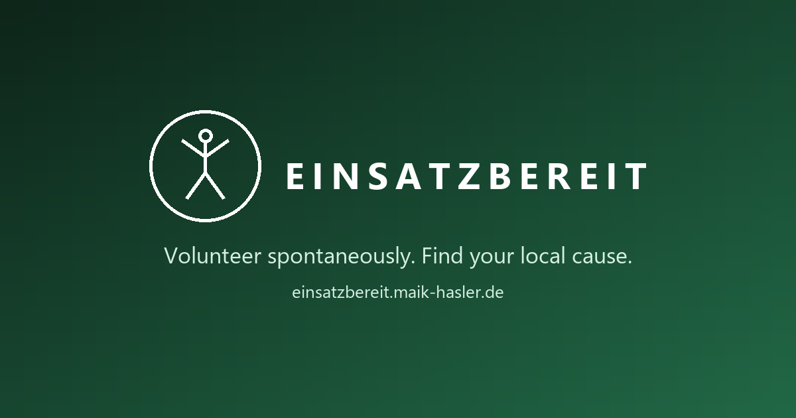

<div align="center">



**Volunteer coordination platform matching helpers with regional needs.**

*Volunteer spontaneously. Find your local cause.*

[Live Demo](https://einsatzbereit.maik-hasler.de) - [Architecture Docs](https://maik-hasler.github.io/einsatzbereit/Architecture.html) - [Report Bug](https://github.com/maik-hasler/einsatzbereit/issues/new/choose) - [Request Feature](https://github.com/maik-hasler/einsatzbereit/issues/new/choose)

[](https://github.com/maik-hasler/einsatzbereit/actions/workflows/dotnet.yml)
[](https://github.com/maik-hasler/einsatzbereit/actions/workflows/frontend.yml)
[](https://github.com/maik-hasler/einsatzbereit/actions/workflows/docs.yml)
[](LICENSE)

</div>

---

## Table of Contents

- [About](#about)
- [Features](#features)
- [Live Demo](#live-demo)
- [Tech Stack](#tech-stack)
- [Architecture](#architecture)
- [Getting Started](#getting-started)
- [Project Structure](#project-structure)
- [Contributing](#contributing)
- [Security](#security)
- [Versioning & Releases](#versioning--releases)
- [License](#license)

---

## About

Volunteering doesn't have to mean a long-term commitment - sometimes an afternoon is enough, sometimes a week. The hard part is usually finding out where help is needed right now, whether that's a large NGO or a local sports tournament. Existing platforms tend to be too complex, too generic, or simply unused.

Einsatzbereit makes concrete needs visible: what, where, when. Organizations post opportunities with real time slots, and volunteers who are ready ("einsatzbereit") sign up for exactly the slot that fits their schedule.

The app itself is served in German by default, since Einsatzbereit's primary audience is German-speaking, with English available as a secondary UI language via a language selector. Code, commits, and documentation for contributors stay in English throughout.

---

## Features

- **Browse and filter opportunities** across a list view, a mini calendar, and city/location autocomplete.
- **Sign up for a specific time slot ("engagement")** - withdraw if plans change, reactivate later within limits, get reminders, and check in on the day.
- **Rate your engagement afterwards** with a rating and comment, editable for a short window after submission.
- **Organizations post opportunities** with scheduled time slots (occurrences) and defined participation types.
- **Organizer dashboard** with a customizable widget layout: upcoming opportunities, calendar, to-do list, quick check-in, and a create-opportunity shortcut.
- **Organization management** covering membership, roles, a public directory of organizations, and multi-organization support with an org switcher.
- **Platform administration** to verify organizations, manage users, and toggle admin/enabled status.
- **Notifications and a language selector** (German by default, English as a secondary language).
- **Keycloak-backed authentication** via OIDC/PKCE, with Keycloak Organizations powering org membership.
- **Achievements and badges** awarded for volunteering milestones, shown on the profile.
- **Saved search alerts** - save a filtered opportunity search and get a digest email when new matches appear.
- **Organization invitations** to join and manage an organization's membership.
- **Reporting and moderation** for opportunities, organizations, and users, backed by a full admin audit log.
- **Image uploads** for avatars, organization logos, and opportunity banners, stored in MinIO object storage.
- **Installable as a PWA** with offline support for previously visited pages.

---

## Live Demo

A live staging deployment runs at **[einsatzbereit.maik-hasler.de](https://einsatzbereit.maik-hasler.de)**.

> [!NOTE]
> This is a disposable staging/QA environment, not a hardened production deployment. It intentionally shares the same Keycloak realm as local dev, including the test-user credentials listed under [Getting Started](#getting-started). That is a deliberate trade-off for demo infrastructure, not an oversight - staging gets wiped and reseeded rather than treated as anything precious.

---

## Tech Stack

| Layer | Tech |
|---|---|
| Backend | .NET 10, Clean Architecture (Api -> Application -> Domain, Infrastructure -> Domain), EF Core 10, PostgreSQL 18, CQRS-style command/query handlers, transactional outbox for domain events |
| Auth | Keycloak 26.7.1 (OIDC, JWT, Keycloak Organizations) |
| Frontend | Vite SPA, React 19, React Router v8, Tailwind CSS 4, react-oidc-context, Leaflet/react-leaflet |
| API client | NSwag-generated TypeScript client from the backend OpenAPI spec - never hand-edited |
| Object storage | MinIO (avatars, organization logos, opportunity banners) |
| Observability | Grafana, Prometheus, Alertmanager, Tempo (distributed tracing) |
| Tests | TUnit + Aspire.Hosting.Testing + Respawn + NetArchTest (Application.UnitTests, IntegrationTests, ArchitectureTests), Vitest (frontend pure-logic units), Playwright + axe-core (E2E and accessibility, `backend/tests/VisualTests`) |
| CI/CD | GitHub Actions (build and test on every PR, Docker images to GHCR on tag push, auto-deploy to staging) |
| Dependency updates | Renovate |

---

## Architecture

The full system architecture is documented in arc42 format and published at:

**[maik-hasler.github.io/einsatzbereit/Architecture.html](https://maik-hasler.github.io/einsatzbereit/Architecture.html)**

It is built from the AsciiDoc sources in `docs/Architecture/` via AsciiDoctor and redeployed to GitHub Pages on every push to `main` (`docs.yml`). Individual Architecture Decision Records live alongside it in `docs/ADRs/`.

---

## Getting Started

### Prerequisites

- [.NET 10 SDK](https://dotnet.microsoft.com/) - exact version pinned in `backend/global.json` (10.0.400)
- [Docker](https://www.docker.com/) - Aspire runs PostgreSQL and Keycloak as containers
- [pnpm](https://pnpm.io/) - frontend package manager

### Run everything with one command

```bash
dotnet run --project backend/src/Aspire/AppHost
```

The Aspire AppHost provisions PostgreSQL, Keycloak, the backend API, and the Vite frontend, then prints every service URL in the Aspire dashboard. On first start, databases are created automatically and the Keycloak realm is imported.

### Services

| Service | URL | Credentials |
|---|---|---|
| Frontend | http://localhost:4321 | - |
| Backend API | *dynamic port - see the Aspire dashboard* | - |
| Keycloak | http://localhost:8080 | admin / admin |
| pgAdmin | http://localhost:5050 | admin@admin.com / admin |
| PostgreSQL | localhost:5432 | postgres / postgres |
| Mailpit | http://localhost:1080 | - (no auth, captures outgoing email) |

### Test users

| Username | Password | Roles | Persona | Can |
|---|---|---|---|---|
| vera | vera123 | user | Volunteer Vera | Browse volunteer opportunities |
| olaf | olaf123 | user, organisator | Organizer Olaf | Browse and create opportunities |
| admin | admin123 | admin | Administrator | Full administration |

These same credentials are intentionally also live on the public [staging deployment](#live-demo) - see the note above.

---

## Project Structure

```
einsatzbereit/
├── backend/        .NET 10 Clean Architecture API
├── frontend/       Vite SPA + React 19 + Tailwind CSS 4
├── keycloak/       Custom Keycloak image + realm config
├── docs/           arc42 architecture docs + ADRs
└── .github/        CI/CD workflows + issue templates
```

---

## Contributing

Contributions are welcome. See [CONTRIBUTING.md](CONTRIBUTING.md) for Conventional Commits, branch naming (`feat/`, `fix/`, `docs/`, `chore/`), the PR process, and code style. Please also read the [Code of Conduct](CODE_OF_CONDUCT.md).

---

## Security

Found a vulnerability? Please report it privately via the GitHub Security tab's "Report a vulnerability" option rather than a public issue - see [SECURITY.md](SECURITY.md) for details.

---

## Versioning & Releases

Einsatzbereit uses a single unified SemVer tag across the whole monorepo - see [VERSIONING.md](VERSIONING.md). Stable releases are tagged `vX.Y.Z`; release candidates are `vX.Y.Z-rc.N`. Every tag push builds and publishes Docker images for backend, frontend, and Keycloak to GitHub Container Registry (GHCR). Release notes are auto-generated on [GitHub Releases](https://github.com/maik-hasler/einsatzbereit/releases) - there is no separate changelog file.

---

## License

Einsatzbereit is intentionally licensed under the [GNU Affero General Public License v3.0](LICENSE).

It doesn't matter who develops the project further. The benefit to society comes first. No profit, no closed source, no lost knowledge.

Practically, this means: if you self-host a modified version of Einsatzbereit and let others interact with it over a network, you are obligated to make your modified source available to them too.

---

<div align="center">

Built for the moments when an afternoon of help is exactly enough.

</div>
