# Frontend & UX Review - einsatzbereit - 2026-08-20

Reviewed: https://einsatzbereit.maik-hasler.de/ · Commit (main, as of review start): `068a2f5`

## Executive Summary

Overall the live product reads as a genuinely considered, well-crafted piece of design work, not a generic template. The green/cream palette, the blob-shaped hero graphics, the bold display type, and the little green-dog 404 illustration all feel like deliberate, consistent choices, and the theme color holds up across the app as a controlled tint/shade system rather than drifting randomly. Baseline UX hygiene is strong: a working skip-link, visible keyboard focus rings, sensible tab order, an appropriate "discard unsaved changes?" guard on the create-opportunity form, and a PWA offline experience that shows a calm inline "you're offline" card instead of a browser error. Image-upload validation (wrong type / too large) produces specific, actionable German error copy.

The most consequential finding is a **status inconsistency between the volunteer's and the organization's view of the same sign-up** (F2): a volunteer's engagement can simultaneously show as "Ausstehend" (pending) on her own account and "Zurückgezogen" (withdrawn) on the organization's engagement-management screen. In a marketplace whose entire value proposition is "your sign-up did or didn't go through," that is a trust-critical bug. Second, the platform's very first opportunity card - visible to every anonymous visitor on the homepage - carries a literal `xxx` placeholder description and, in English, the un-idiomatic title "We search helper" (F1); this is very likely accumulated test/demo debris on shared staging data rather than a code defect, but it is exactly the kind of thing a first-time visitor sees first. Third, on mobile the organizer and admin section tab bars overflow horizontally with no visual hint that more tabs exist off-screen, silently hiding the "Mitglieder" / "Audit-Log" tabs (F3). A smaller but real i18n gap: organization bios never get the "only available in German" fallback treatment that opportunity titles/descriptions already correctly use (F5).

Several features named in this review's brief - a map view and mini-calendar for browsing opportunities, saved searches/alerts, CSV export for organizers, and a distinct "verify organization" admin action - were not found in the current live build; these are noted under Scope & Method / Parking Lot rather than treated as regressions.

**Selected positive evidence** (not findings, referenced from the narrative above):

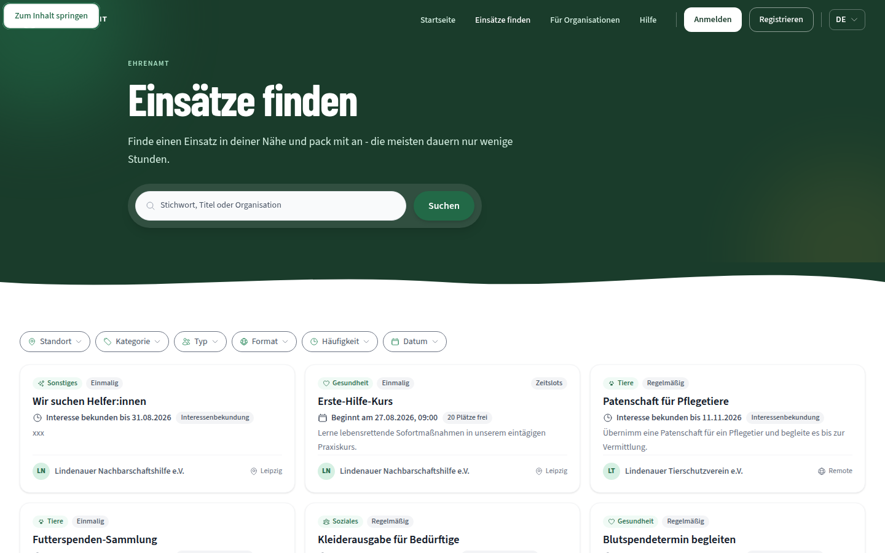
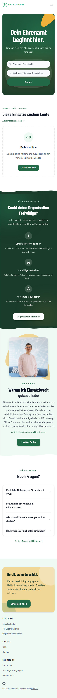
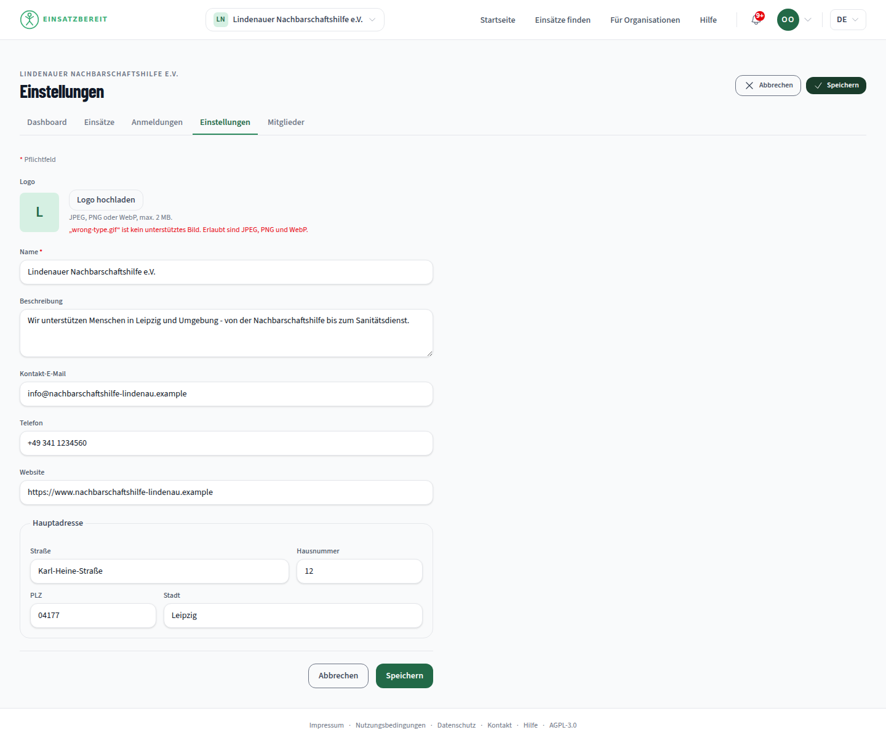

## Scope & Method

**Personas:** anonymous visitor, Vera (`vera`/volunteer), Olaf (`olaf`/organizer), Admin (`admin`). All three logged in successfully via the single-step Keycloak form.

**Viewports:** 375px (mobile), 768px (tablet), 1440px (desktop). Full coverage at 375/1440 for the core flows; 768px spot-checked on the public pages.

**Languages:** German (default) and English (via the header language switcher), checked on the homepage, opportunities list, opportunity detail, and (partially) the volunteer's "Meine Anmeldungen" screen.

**Pages/flows covered:** homepage, opportunity list + detail, organization directory + profile, 404, Keycloak login; Vera's notifications, opportunity sign-up (scheduled-slot and expression-of-interest), withdraw, profile/achievements, profile settings; Olaf's org dashboard, org switcher, opportunity management, members/invitations, org settings incl. logo upload (including deliberate wrong-type and over-size-limit error cases), create-opportunity wizard (steps 1-4, abandoned before publishing); Admin's organizations/users/reports/audit-log; a 10-stop keyboard-only pass from the homepage, `prefers-reduced-motion`, PWA manifest + offline behavior (revisited and non-revisited pages), and a language-switch check for route/tab-state retention.

**Method:** real Chromium via a throwaway Playwright script (no MCP browser tool resolved in this session, so the `/live-verify` scratch-script recipe from `AGENTS.md` was used directly), screenshots at every step, console/network error capture. Only one browser engine (Chromium) was available - no Firefox/Safari/WebKit coverage.

**Not found in the live app** (mentioned in the review brief but absent from the current build - noted for context, not scored as defects):
- A map view or mini-calendar for browsing opportunities (`OpportunitiesPage.tsx` has no map/calendar toggle; the only Leaflet usage in the app is the single-marker map on the opportunity detail page).
- Saved searches / alerts (no such feature anywhere in the frontend).
- CSV export for organizers.
- A distinct "verify organization" admin action - the admin organizations screen offers only "Verbergen" (hide); orgs otherwise carry "Aktiv"/"Neu" badges with no separate approval step.

**Not exercised live** (data/time constraints, not defects):
- Check-in (QR/PIN): no opportunity in the current dataset has a time slot occurring "now," and the check-in PIN flow only activates around a slot's actual time window.
- Post-event rating: every past engagement in the test accounts had already been withdrawn (see below), so no confirmed-and-completed engagement was available to trigger the rating prompt.
- Full screen-reader sampling was time-boxed to spot checks; the keyboard-only pass covered ~10 tab stops on the public browsing flow, not every authenticated screen.

**Staging state note:** both `vera` and `olaf`'s accounts already carried extensive prior test debris (withdrawn sign-ups with messages like *"Testnachricht fuer Review - bitte ignorieren"*) from earlier automated review passes, consistent with `AGENTS.md`'s own note that shared staging accounts accumulate this over time. During this review, an automated script selector bug (`.first()` matching the wrong "Zurückziehen" button) briefly withdrew Vera's **pre-existing, not self-created** "Blutspendetermin begleiten" interest expression. It was restored via the normal "Interesse bekunden" flow, but its organizer-confirmed status could not be fully restored (an organizer action) - it now shows "Ausstehend" instead of the original "Bestätigt." This incident is disclosed here in the interest of transparency, and the resulting cross-view discrepancy is what led directly to Finding F2 below.

## Findings

### Content

#### F1 - Placeholder/unedited content live on the platform's first-shown opportunity
**Kategorie:** Content
**Schweregrad:** Hoch
**Konfidenz:** Bestätigt
**Einordnung:** Präferenz, gestützt auf projekteigene Konvention (Schreibregeln aus `/frontend-design`: Inhalte sollen nie wie unfertige Platzhalter wirken)
**Ort:** Homepage "Diese Einsätze suchen Leute" (erste Karte), `/opportunities`, `/volunteer-opportunities/{id}` · Persona: anonym & alle drei Personas · Viewport: alle · Sprache: DE/EN

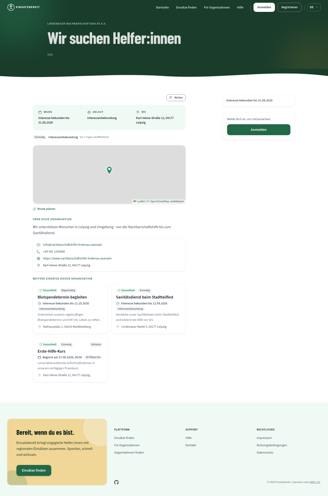
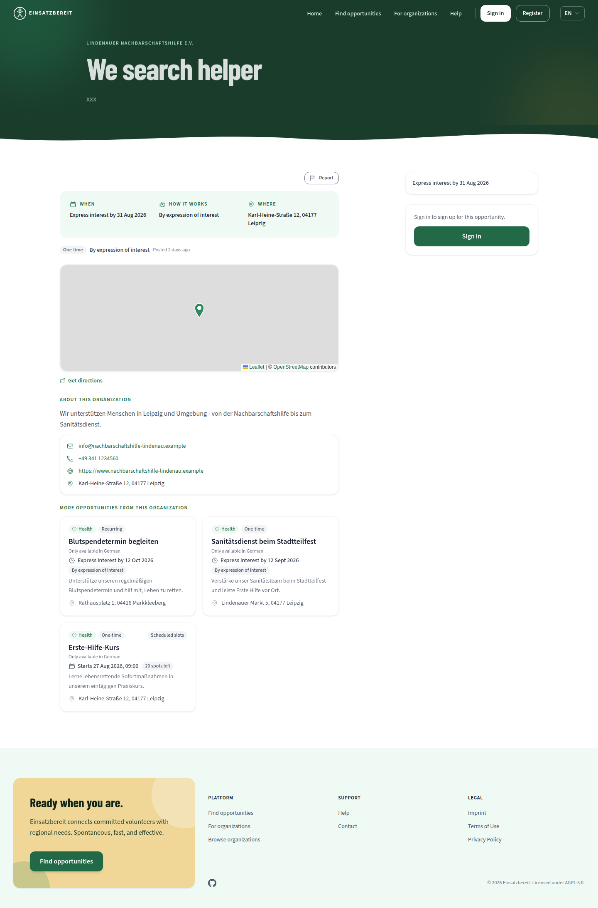

Beleg: `f1-opportunity-detail-de-xxx.png` (DE: description is the literal string "xxx"), `f1-f5-opportunity-detail-en-we-search-helper.png` (EN: title reads "We search helper", an un-idiomatic word-for-word rendering of "Wir suchen Helfer:innen" rather than something like "Volunteers needed").
Auswirkung: This is the very first opportunity card shown on the homepage and in the list, to every anonymous visitor, in both languages. It reads as an unfinished demo rather than a live platform, which is exactly the kind of first impression that erodes trust before a visitor even signs in.
Verbesserungsvorschlag: Replace with realistic seed content (or delete the record); if organizer-authored bilingual titles remain free text, consider flagging suspiciously short/placeholder-like values (e.g. "xxx", single characters) for the organizer before publish, the way the upload validator already flags bad files. · Aufwand: S

Vermutlich Ursache: Live user-generated test data on the shared staging organization, not a code defect - likely resolved by the existing `reset-staging.yml` workflow rather than a frontend change.

### UX

#### F2 - A volunteer's sign-up shows a different status on her own account than on the organization's engagement list
**Kategorie:** UX
**Schweregrad:** Kritisch
**Konfidenz:** Bestätigt
**Einordnung:** Best Practice (Quelle: Nielsen-Norman-Heuristik #1 Sichtbarkeit des Systemstatus, #4 Konsistenz und Standards)
**Ort:** Vera: `/my-signups` ("Meine Anmeldungen") · Olaf: `/app/{orgId}/dashboard/engagements` ("Anmeldungen") · Persona: Vera + Olaf · Viewport: 1440px · Sprache: DE

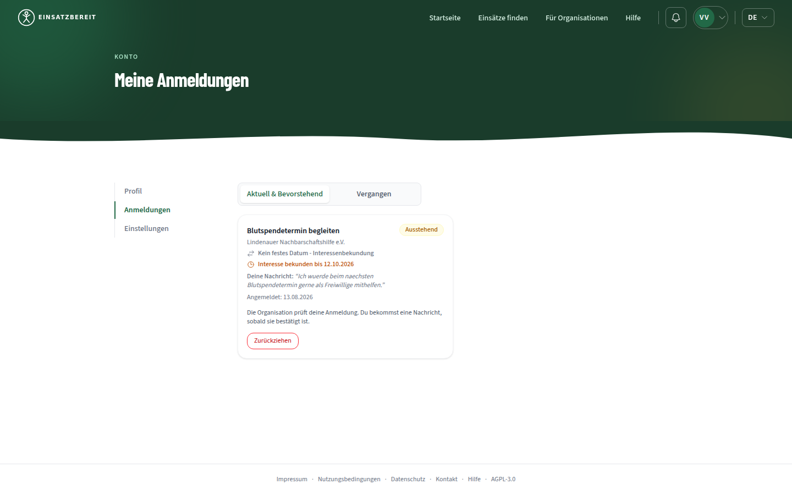
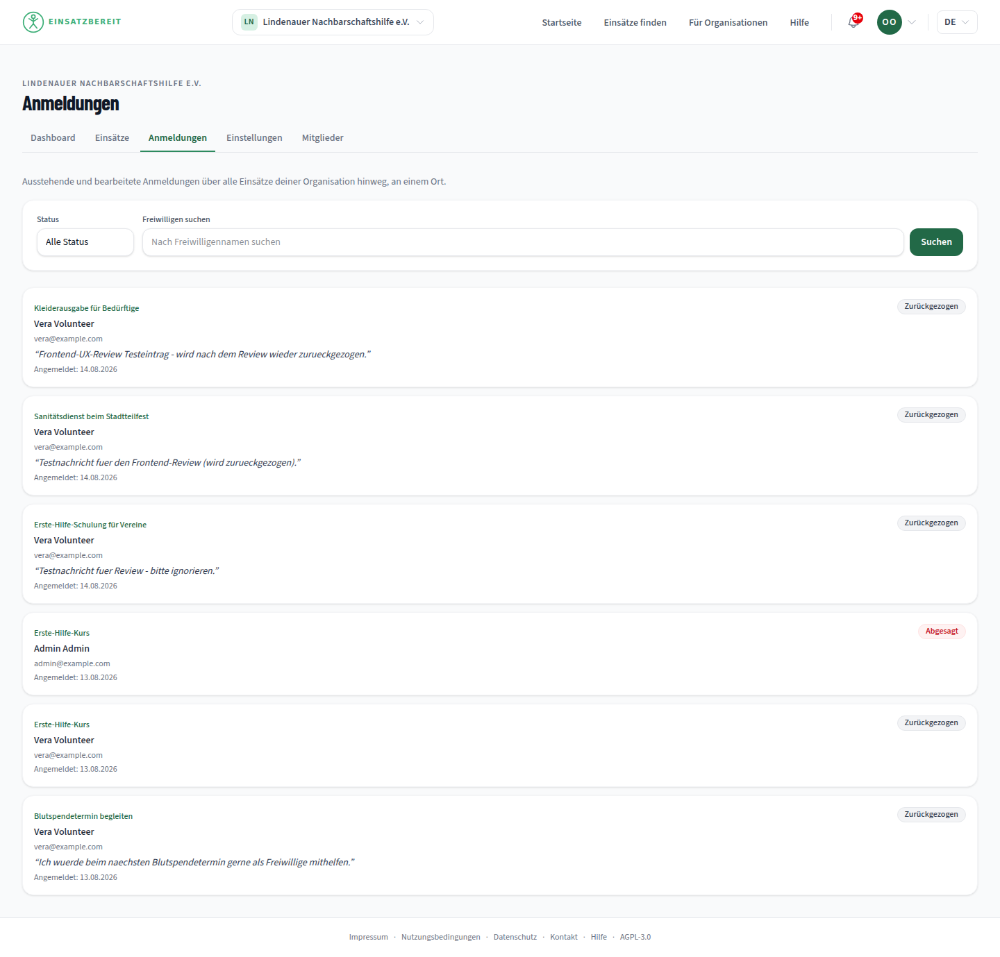

Beleg: `f2-volunteer-view-ausstehend.png` (Vera's own "Meine Anmeldungen" shows "Blutspendetermin begleiten" as **Ausstehend**/pending) vs. `f2-organizer-view-zurueckgezogen.png` (Olaf's org-wide "Anmeldungen" list shows the identical engagement, same message text, same "Angemeldet: 13.08.2026" date, as **Zurückgezogen**/withdrawn). Reproduced twice from independent, freshly-logged-in Playwright sessions minutes apart, with no user action in between that should have changed either view.
Auswirkung: The two sides of a volunteering marketplace are structurally supposed to agree on whether a sign-up is live. If a volunteer believes she's still pending while the organization's dashboard says she withdrew (or vice versa), the organization may under- or over-staff an event, and the volunteer may show up - or not - based on wrong information. This is a correctness/trust failure in the single most important piece of shared state the app has.
Verbesserungsvorschlag: Audit whichever of the two read paths (volunteer's own engagement list vs. the organization's engagement-management list) computes/labels status independently, and make them derive from the same source of truth. Add an integration test asserting both views agree on status for the same engagement ID after a withdraw → re-express-interest cycle. · Aufwand: M

Vermutlich Backend: the two screens likely call different read endpoints/queries over the same `Engagement` record; the discrepancy looks like a status-computation or caching mismatch on the API side rather than a pure rendering bug, but it is flagged here because it is entirely frontend-visible and directly affects trust in the UI.

#### F4 - Organizer marketing block still shown to already-logged-in volunteers
**Kategorie:** UX
**Schweregrad:** Niedrig
**Konfidenz:** Werturteil
**Einordnung:** Präferenz
**Ort:** Homepage, "Sucht deine Organisation Freiwillige?" section · Persona: Vera (logged in, no organizer role) · Viewport: 1440px · Sprache: DE

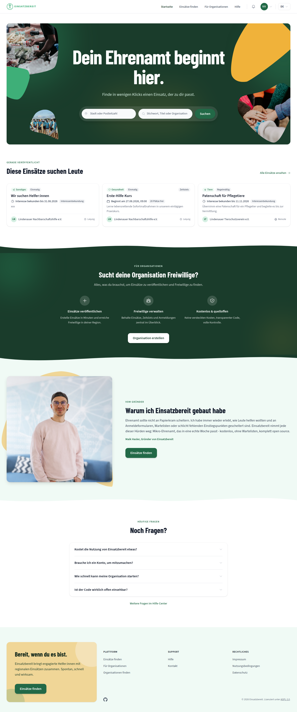

Beleg: `f4-vera-home-fuer-organisationen.png`
Auswirkung: Nielsen #8 (aesthetic and minimalist design) - a volunteer who is already signed in and has no organizer role still sees a full-width "does your organization need volunteers? Create an organization" pitch on every homepage visit. Not broken, just irrelevant real estate for that audience.
Verbesserungsvorschlag: Hide or replace this section once a user is authenticated and not an organizer, or swap its CTA to something volunteer-relevant (e.g. "invite a friend"). · Aufwand: S

#### F6 - No spatial/map-based way to browse opportunities
**Kategorie:** UX
**Schweregrad:** Niedrig
**Konfidenz:** Werturteil
**Einordnung:** Präferenz
**Ort:** `/opportunities` · Persona: alle · Viewport: alle · Sprache: DE/EN

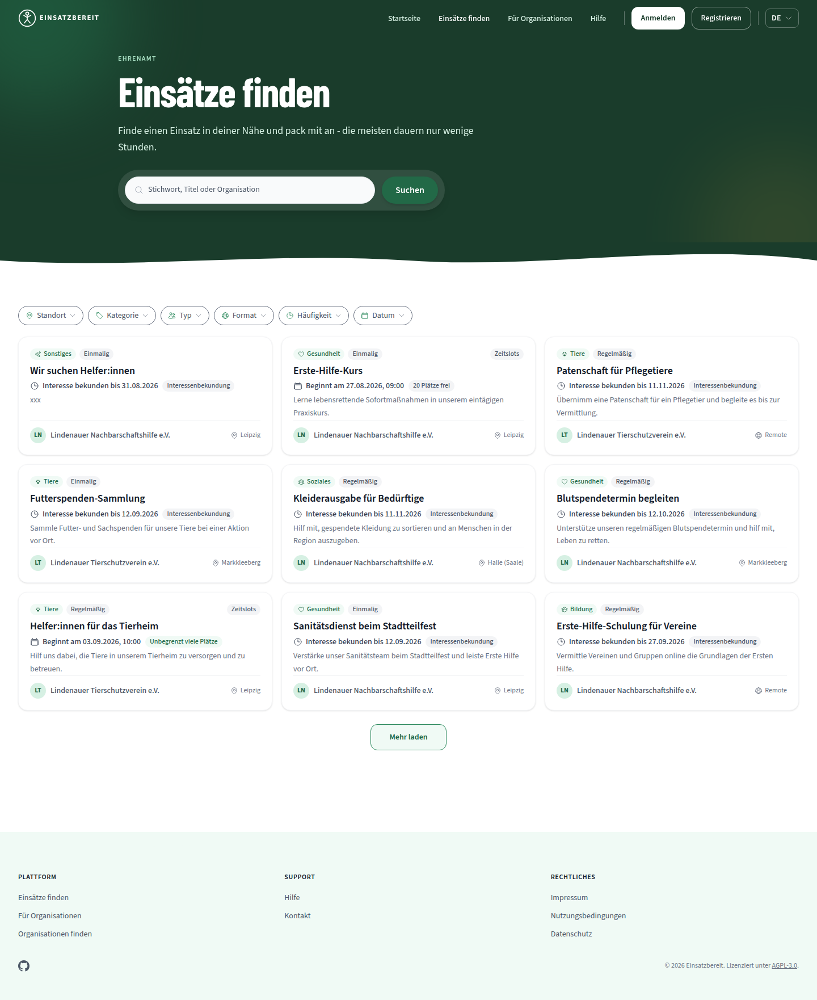

Beleg: `f6-opportunities-list-no-map.png` - the filter bar offers a "Standort" (location) filter and the homepage has a "Stadt oder Postleitzahl" field, but results only ever render as a card list; the only Leaflet map in the app is the single-pin map on an opportunity's own detail page.
Auswirkung: Nielsen #7 (flexibility and efficiency of use) - for a platform explicitly about finding *nearby* short-notice opportunities, a spatial overview (which of these are actually a five-minute walk from me?) is a natural complement to a text list. Not a defect against anything currently promised in-product, so scored as a preference rather than a bug.
Verbesserungsvorschlag: If on the roadmap, a map view reusing the existing `SingleMarkerMap`/Leaflet setup with clustered pins would fit the existing visual language well. · Aufwand: L

### UI

#### F3 - Mobile section tab bars overflow with no scroll affordance, hiding tabs off-screen
**Kategorie:** UI
**Schweregrad:** Mittel
**Konfidenz:** Bestätigt
**Einordnung:** Best Practice (allgemeine Mobile-Web-Konvention: Affordanz für horizontal scrollbare Inhalte, z. B. Fade/Schatten am Rand)
**Ort:** Olaf's org dashboard tab bar (Dashboard/Einsätze/Anmeldungen/Einstellungen/Mitglieder) and Admin's section tab bar (Organisationen/Nutzer:innen/Meldungen/Audit-Log) · Persona: Olaf, Admin · Viewport: 375px · Sprache: DE

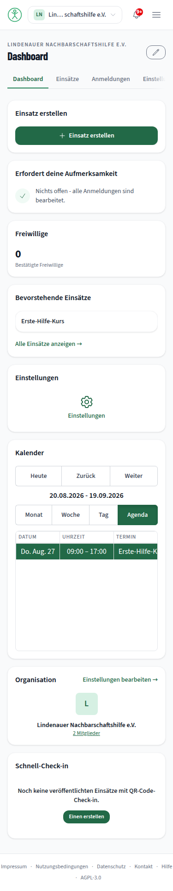
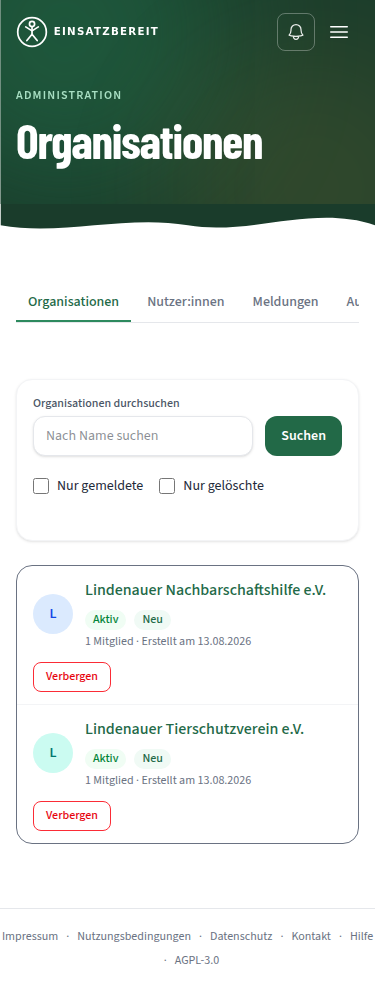

Beleg: `f3-mobile-tabbar-overflow.png` (Olaf: "Einstellungen" is cut mid-word, "Mitglieder" is entirely off-screen), `f3-admin-mobile-tabbar-overflow.png` (Admin: "Audit-Log" cut to "Au..."). Confirmed via DOM inspection: the tab `<nav>` has `overflow-x: auto`, `scrollWidth` 474px vs. `clientWidth` 343px - the tabs are reachable by swiping, they are simply not visually indicated as such.
Auswirkung: Nielsen #6 (recognition rather than recall) - a mobile organizer or admin has no visual cue that "Mitglieder" or "Audit-Log" exist at all unless they happen to swipe the tab row sideways, which is not an obvious gesture over what reads as a static heading row.
Verbesserungsvorschlag: Add an edge fade/gradient (or a subtle drop shadow) on the trailing edge of the scroll container when it has more content to reveal, a common CSS-only pattern (`mask-image` gradient or a pseudo-element shadow tied to scroll position). Same fix applies to both occurrences. · Aufwand: S

### i18n

#### F5 - Organization descriptions are never localized, unlike opportunity text
**Kategorie:** i18n
**Schweregrad:** Mittel
**Konfidenz:** Bestätigt
**Einordnung:** Best Practice (projekteigene Konvention: das bestehende `pickLocalizedText`/"Only available in German"-Fallback-Muster für Opportunity-Titel/-Beschreibungen, siehe Commit `e00282c`)
**Ort:** Opportunity detail page, "Über diese Organisation" / "About this organization" box · Organization profile page · Persona: alle · Viewport: 1440px · Sprache: EN

Beleg: `f1-f5-opportunity-detail-en-we-search-helper.png` - under the English UI, the organization bio still renders in German ("Wir unterstützen Menschen in Leipzig und Umgebung...") with no `lang` override and no "Only available in German" notice, even though the opportunity title/description directly above it correctly shows that exact notice when they fall back to German.
Auswirkung: Inconsistent with the app's own established i18n convention; a screen reader on an English-locale session will announce this paragraph with English phonetics (the same bug class `e00282c` fixed for opportunity text), and a sighted English reader gets no explanation for the sudden language switch.
Verbesserungsvorschlag: Route organization `description`/`descriptionEn` (if such a field exists) or a fallback note through the same `pickLocalizedText` helper already used for opportunities, including the `lang` attribute and "Only available in German" badge. · Aufwand: S/M

## Parking Lot

- Console shows a `400` on every page load from `useSilentSsoProbe`'s `prompt=none` request when logged out - invisible to users, but worth a look under the `bugs` lens.
- Extensive withdrawn-signup test debris under `vera`'s "Vergangen" tab and `olaf`'s org "Anmeldungen" list (`"bitte ignorieren"`-style messages from prior review passes) - candidate for `reset-staging.yml` rather than a code fix; `repo-hygiene`/`contributor-dx` lens territory.
- Org dashboard widgets (Freiwillige/Kalender/Erfordert deine Aufmerksamkeit) render visible skeleton placeholders for roughly a second after `networkidle` - correct pattern (Nielsen #1), just noting the load feels slightly staggered; candidate for a performance-focused pass, not this review.
- No CSV export and no saved-searches/alerts feature exist yet - product-roadmap items, not regressions, surfaced here only because the review brief named them as expected areas to check.
- Admin's org moderation only offers "Verbergen" (hide), no distinct "verify" step - worth a product decision on whether a formal verification workflow is intended, out of scope for a frontend-only review to prescribe.
- Check-in (QR/PIN) and post-event rating flows need a dedicated live-verify pass with a purpose-built near-term opportunity slot and a genuinely completed engagement - good candidate for the next `/live-verify` or `lens` "live personas" run.

## Prioritized Next Steps

**Quick wins (low effort, high impact):**
- Clean/replace the "xxx" / "We search helper" opportunity content (F1), or run staging reset.
- Add scroll-affordance styling to the two overflowing mobile tab bars (F3).
- Hide or reword the organizer marketing block for logged-in volunteers (F4).
- Route organization descriptions through the existing localization-fallback helper (F5).

**Larger undertakings:**
- Root-cause and fix the volunteer-vs-organizer engagement status inconsistency (F2) - trust-critical, needs backend investigation plus a regression test asserting both views agree.
- Decide on and, if desired, build a map/spatial browsing view for opportunities (F6).
