# Frontend & UX Review - einsatzbereit - 2026-08-24

Reviewed: <https://einsatzbereit.maik-hasler.de/> (public staging)
Repository HEAD used for code references: `ee27be5` (the deployed build may be slightly ahead or behind)
Screenshots: `docs/reviews/assets/frontend-review-2026-08-24/`

## Executive Summary

Einsatzbereit is in far better shape than a typical pre-1.0 product. Every text/background pair I measured across nine public routes and the Keycloak login clears WCAG 2.2 AA, the worst being 5.48:1 on the homepage. Keyboard support is real rather than nominal: a working skip link, a visible focus ring on every interactive element, focus moved into modals and restored to the trigger on close, `role="alert"` validation messages and `aria-invalid`. `prefers-reduced-motion` genuinely removes the entrance animations and smooth scrolling. Upload validation messages name the file, the actual size and the allowed formats. Offline states read as states, not as errors, and offer a retry. The German/English switch preserves route, query string and scroll target, survives the Keycloak round trip, swaps the PWA manifest, and I found no raw i18next keys anywhere.

Against that baseline, the findings below cluster into three groups. First, a small number of defects that a visitor will actually hit: a volunteer can select and submit a sign-up for a time slot that ended six days ago, and the "38 Plätze frei" counter on the same opportunity includes that dead slot's 19 seats (F1). Every native `<select>` in the app renders without a dropdown arrow, because the chevron is a `data:` URI that the deployed Content-Security-Policy blocks while `appearance-none` has already removed the native one, so a dropdown is visually indistinguishable from a text input (F2). The installed PWA icon is a featureless green square, even though the shortcut icons right beside it carry the logo (F3).

Second, a set of composition and consistency issues that make a carefully designed product read as less carefully assembled than it is: on the three highest-traffic templates the page-header band and the page body do not share a left gutter at desktop widths, off by 176px on `/opportunities` (F4); the same organisation is drawn as a 24px green rounded square in one place and a 48px hash-coloured circle in another (F7); two form implementations disagree about whether an invalid field should look invalid (F13).

Third, a group of content and microcopy issues rooted in a repository-wide convention: `ban-typographic-dashes` in `lint.yml` applies to `frontend/src/locales/*.json` as well as to code, so 45 German UI strings use a hyphen where German typography needs an en dash, and the German quotation style is split roughly half and half between `„…"` and straight ASCII quotes (F16).

The highest-value fixes are cheap. F1, F2 and F3 are each an afternoon. F4 is a container class. Together they remove the three things a first-time visitor is most likely to notice.

## Scope & Method

**Environment.** Live staging at <https://einsatzbereit.maik-hasler.de/>, reviewed 2026-08-24 (the app's own clock confirmed `Mon Aug 24 2026 ... GMT+0200`). Chromium 141 via Playwright, driven directly in this session.

**Personas.** All three documented test accounts: `vera` (user), `olaf` (user + organisator, member of two organisations), `admin` (admin).

**Viewports.** 375, 768 and 1440 CSS px. Alignment and layout measurements were taken programmatically, not estimated from screenshots.

**Languages.** German (default) and English, switched on `/`, `/opportunities`, `/organizations`, `/help`, `/imprint`, `/my-signups`, `/profile` and an opportunity detail page.

**Areas covered.** Public: home, opportunity directory, organisation directory, help, contact, imprint, terms, privacy, 404, unsubscribe, Keycloak login. Vera: browse, filters, detail pages (both scheduled-slot and expression-of-interest types), sign-up modal and validation, `/my-signups`, profile with achievements, notifications. Olaf: organiser dashboard and its customise mode, opportunity list, engagement management with check-in, members and invitations, organisation settings, the four-step create-opportunity wizard including image-upload validation, and the organisation switcher. Admin: organisations, users, reports, audit log. Cross-cutting: empty states, offline states, keyboard-only traversal, focus order and visibility, `prefers-reduced-motion`, PWA manifest and icons, service-worker precache contents.

**Method notes and limits, stated so the findings can be weighed:**

- **Contrast** was measured with an injected WCAG 2.2 auditor that resolves the backdrop by hit-testing (`document.elementsFromPoint`) rather than by walking ancestors, so a transparent header painted over a dark hero band resolves against the hero. An earlier ancestor-walk version produced false positives; those were discarded. The tool was sanity-checked by having it report the worst ratios whether or not they fail, which confirms it measures rather than silently returning nothing.
- **One browser engine only.** Chromium. No Safari/WebKit or Firefox verification. Anything engine-specific is out of reach here.
- **Service worker could not be exercised.** This container's Chromium sends a 1817-byte post-quantum ClientHello that the session's egress path resets, and the key share is no longer flag-gated, so every browser request had to be fetched by Node and returned via Playwright's `route.fulfill`. A service worker cannot register under that arrangement. PWA findings therefore rest on the manifests, the icon files and a static read of the deployed `sw.js`, plus the app's own offline states exercised via client-side navigation with `navigator.onLine` forced false and the API blocked. Real install and real offline reload were not tested.
- **Automated a11y is not duplicated.** The repo already runs `jsx-a11y`, `tsc --noEmit` and Playwright + axe-core. This review deliberately covers what those cannot: full keyboard traversal, focus order versus visual order, focus restoration, error-state affordances, and reading the interface as a user.
- **Nothing was created or destroyed.** No sign-up was submitted, no opportunity created, no notification cleared, no member changed. Modals were opened and dismissed with Escape; upload validation was triggered with throwaway files that are rejected client-side. The only state touched was reading notifications, which the app itself can undo (`onMarkUnread`).

**Features named in the brief that do not exist in this build**, so they were not reviewed and their absence is not reported as a finding: saved searches and search alerts, CSV export, and organisation verification (the admin organisation list offers only "Verbergen"). There is also no map/list toggle on `/opportunities`; Leaflet is used only for the single-marker map on the detail page. No mini-calendar exists on the browse page either; the calendar is an organiser dashboard widget.

**One claim I checked and withdrew.** Keycloak sends `Content-Security-Policy: frame-ancestors 'self'`, which does block the app's hidden OIDC iframe, and I initially expected this to break automatic token renewal and eject users mid-task. It does not. Over a seven-minute watch, the 300-second access token was renewed at t+270s via `grant_type=refresh_token` with no iframe involved, no expiry toast and no redirect. Only the anonymous silent-SSO probe is affected, which is F19 and much smaller.

## Findings

### Content

#### F1 - A time slot that has already passed is offered, selectable, in the sign-up picker

**Kategorie:** Content
**Schweregrad:** Hoch
**Konfidenz:** Bestätigt
**Einordnung:** Best Practice (Nielsen-Norman-Heuristik #5 Fehlervermeidung; #1 Sichtbarkeit des Systemstatus)
**Ort:** `/volunteer-opportunities/01a0254e-5025-75e6-a903-2d8c98fa6811` ("Erste-Hilfe-Kurs") - Persona: any signed-in volunteer - Viewport: all - Sprache: DE and EN

Beleg: `past-slot-in-signup-picker.png`, `past-slot-listed-as-available.png`. The browser clock during the session was `Mon Aug 24 2026`. Under the heading "Verfügbare Zeitslots" the page lists `18.08.2026, 11:00-19:00 - 19 Plätze frei` styled identically to the future slot below it. Opening "Für Zeitslot anmelden" as `admin` shows the same past date as the first, fully enabled option. Code: `components/SignUpModal.tsx:147` maps every entry of `timeSlots` into the dropdown and sets `disabled` only from `isSlotFull`, with no date comparison; `pages/VolunteerOpportunityDetailPage.tsx` renders the same unfiltered list. The codebase already has `findNextTimeSlot`, used for the "WANN" summary, so the notion of a future slot exists but is not applied here.

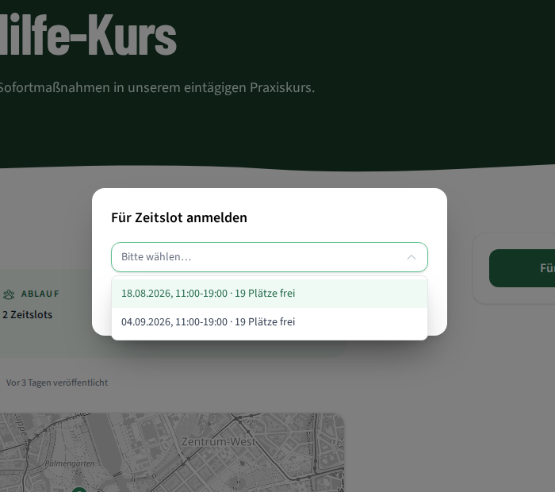
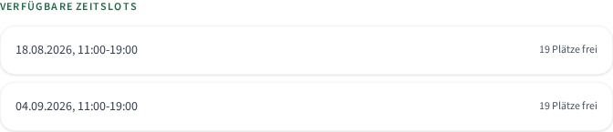

Auswirkung: A volunteer can complete a sign-up for a shift that ended six days ago and will sit in "Ausstehend" waiting for a confirmation that cannot sensibly come. The same arithmetic inflates the headline availability: the meta row claims "38 Plätze frei" because it sums 19 dead seats and 19 live ones, and that inflated number is repeated on the browse cards and in the related-opportunity rail.

Verbesserungsvorschlag: Filter `timeSlots` by `endDateTime > now` for both the "Verfügbare Zeitslots" list and the picker, and derive the aggregate spot count from the same filtered set. If past slots should stay visible for transparency, render them in a separate "Vergangene Zeitslots" group, visually muted and excluded from both the picker and the count. Aufwand: S

#### F5 - Search matches across both locales, and the results give no clue why they matched

**Kategorie:** Content
**Schweregrad:** Mittel
**Konfidenz:** Bestätigt
**Einordnung:** Best Practice (Nielsen-Norman-Heuristik #1 Sichtbarkeit des Systemstatus; #2 Übereinstimmung mit der realen Welt)
**Ort:** `/opportunities?q=...` - Persona: any - Viewport: all - Sprache: DE and EN

Beleg: `search-erste-in-english-ui.png`. In the English UI, searching `Erste` returns "First Aid Course", "First Aid Training for Clubs" and "First Aid Team at the Neighborhood Festival". The active filter chip reads `"Erste"`, and not one visible character of any result matches it. The mirror case also holds: in the German UI, `First Aid` returns "Erste-Hilfe-Kurs", "Erste-Hilfe-Schulung für Vereine" and "Sanitätsdienst beim Stadtteilfest". The third result matches only on description text, which is truncated in the card and never highlighted.

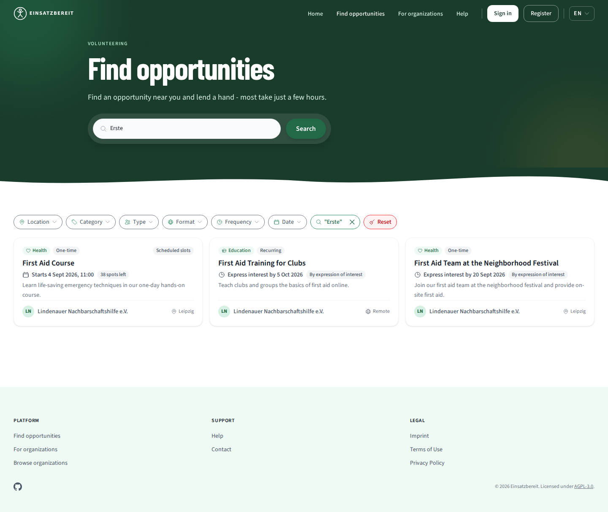

Auswirkung: Results look arbitrary. A user cannot tell whether the search worked, matched something they cannot see, or is simply broken, and has no basis for refining the query.

Verbesserungsvorschlag: Two independent improvements, either of which helps. Show a matched snippet with the query term highlighted, so a description-only match explains itself. And restrict matching to the active locale, or state plainly that both languages are searched. Aufwand: M (likely needs a backend field for the snippet, which is out of scope for this run; the locale restriction is a query parameter away)

#### F8 - The map disappears without a fallback, and two different addresses are shown with the same icon

**Kategorie:** Content
**Schweregrad:** Mittel
**Konfidenz:** Bestätigt
**Einordnung:** Best Practice (Nielsen-Norman-Heuristik #1 Sichtbarkeit des Systemstatus; #6 Wiedererkennen statt Erinnern)
**Ort:** `/volunteer-opportunities/01a0254e-5029-7995-a08b-315bdb66583b` ("Kleiderausgabe für Bedürftige") - Persona: any - Viewport: all - Sprache: DE and EN

Beleg: `detail-without-map.png`. `document.querySelector('.leaflet-container')` returns nothing on this page; on "Futterspenden-Sammlung" it returns a 668x254 map. The "Route planen" link survives but falls back to an address string (`destination=Lagerstra%C3%9Fe%2010,%2006108%20Halle%20(Saale)`) instead of coordinates, and now floats alone under the tag row with nothing above it. Separately, the page shows the opportunity location "Lagerstraße 10, 06108 Halle (Saale)" in the WO column and the organisation's seat "Karl-Heine-Straße 12, 04177 Leipzig" in the organisation card, both with the same pin glyph and no label distinguishing them. The two cities are 150km apart.

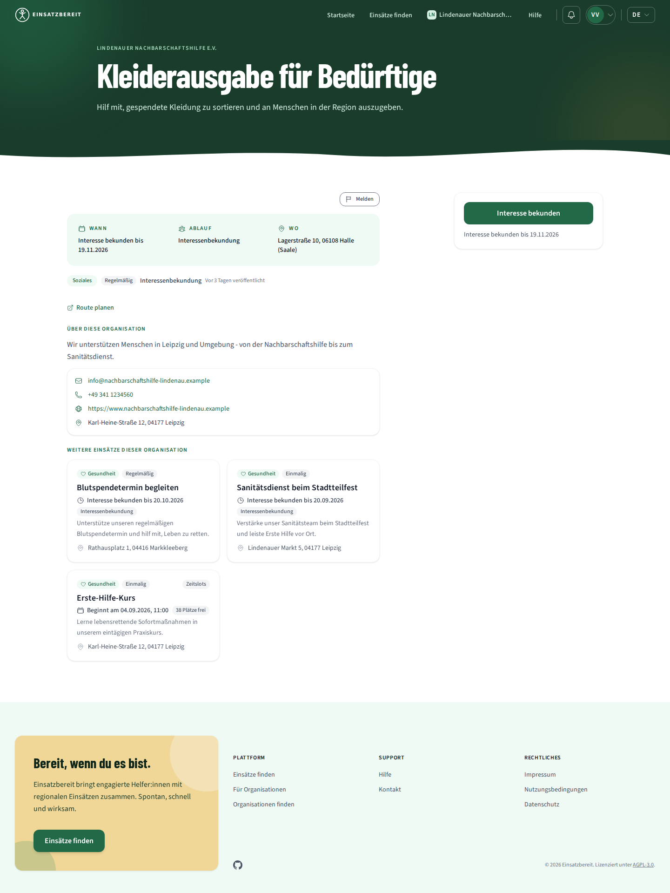

Auswirkung: The missing map reads as a failed load rather than a deliberate state. The unlabelled second address is worse: a volunteer scanning the page for "where do I go" can easily take the organisation's registered seat for the meeting point.

Verbesserungsvorschlag: When coordinates are absent, render a labelled placeholder in the map's slot ("Für diesen Einsatz liegt keine Kartenposition vor") so the block keeps its shape and the "Route planen" link keeps its context. Independently, label the organisation card's address ("Sitz der Organisation") or drop it, since the opportunity's own WO field already answers the question that matters. Aufwand: S

<probably backend> The missing coordinates themselves come from the API. The frontend fallback above is what is in scope here.

#### F11 - A generic "unexpected error" toast is shown for any unhandled promise rejection

**Kategorie:** Content
**Schweregrad:** Mittel
**Konfidenz:** Bestätigt (mechanism), Wahrscheinlich (frequency for real users)
**Einordnung:** Best Practice (Nielsen-Norman-Heuristik #9 Fehler erkennen, diagnostizieren, beheben; `/frontend-design` writing rules: errors state what happened and how to fix it)
**Ort:** Global - Persona: any - Viewport: all - Sprache: DE and EN

Beleg: `generic-error-toast-and-quotes.png`. Code: `main.tsx:59-62` registers `window.addEventListener("unhandledrejection", ...)` and unconditionally calls `dispatchToast("error", i18n.t("error.serverError"))`, which renders "Ein unerwarteter Fehler ist aufgetreten. Bitte versuche es später erneut." During this session it fired roughly 2 to 3 seconds after loading the organiser dashboard and `/my-signups` while every single API call on those pages returned 200. The rejection that triggered it in my case was a service-worker registration failure, which is an artefact of this review harness rather than something a normal visitor hits, so I am not claiming this specific trigger affects production. The mechanism is the finding: any rejected promise anywhere, including an aborted fetch on navigation, a Leaflet tile error, or a browser extension, is reported to the user as a server problem.

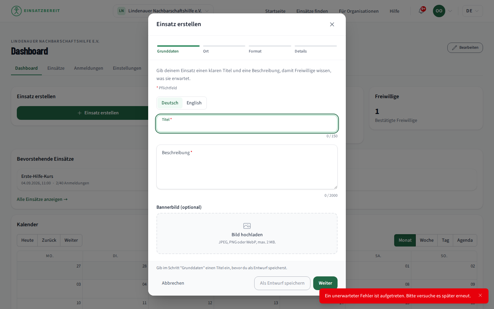

Auswirkung: The message is wrong twice over. It attributes a client-side event to the server, and it gives the user nothing to act on. A toast that appears without a cause the user can perceive teaches people to ignore all toasts, including the ones that matter.

Verbesserungsvorschlag: Keep the handler for telemetry, but stop routing it to a user-facing toast by default. Show a toast only for rejections that are recognisably API failures (the `api-instance.ts` error shape), and let everything else log to the console. If a catch-all message is wanted, make it honest and specific to what the user can do, not "Bitte versuche es später erneut". Aufwand: S

#### F16 - German typography: hyphens used as dashes, and two competing quotation styles

**Kategorie:** Content
**Schweregrad:** Mittel
**Konfidenz:** Bestätigt
**Einordnung:** Best Practice (Duden, Richtlinien zur Zeichensetzung: Gedankenstrich = Halbgeviertstrich; German quotation marks are `„…"`) plus projekteigene Konvention at `.github/workflows/lint.yml:18` (`ban-typographic-dashes`)
**Ort:** All German surfaces - Persona: any - Viewport: all - Sprache: DE (and, for dashes, EN)

Beleg: `hero-375-dash-and-pill.png` and character counts over `frontend/src/locales/de.json` (1357 strings):

| Character | de.json | en.json |
| --- | ---: | ---: |
| `"` U+0022 straight | 40 | 46 |
| `„` U+201E | 20 | 0 |
| `"` U+201C | 20 | 2 |
| strings containing `" - "` used as a dash | 45 | 43 |

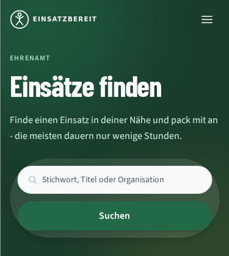


Concrete instances: `opportunitiesPage.lead` renders as "Finde einen Einsatz in deiner Nähe und pack mit an - die meisten dauern nur wenige Stunden.", which at 375px wraps so that line two begins with "- die meisten" and reads as a bullet. `opportunities.dateRangeDisplay` is `"{{from}} - {{to}}"`, so every time range shows as "11:00-19:00". Within a single dialog, the upload error uses correct German quotes (`„notanimage.txt" ist kein unterstütztes Bild.`) while the draft hint two lines below uses straight ones (`Gib im Schritt "Grunddaten" einen Titel ein`) - visible together in `generic-error-toast-and-quotes.png`.

Auswirkung: For a German-first product this is the most visible signal of polish there is, and it is inconsistent within a single screen. The line-initial hyphen at mobile widths is the worst case, because it changes how the sentence parses.

Verbesserungsvorschlag: The `ban-typographic-dashes` job greps the whole repository, which is right for source and docs and wrong for user-facing copy. Scope it to exclude `frontend/src/locales/*.json` and `keycloak/**/messages/*`, then normalise those files: U+2013 (en dash) for sentence and range dashes, `„…"` for German quotations, `"…"` for English. (This report cannot spell the en dash literally, for the same reason.) Add a locale-file lint that enforces the opposite rule (no straight quotes in `de.json`) so the two conventions cannot drift again. Aufwand: M

#### F20 - The draft hint tells you to go to the step you are already on

**Kategorie:** Content
**Schweregrad:** Niedrig
**Konfidenz:** Bestätigt
**Einordnung:** Best Practice (Nielsen-Norman-Heuristik #2 Übereinstimmung mit der realen Welt)
**Ort:** Create-opportunity wizard, step 1 - Persona: Olaf - Viewport: all - Sprache: DE

Beleg: `generic-error-toast-and-quotes.png`, footer line: "Gib im Schritt "Grunddaten" einen Titel ein, bevor du als Entwurf speicherst." shown while the "Grunddaten" step is the active step. Key `createOpportunity.saveDraftRequiresTitle`.


Auswirkung: The hint sends the user looking for a step they are standing on, which reads as a bug in the wizard rather than as guidance.

Verbesserungsvorschlag: Make the copy step-aware. On step 1: "Gib einen Titel ein, um als Entwurf zu speichern." On later steps, keep the current wording. Aufwand: S

#### F21 - Every card on "Meine Anmeldungen" repeats the same status sentence

**Kategorie:** Content
**Schweregrad:** Niedrig
**Konfidenz:** Bestätigt
**Einordnung:** Best Practice (Nielsen-Norman-Heuristik #8 Ästhetisches und minimalistisches Design)
**Ort:** `/my-signups` - Persona: Vera - Viewport: all - Sprache: DE and EN

Beleg: the three pending cards each carry the identical sentence "Die Organisation prüft deine Anmeldung. Du bekommst eine Nachricht, sobald sie bestätigt ist." (see the page text dump; visible in the review's `/my-signups` capture). The sentence occupies two lines per card and is the largest block of text on the screen.

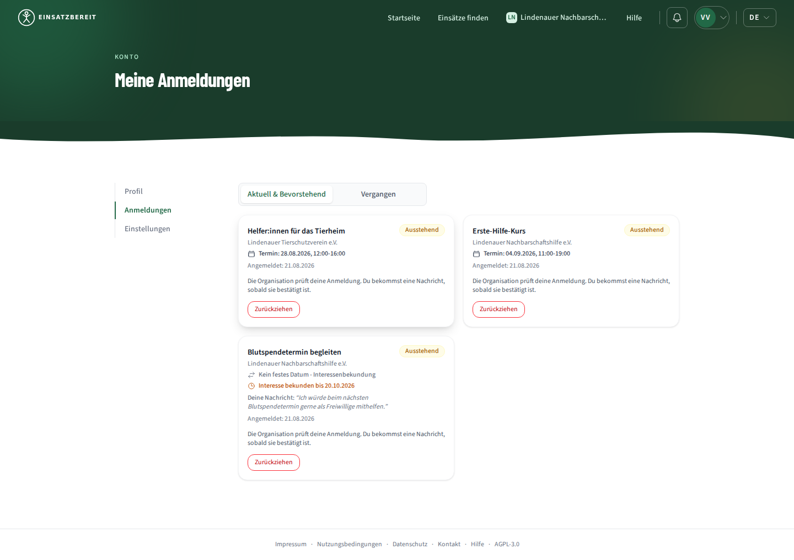

Auswirkung: The repetition crowds out the details that actually differ per card (title, organisation, date, message) and makes the list slower to scan.

Verbesserungsvorschlag: Show the explanation once per status group, or move it into a tooltip or popover on the "Ausstehend" badge, and let the card carry only the badge. Aufwand: S

### Visual Design

#### F3 - The installed PWA icon is a blank green square

**Kategorie:** Visuelles Design
**Schweregrad:** Hoch
**Konfidenz:** Bestätigt
**Einordnung:** Best Practice (W3C Web App Manifest / maskable-icon guidance; brand identity)
**Ort:** `/icons/icon-192.png`, `/icons/icon-512.png`, referenced by both manifests and by `<link rel="apple-touch-icon">` - Persona: any installing the PWA - Viewport: n/a - Sprache: n/a

Beleg: `pwa-app-icon-512.png`. Both files decode to a single colour, `rgb(45,138,94)` (the theme colour `#2d8a5e`), across all 36,864 and 262,144 pixels respectively. There is no mark, no wordmark, nothing. By contrast `pwa-shortcut-icon.png` (`/icons/shortcut-search.png`, 96x96) is a properly composed green rounded square with a white magnifying glass, and `/favicon.svg` contains the real logo mark. The 512px file is additionally declared with `"purpose": "maskable"` while being identical to the `any` variant, so even if a logo were added it would need a safe zone.


Auswirkung: An installed Einsatzbereit on a home screen is an unlabelled green tile. It cannot be found by eye among other icons, and it is the single most-repeated brand impression the product gets. That the shortcut icons are correct makes this read clearly as an oversight rather than a choice.

Verbesserungsvorschlag: Render `favicon.svg`'s mark onto both PNGs, matching the shortcut icons' treatment. Produce a separate maskable variant with the mark inside the 80% safe zone and declare that one as `"purpose": "maskable"`, leaving the unpadded version as `"any"`. Aufwand: S

#### F4 - The page-header band and the page body do not share a left gutter at desktop widths

**Kategorie:** Visuelles Design
**Schweregrad:** Mittel
**Konfidenz:** Bestätigt
**Einordnung:** Best Practice (a consistent layout grid; Nielsen-Norman-Heuristik #4 Konsistenz und Standards)
**Ort:** `/opportunities`, `/organizations`, `/volunteer-opportunities/{id}` - Persona: any - Viewport: 1440 (not reproducible at 768 or 375) - Sprache: DE and EN

Beleg: `grid-opportunities.png` and `grid-opportunity-detail.png` show measured marker lines drawn at the two edges. Measured left offsets at 1440px:

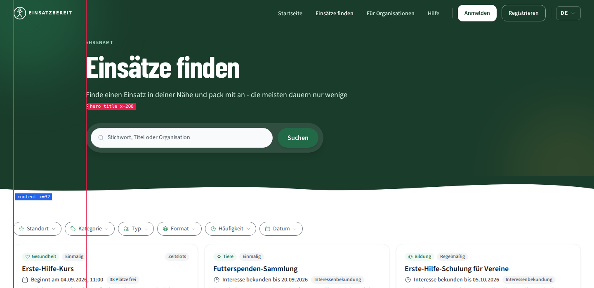
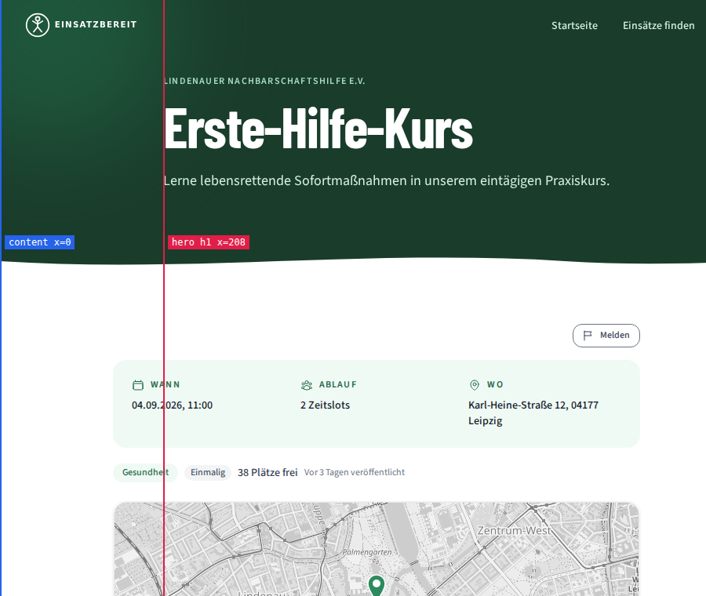

| Route | Hero `h1` | First content block | Delta |
| --- | ---: | ---: | ---: |
| `/opportunities` | 208 | 32 | **176** |
| `/organizations` | 208 | 32 | **176** |
| `/volunteer-opportunities/{id}` | 208 | 144 | **64** |
| `/help`, `/contact`, `/imprint`, `/terms-of-use`, `/my-signups`, `/profile` | 208 | 208 | 0 |

At 768px every route measures 24/24. So six templates honour a 208px gutter and three break it, including the two directory pages that are the product's main entry points.

Auswirkung: The title of the page floats 176px to the right of everything beneath it while the header logo sits flush at 32px, giving three competing left edges on one screen. It is the kind of misalignment that is hard to name but reliably makes a page feel unfinished, and it is on the pages most visitors see first.

Verbesserungsvorschlag: Give `PageHeaderBand` and the body container the same max-width and padding tokens, and apply that pair on the three outliers. The already-correct pages show the intended value (208px at 1440), so this is a container class change rather than a redesign. Aufwand: S

#### F12 - The hero search wrapper uses a pill radius on a stacked column below 640px

**Kategorie:** Visuelles Design
**Schweregrad:** Niedrig
**Konfidenz:** Bestätigt
**Einordnung:** Präferenz (no standard is violated; this is a visual quality judgement)
**Ort:** `/` and `/opportunities` hero search - Persona: any - Viewport: 375 - Sprache: DE and EN

Beleg: `home-hero-375-pill.png`, `hero-375-dash-and-pill.png`. Code: `pages/HomePage.tsx:268` and `pages/OpportunitiesPage.tsx:39` both use `className="flex flex-col gap-3 rounded-full bg-white/10 p-3 ... sm:flex-row sm:items-stretch"`. Below the `sm` breakpoint the wrapper is a tall column, and `rounded-full` (`border-radius: 9999px`) turns it into a capsule whose curvature cuts across the corners, so the full-width `rounded-full` children visibly overhang the translucent wrapper at top left and top right.

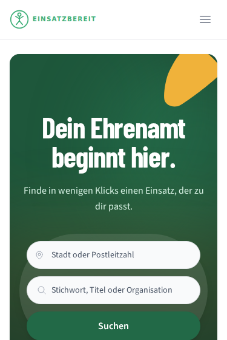


Auswirkung: The most prominent element on the mobile landing page has a container that does not fit its contents. It is small, but it is the first thing on the page.

Verbesserungsvorschlag: `rounded-3xl sm:rounded-full` on both wrappers, so the pill shape applies only in the horizontal layout it was designed for. Aufwand: S

### UX

#### F6 - No result count on the opportunity directory, while the organisation directory has one

**Kategorie:** UX
**Schweregrad:** Mittel
**Konfidenz:** Bestätigt
**Einordnung:** Best Practice (Nielsen-Norman-Heuristik #1 Sichtbarkeit des Systemstatus; #4 Konsistenz und Standards)
**Ort:** `/opportunities` versus `/organizations` - Persona: any - Viewport: all - Sprache: DE and EN

Beleg: `/organizations` renders "2 Organisationen gefunden." above the grid (`avatars-in-directory.png`). `/opportunities` renders nothing equivalent, in any state: no filters, with a keyword, or with filter chips active (`search-erste-in-english-ui.png`). It shows nine cards and a "Mehr laden" button with no indication of how many results exist or how many remain.

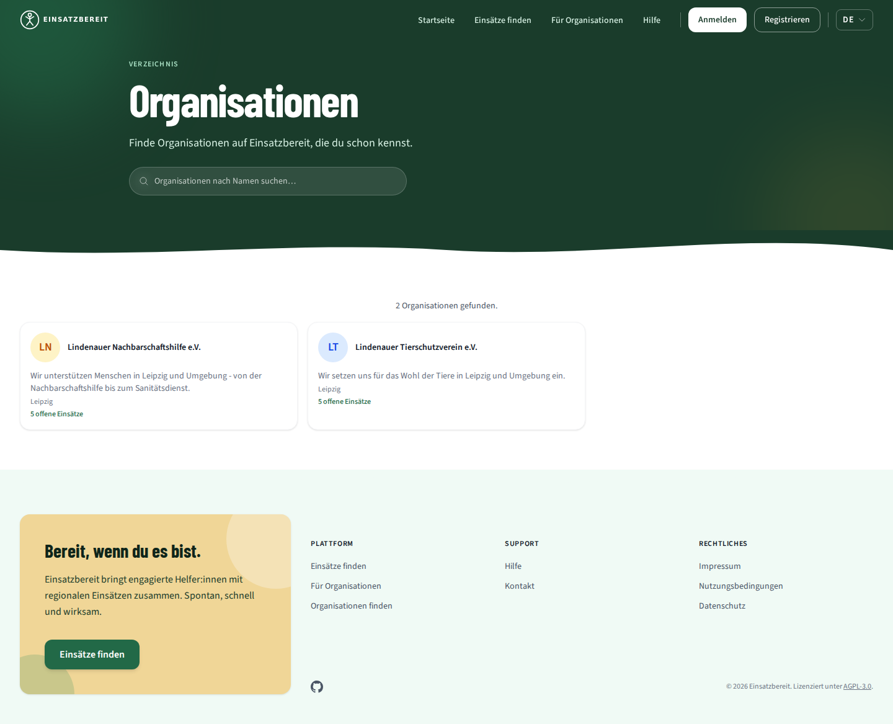

Auswirkung: On the product's primary browse surface, the user cannot tell whether a filter narrowed anything, whether "Mehr laden" will add two results or two hundred, or whether they have seen everything. The organisation directory proving the pattern already exists makes the omission harder to read as intentional.

Verbesserungsvorschlag: Show the same count line on `/opportunities`, and make "Mehr laden" state what is left ("Weitere 12 laden"). Aufwand: S

#### F9 - Achievement shows full progress but is styled as not yet earned

**Kategorie:** UX
**Schweregrad:** Mittel
**Konfidenz:** Bestätigt
**Einordnung:** Best Practice (Nielsen-Norman-Heuristik #1 Sichtbarkeit des Systemstatus; #4 Konsistenz und Standards)
**Ort:** `/profile`, "Abzeichen" section - Persona: Vera - Viewport: all - Sprache: DE and EN

Beleg: `achievement-complete-but-unearned.png`. The profile header states "1 Bestätigter Einsatz". The "Erster Schritt" badge, whose own description is "Verdient bei deinem ersten bestätigten Einsatz", shows a full green progress bar and "1 von 1" while being rendered in the unearned treatment: grey icon, no green border, no unlock date. The "Früheinsteiger" badge on the same grid shows what earned looks like (green border, green icon, "Freigeschaltet: 24.08.2026"). Code: `components/BadgeGrid.tsx:141` sets `isEarned = !!earned`, driven purely by the API's unlocked list, independent of the progress numbers rendered right beside it.

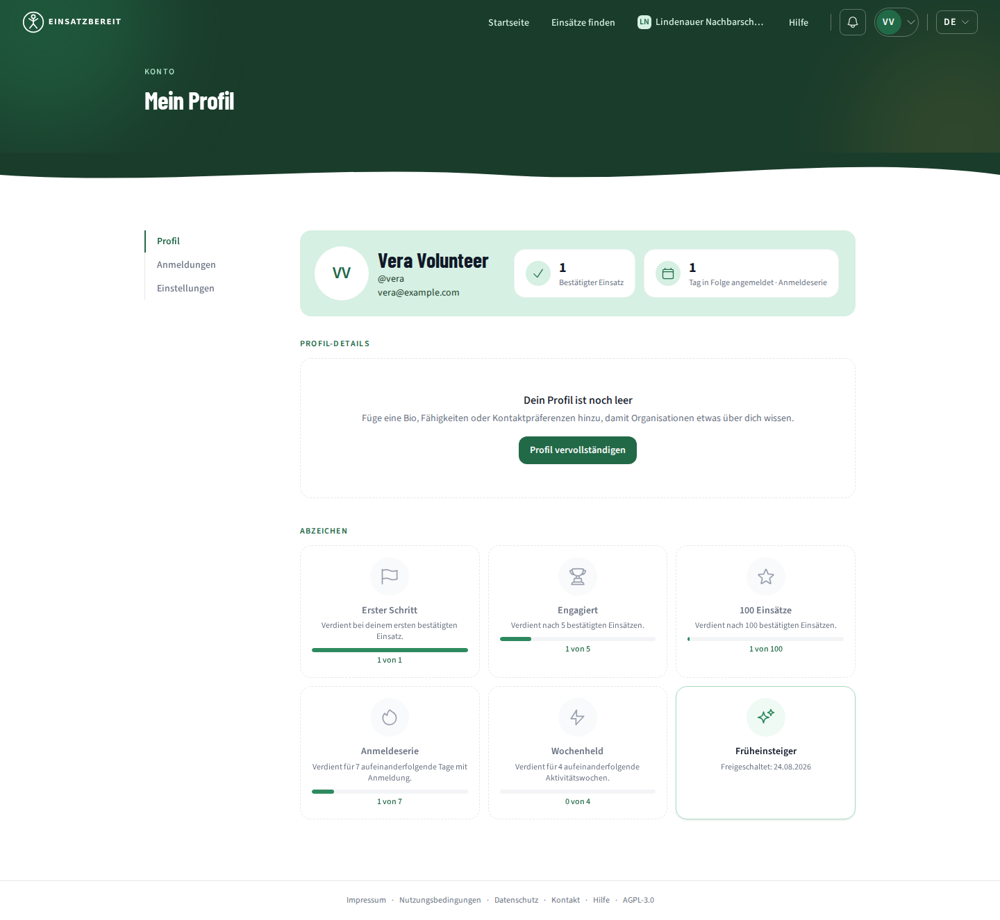

Auswirkung: The screen contradicts itself in two places at once. A user who has met a requirement and can see a full progress bar is told, by styling, that they have not.

Verbesserungsvorschlag: When `currentProgress >= progressTarget.target` but the achievement is not in the earned list, do not render the unearned treatment. Either show a pending state ("Wird in Kürze freigeschaltet") or suppress the progress bar so the card does not claim completion it cannot show. Aufwand: S

<probably backend> The award itself is not being written by the API. The frontend cannot fix that, but it can stop rendering the contradiction.

#### F10 - Organisers with more than one organisation have no switcher outside the organiser app

**Kategorie:** UX
**Schweregrad:** Mittel
**Konfidenz:** Bestätigt
**Einordnung:** Best Practice (Nielsen-Norman-Heuristik #3 Nutzerkontrolle und -freiheit; #6 Wiedererkennen statt Erinnern; #7 Flexibilität und Effizienz)
**Ort:** `/`, `/opportunities`, `/my-signups`, `/profile` versus `/app/{orgId}/...` - Persona: Olaf (member of two organisations) - Viewport: 1440 - Sprache: DE and EN

Beleg: `org-switcher-in-org-app.png` shows the switcher inside the organiser app: a pill in the header top left, opening a list with "Lindenauer Nachbarschaftshilfe e.V." (marked `aria-current="page"`, tinted `bg-brand-50`), "Lindenauer Tierschutzverein e.V." and "Organisation erstellen". `volunteer-header-no-switcher.png` shows the same user on `/`: the only organisation control in the header is a plain link, truncated to "Lindenauer Nachbarsch...", hard-wired to organisation one's dashboard. Enumerating the header's interactive elements on volunteer routes returns exactly that one link and no switcher.

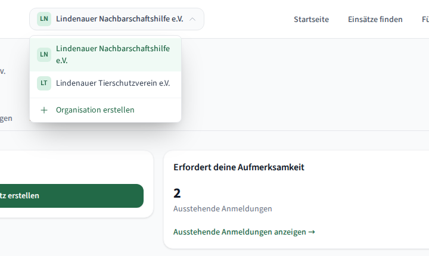
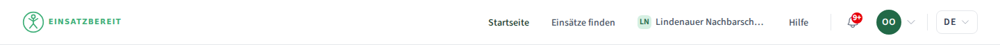

Auswirkung: The brief's question is whether it is always clear on whose behalf you are acting. Inside the organiser app, yes. Outside it, a two-organisation organiser sees one truncated name, cannot tell it is not a switcher, and has no route to their second organisation except going into the first one and switching there.

Verbesserungsvorschlag: Use the same `OrganizationSwitcher` component in the volunteer-side header whenever the user belongs to more than one organisation, instead of a static link. Where truncation is unavoidable, keep the full name in a `title` so hovering resolves it. Aufwand: M

#### F19 - The anonymous "are you already signed in?" probe always fails

**Kategorie:** UX
**Schweregrad:** Niedrig
**Konfidenz:** Bestätigt
**Einordnung:** Best Practice (Nielsen-Norman-Heuristik #7 Flexibilität und Effizienz)
**Ort:** Every route while logged out - Persona: anonymous - Viewport: all - Sprache: DE and EN

Beleg: On every anonymous page load the console reports `Refused to frame 'https://login.maik-hasler.de/' because an ancestor violates the following Content Security Policy directive: "frame-ancestors 'self'"`, accompanied by an HTTP 400 on the silent-renew authorize request. `curl -sSI https://login.maik-hasler.de/realms/einsatzbereit/protocol/openid-connect/auth` confirms Keycloak sends `Content-Security-Policy: frame-src 'self'; frame-ancestors 'self'` and `X-Frame-Options: SAMEORIGIN`. The app's own CSP does permit `frame-src https://login.maik-hasler.de`, so the block is on Keycloak's side. Code: `hooks/useSilentSsoProbe.ts` calls `auth.signinSilent()` for logged-out visitors and swallows the rejection.

```
$ curl -sSI https://login.maik-hasler.de/realms/einsatzbereit/protocol/openid-connect/auth
content-security-policy: frame-src 'self'; frame-ancestors 'self'; object-src 'none';
x-frame-options: SAMEORIGIN

$ curl -sSI https://einsatzbereit.maik-hasler.de/   # the app does allow the frame
content-security-policy: ... frame-src 'self' https://login.maik-hasler.de; ...

browser console, every anonymous page load:
Refused to frame 'https://login.maik-hasler.de/' because an ancestor violates the following
Content Security Policy directive: "frame-ancestors 'self'".
network: 400 GET .../protocol/openid-connect/auth?...&redirect_uri=.../silent-renew.html
```

This finding has no screenshot: the symptom lives in the console and the network log, not in rendered pixels.

Auswirkung: A visitor who already has a live Keycloak session in another tab is never recognised on einsatzbereit; they see "Anmelden / Registrieren" and have to click through a login they have already completed. Every anonymous page load also leaves a CSP violation and a failed request in the console, which is noise for anyone debugging something else. Note that this does **not** affect token renewal: I verified that renewal uses `grant_type=refresh_token` and works.

Verbesserungsvorschlag: Add the app origin to the realm's `frame-ancestors` (a Keycloak realm setting, not a frontend change). If that is not wanted, drop the probe rather than shipping a call that can never succeed; the cost of leaving it in is a guaranteed console error on every anonymous page view. Aufwand: S

<probably backend> The realm's Content-Security-Policy header is Keycloak configuration under `keycloak/`, outside this review's remit to change.

#### F22 - The two directory pages use different URL parameters, and one ignores the other's

**Kategorie:** UX
**Schweregrad:** Niedrig
**Konfidenz:** Bestätigt
**Einordnung:** Best Practice (Nielsen-Norman-Heuristik #4 Konsistenz und Standards)
**Ort:** `/opportunities?q=` versus `/organizations?search=` - Persona: any - Viewport: all - Sprache: DE and EN

Beleg: `pages/OpportunitiesPage.tsx:16` reads `searchParams.get("q")`; `pages/OrganizationsPage.tsx:31` reads `searchParams.get("search")`. Visiting `/organizations?q=zzzzz` returns the unfiltered list and still reports "2 organizations found", silently ignoring the parameter. For comparison, `/opportunities?q=zzzzz-nichts` correctly renders the empty state. This finding has no screenshot: the difference is in the URL contract, not in pixels.

Auswirkung: Two sibling pages that look identical behave differently, so a shared or bookmarked filtered URL works on one and silently does nothing on the other.

Verbesserungsvorschlag: Standardise on `q` for both and keep `search` as an accepted alias on `/organizations` so existing links survive. Aufwand: S

### UI

#### F2 - Every native dropdown renders without a dropdown indicator

**Kategorie:** UI
**Schweregrad:** Hoch
**Konfidenz:** Bestätigt
**Einordnung:** Best Practice (Nielsen-Norman-Heuristik #6 Wiedererkennen statt Erinnern; #4 Konsistenz und Standards)
**Ort:** `/app/{orgId}/dashboard/engagements` (Status filter), `/app/{orgId}/dashboard/members` (Einladen als), `/app/{orgId}/dashboard/opportunities/{id}/engagements` (two selects) - Persona: Olaf - Viewport: all - Sprache: DE and EN

Beleg: `select-without-chevron.png`. The "Status" dropdown renders as a plain rounded box reading "Alle Status", visually identical to the "Freiwilligen suchen" text input beside it. The browser console reports `Refused to load the image 'data:image/svg+xml;charset=utf-8,...'`. The deployed CSP is `img-src 'self' blob: https://api.maik-hasler.de https://storage.maik-hasler.de` with no `data:`. Code: `lib/formClasses.ts:8` combines `appearance-none` (which removes the native arrow) with `bg-[url('data:image/svg+xml,...')]` (which the CSP blocks), so neither arrow survives. Used at `pages/app/OrgEngagementsPage.tsx:172`, `pages/app/OrgMembersPage.tsx:297`, `pages/EngagementManagementPage.tsx:562` and `:584`. Note `lib/formClasses.test.ts:45` asserts the URL token is present, so the unit test passes while the deployed page does not render the icon.

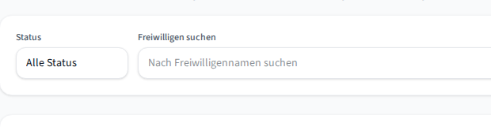

Auswirkung: Organisers cannot tell a dropdown from a text input. The most likely reaction to the status filter is to click into it and try to type. The app's own custom `Dropdown` component does show a chevron (visible in `past-slot-in-signup-picker.png`), which makes the inconsistency more confusing rather than less.

Verbesserungsvorschlag: Frontend-only fix, no infrastructure change needed: drop the background-image chevron and render an inline `<svg>` positioned absolutely over the select, exactly as `components/Header/LanguageSelector.tsx` already does for its trigger. That removes the CSP dependency entirely. Alternatively, add `data:` to `img-src`, but that is a deployment change and weakens the policy for the sake of one icon. Aufwand: S
#### F7 - The same organisation is drawn with two different avatar systems

**Kategorie:** UI
**Schweregrad:** Mittel
**Konfidenz:** Bestätigt
**Einordnung:** Best Practice (Nielsen-Norman-Heuristik #4 Konsistenz und Standards; #6 Wiedererkennen statt Erinnern)
**Ort:** `/organizations` and `/administration/users` versus opportunity cards, header and organisation switcher - Persona: any - Viewport: all - Sprache: DE and EN

Beleg: `avatars-in-directory.png` shows "Lindenauer Nachbarschaftshilfe e.V." as a 48px amber circle and "Lindenauer Tierschutzverein e.V." as a 48px blue circle. `avatars-on-cards.png` shows the same two organisations on the opportunity cards as 24px light-green rounded squares. Code: `components/Header/OrgAvatar.tsx` always uses `rounded-md bg-brand-100 text-brand-700` at 20 or 24px; `lib/avatarColor.ts` hashes the organisation id into a six-colour palette (brand, blue, purple, amber, teal, rose), used at `pages/OrganizationsPage.tsx:230` and `pages/AdministrationPage.tsx:327` with `rounded-full` at 40 or 48px.


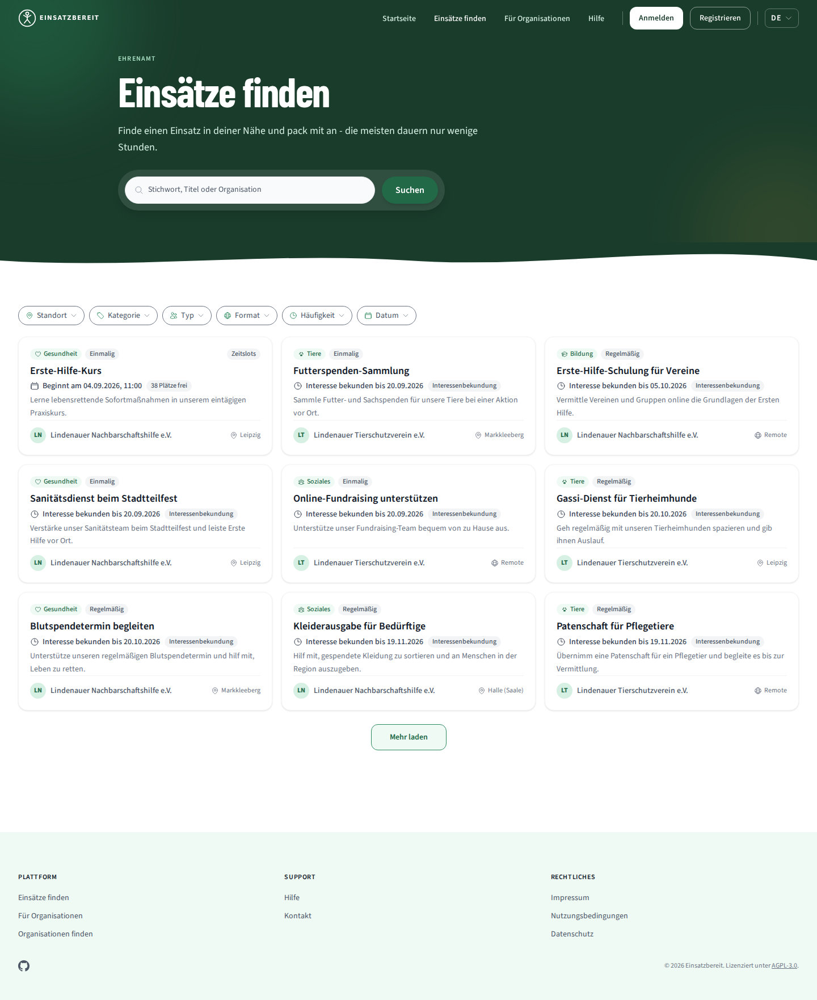

Auswirkung: An organisation has no stable visual identity across the product. A user who learns "the amber circle is the Nachbarschaftshilfe" on the directory page finds a green square on the browse page, which defeats the purpose of having an avatar at all. It also means the interface has two unrelated colour systems, one brand-locked and one randomised.

Verbesserungsvorschlag: Pick one. The hashed palette is the more useful of the two because it actually distinguishes organisations, so extend `OrgAvatar` to take the hashed colours and a size prop, and use it everywhere. If the small inline contexts should stay brand-green for visual calm, then make the directory use brand-green too and distinguish organisations by their logo instead. Aufwand: M

#### F13 - Two form implementations disagree on whether an invalid field should look invalid

**Kategorie:** UI
**Schweregrad:** Niedrig
**Konfidenz:** Bestätigt
**Einordnung:** Best Practice (Nielsen-Norman-Heuristik #9 Fehler erkennen, diagnostizieren, beheben; #4 Konsistenz und Standards)
**Ort:** Sign-up / expression-of-interest modal versus create-opportunity wizard - Persona: Vera and Olaf - Viewport: all - Sprache: DE and EN

Beleg: `error-without-field-styling.png` is the expression-of-interest modal after an empty submit, with the textarea blurred: the border computes to `oklch(0.928 0.006 264.531)`, the app's neutral grey, indistinguishable from a pristine field. Only the red helper text marks the error. `error-with-field-styling.png` is the create-opportunity wizard after an empty submit: red field borders, red labels, a red error dot on the "Deutsch" language tab, and a red step indicator. Both set `aria-invalid="true"` and `aria-describedby` correctly, so this is purely visual.

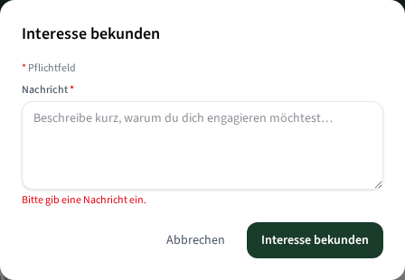


Auswirkung: The wizard's treatment is good and the modal's is not, and the same user meets both. In a longer form the modal's behaviour would mean a user who scrolls past the message has no way to locate the offending field.

Verbesserungsvorschlag: Extract the wizard's error styling into the shared field primitives in `lib/formClasses.ts` and drive it off `aria-invalid`, so any field marked invalid picks it up automatically. Aufwand: S

#### F17 - Navigation is implemented as buttons in the notification list and the organisation switcher

**Kategorie:** UI
**Schweregrad:** Niedrig
**Konfidenz:** Bestätigt
**Einordnung:** Best Practice (HTML semantics: `<a>` for navigation, `<button>` for actions; WAI-ARIA Authoring Practices)
**Ort:** Notification dropdown, organisation switcher - Persona: Olaf, Vera - Viewport: all - Sprache: DE and EN

Beleg: Enumerating the notification panel returns `li: link=NONE buttons=[...]` for every row; `components/Header/NotificationItem.tsx:29` calls `onSelect(n)`, which `NotificationDropdown.tsx:65-72` resolves to `onNavigate(n.actionUrl)`. The organisation switcher rows are likewise `<button data-testid="org-switch-row">` (markup in `org-switcher-in-org-app.png`'s captured HTML). These controls do navigate; they are simply not links.

```
notification panel, every row:   li: link=NONE  buttons=["Ungelesen Neue Anmeldung ...", "Löschen: ..."]
org switcher, every row:         <button type="button" data-testid="org-switch-row" aria-current="page">
```

No screenshot: the rows look correct, the defect is in the element type.

Auswirkung: Middle-click, ctrl-click, "open in new tab" and "copy link address" do not work, and the browser shows no destination on hover. Screen readers announce "Schaltfläche" for something that changes the page. For a notification list, where opening several items in tabs is a natural workflow, this costs real efficiency.

Verbesserungsvorschlag: Render both as `<a href={actionUrl}>` and keep the click handler for the mark-as-read side effect, calling `preventDefault` only when doing client-side routing. Aufwand: S

#### F23 - A user without a display name shows their username twice

**Kategorie:** UI
**Schweregrad:** Niedrig
**Konfidenz:** Bestätigt
**Einordnung:** Präferenz
**Ort:** `/administration/users` - Persona: admin - Viewport: all - Sprache: DE and EN

Beleg: `admin-user-without-name.png`. The API (`GET /v1/admin/users`) returns `firstName: null, lastName: null` for one account, and the row renders the username as the display name on line one and again in the meta line: "maikhasler" above "maikhasler - maikhasler@proton.me".

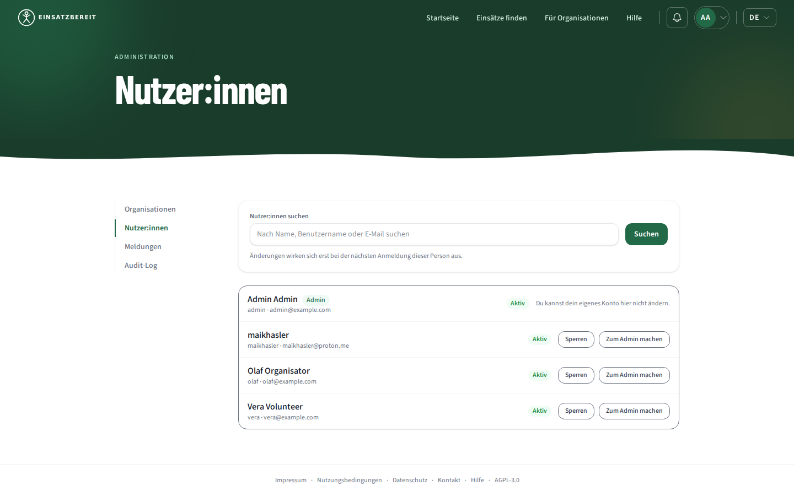

Auswirkung: Minor, but it makes the row look like a rendering fault next to the three rows that have proper names.

Verbesserungsvorschlag: When no display name exists, either omit the meta-line username or label the primary line ("Kein Name hinterlegt"). Aufwand: S

### Accessibility

The automated layers already in CI (`jsx-a11y`, axe-core in Playwright) cover the rule-checkable surface, and they are doing their job: I found no missing accessible names, including on the stretched card links, which carry `aria-label={title.text}` (`components/OpportunityCard.tsx:156`). The findings below are the manual layer.

**What I checked and found correct**, recorded so it is not re-litigated:

- Skip link is the first tab stop and becomes visible on focus (`good-skip-link-focus.png`).
- Every one of the 38 elements I traversed on `/` and `/opportunities` has a visible 2px focus outline, with the ring colour adapting to its backdrop (brand green on white, white on dark green, light green on the hero band).
- Tab order matches visual order. The apparent upward jumps in a card grid are correct DOM order within each card, not a defect.
- Modals: `aria-modal="true"`, `aria-labelledby`, focus moved into the dialog on open, Escape closes, focus restored to the triggering button on close. Validation errors carry `role="alert"` and the field gets `aria-invalid="true"` plus `aria-describedby`.
- `prefers-reduced-motion: reduce` removes the `fade-up` keyframe animations entirely and switches `scroll-behavior` from `smooth` to `auto`. The only surviving transitions are 0.15s to 0.3s colour changes, and transform-based hover effects carry `motion-reduce:transition-none`.
- Text contrast passes AA on every route measured. The worst pair on the homepage is 5.48:1 (`#226947` on `#d6f0e3`, the avatar initials); the Keycloak login page has no failures either.

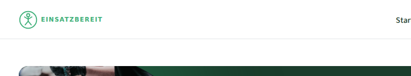
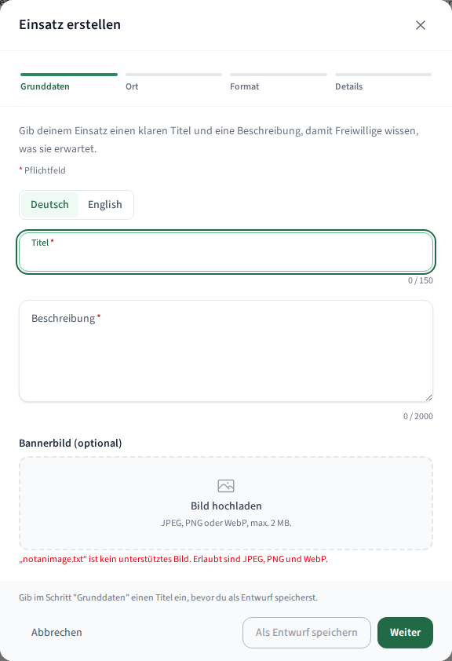
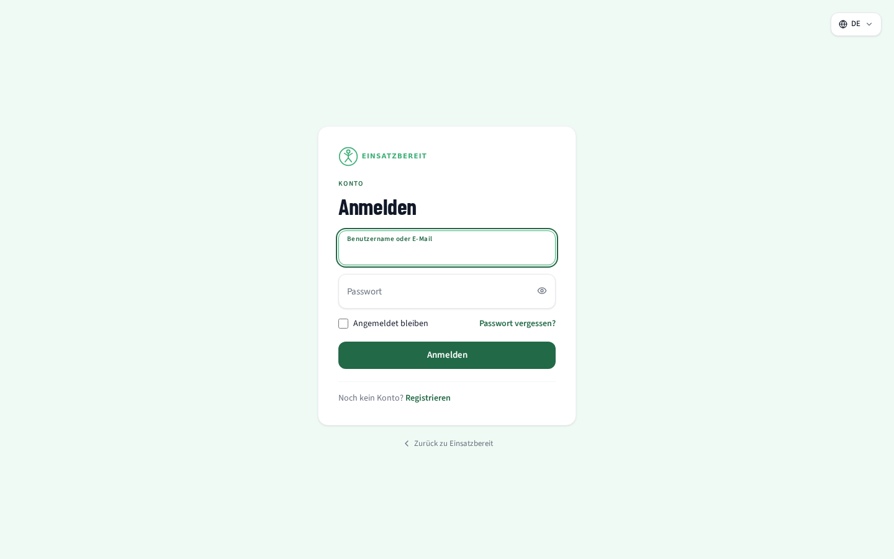

#### F14 - Disclosure triggers lack `aria-haspopup`

**Kategorie:** Barrierefreiheit
**Schweregrad:** Niedrig
**Konfidenz:** Bestätigt
**Einordnung:** Best Practice (WAI-ARIA Authoring Practices, Disclosure pattern)
**Ort:** Language selector, organisation switcher - Persona: any - Viewport: all - Sprache: DE and EN

Beleg: The language selector trigger has `aria-expanded` and a good `aria-label` ("DE - Sprache wechseln, aktuell Deutsch"), and its popup is a `<ul aria-label="Sprache wechseln">` whose current entry carries `aria-current="true"`. It has no `aria-haspopup` and no `aria-controls`. The organisation switcher trigger has `aria-expanded` only: `haspopup=null controls=null`, though its list does use `aria-current="page"` correctly. The notification bell is the good example: it has both `aria-expanded` and `aria-controls="notification-panel"`.

Auswirkung: Screen reader users get no advance warning that activating the control opens a list. It is a small gap in otherwise careful ARIA work, and axe-core will not flag it because `aria-expanded` alone is valid.

```
language selector trigger:   aria-expanded=true  aria-haspopup=null  aria-controls=null
org switcher trigger:        aria-expanded=true  aria-haspopup=null  aria-controls=null
notification bell:           aria-expanded=true  aria-haspopup=null  aria-controls=notification-panel  <- has aria-controls
```

No screenshot: the attributes are invisible on screen by definition.

Verbesserungsvorschlag: Add `aria-haspopup="listbox"` (or `"menu"`, matching whichever role the popup takes) and `aria-controls` pointing at the list id, on both triggers. Aufwand: S

### i18n

**What I checked and found correct:** `<html lang>` updates on switch; the manifest link swaps between `/manifest.de.webmanifest` and `/manifest.en.webmanifest`; route and query string are preserved (`/opportunities?q=Erste&page=1` survived the switch intact); the chosen language survives the full Keycloak login round trip; document titles are translated; and a scan of every rendered line across nine routes in both languages surfaced zero raw i18next keys and no mixed-language leftovers in the chrome.

#### F15 - German UI strings overflow the notification panel header

**Kategorie:** i18n
**Schweregrad:** Niedrig
**Konfidenz:** Bestätigt
**Einordnung:** Best Practice (layouts must absorb the length growth of the non-source language)
**Ort:** Notification dropdown header - Persona: any signed-in user - Viewport: 1440 (panel is a fixed 320px) - Sprache: DE

Beleg: `notifications-panel-de.png` versus `notifications-panel-en.png`, with measured control boxes:

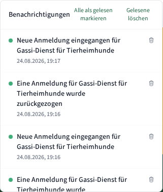
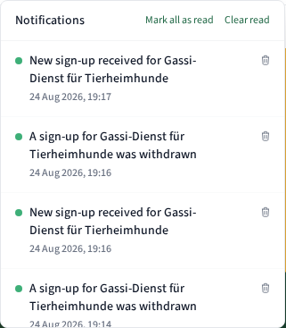

| Control | German | English |
| --- | --- | --- |
| Mark all read | "Alle als gelesen markieren" 91x32, **2 lines** | "Mark all as read" 77x16, 1 line |
| Clear read | "Gelesene löschen" 62x32, **2 lines** | "Clear read" 51x16, 1 line |

Auswirkung: In the product's default language both header controls wrap, crowding the "Benachrichtigungen" title and making the two actions look like four items. The panel is sized for the shorter language.

Verbesserungsvorschlag: Widen the panel at `sm` and above, or move the two actions to a footer row, or shorten the German to "Alle gelesen" / "Gelesene löschen". Aufwand: S

#### F18 - Notification text keeps the German opportunity title in the English interface

**Kategorie:** i18n
**Schweregrad:** Niedrig
**Konfidenz:** Bestätigt
**Einordnung:** Best Practice (consistent terminology per language)
**Ort:** Notification dropdown - Persona: Olaf - Viewport: all - Sprache: EN

Beleg: `notifications-panel-en.png`. In the English UI a row reads "New sign-up received for **Gassi-Dienst für Tierheimhunde**", while the same opportunity appears on the English browse page as "Dog Walking for Shelter Dogs" (confirmed by searching `Tierheim` in the English UI, which returns "Dog Walking for Shelter Dogs" and "Volunteers for the Animal Shelter"). So the catalogue is localised and the notification is not.


Auswirkung: An English-speaking organiser sees a German title in an English sentence and cannot match it to the entry they see everywhere else in the product.

Verbesserungsvorschlag: Resolve the opportunity title client-side from `actionUrl`'s id in the active locale rather than rendering the stored string, or have the notification carry both localised titles. Aufwand: M

<probably backend> The notification body is composed and stored server-side at creation time, which is why it is frozen in the language of the moment.

### PWA

**What I checked and found correct:** both manifests are complete and well-formed, with `id`, `scope`, `display: standalone`, `theme_color: #2d8a5e`, five screenshots in both `wide` and `narrow` form factors with descriptive labels, and two app shortcuts with proper icons. The app's offline states are genuinely good: `offline-state.png` shows an icon, "Du bist offline", a plain explanation and an "Erneut versuchen" action, and `routeState.offline`, `opportunities.offline`, `organizations.offline` and `opportunities.offlineDetail` cover the surfaces separately rather than with one generic message. This reads as a state, not as an error, which is what the brief asked.

#### F24 - The service worker caches the shell but no content, so a previously visited opportunity is unavailable offline

**Kategorie:** PWA
**Schweregrad:** Mittel
**Konfidenz:** Wahrscheinlich (static analysis of the deployed `sw.js`; see Scope & Method for why live SW testing was impossible here)
**Einordnung:** Präferenz, with a product-specific rationale
**Ort:** `/sw.js` - Persona: any - Viewport: all - Sprache: n/a

Beleg: The deployed `sw.js` is a Workbox build whose `precacheAndRoute` manifest covers `index.html`, `favicon.svg`, both manifests and the icons, plus a single runtime route: `registerRoute(/\/assets\/.+\.js$/, new StaleWhileRevalidate({ cacheName: "route-chunks" }))`. There is no runtime caching rule for `https://api.maik-hasler.de/**`. `NavigationRoute` falls back to `/index.html`, so the shell boots offline and then every data-dependent view renders its offline empty state.

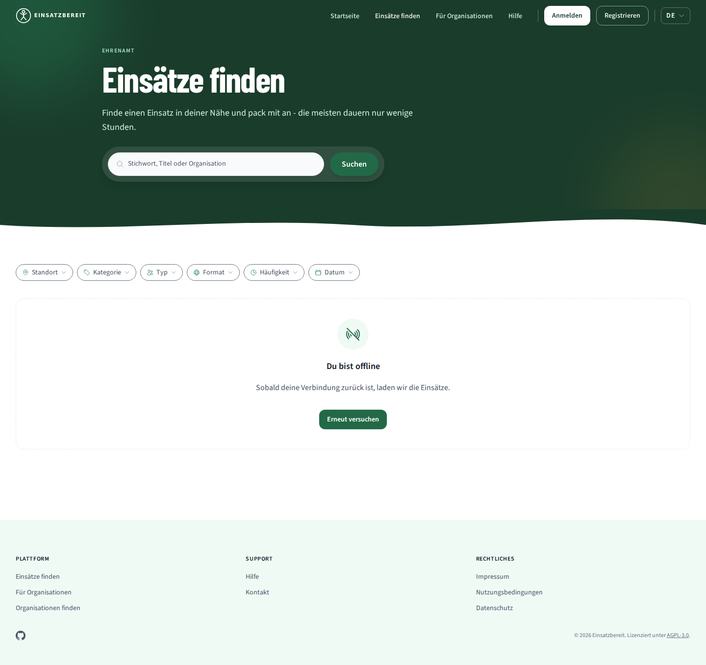

Auswirkung: The product's own pitch is spontaneous, local, short-notice help. The scenario where offline matters most is a volunteer standing at the meeting point with poor signal, wanting the address, the time and the organiser's phone number from a page they opened an hour ago. Today that page comes back empty. The offline messaging is polished, but it is telling the user something they cannot act on.

Verbesserungsvorschlag: Add a Workbox `NetworkFirst` (or `StaleWhileRevalidate`) runtime route for `GET /v1/opportunities/*` and `GET /v1/me/engagements`, with a small `ExpirationPlugin` cap. Render cached data with a "Zuletzt aktualisiert: ..." note so the user knows it may be stale, instead of showing the offline empty state when something usable is cached. Aufwand: M

## Parking Lot

- **Duplicated refresh-token calls.** During the renewal watch, three `POST .../openid-connect/token` requests with `grant_type=refresh_token` fired within five seconds (17:48:25, 17:48:30, 17:48:30). Nothing broke, but with refresh-token rotation a duplicate use can invalidate a session. Belongs to the `bugs` lens.
- **The 404 route returns HTTP 200.** `/gibt-es-nicht` serves the SPA shell with a 200 status, so crawlers see a soft 404. Infrastructure / SEO, not frontend UX.
- **Real personal data in a publicly documented test environment.** The organiser engagement list and the admin user list expose a real, non-`example.com` email address to anyone who logs in with the credentials published in the README. Privacy consideration for the `security` lens, not a UI defect.
- **Two tab stops per opportunity card.** The stretched card link plus the nested organisation link means 18 tab stops for nine cards. Defensible, but worth a look if keyboard traversal of the directory is ever measured.
- **`OrgAvatar` renders initials via `before:content-[attr(data-initial)]`.** Correctly marked `aria-hidden`, so not an a11y issue, but the text is unselectable and vanishes if the stylesheet fails. Code-hygiene lens.
- **Two different footers.** Public pages get the three-column footer with the yellow CTA card; account and organiser pages get a one-line legal strip. Probably deliberate (marketing versus app), noted in case it is not.
- **`/manifest.webmanifest`, `/manifest.json` and `/site.webmanifest` all return the SPA shell** with `Content-Type: text/html`. Harmless, since the real manifests are correctly linked, but tools that probe conventional paths will get HTML.

## Prioritized Next Steps

**Quick wins (low effort, high impact) - roughly one working day for all five:**

1. **F1** Filter past time slots out of the detail list, the sign-up picker and the aggregate spot count. This is the only finding where a user can complete an action that cannot work.
2. **F2** Replace the CSP-blocked `data:` chevron with an inline SVG, matching `LanguageSelector`. Restores the dropdown affordance app-wide.
3. **F3** Draw the logo onto `icon-192.png` and `icon-512.png` and add a padded maskable variant.
4. **F4** Align the header band and body containers on `/opportunities`, `/organizations` and the detail page.
5. **F12** `rounded-3xl sm:rounded-full` on the two hero search wrappers.

**Worth doing next (contained, clearly bounded):**

6. **F6** Result count on `/opportunities`, and a remaining-count on "Mehr laden".
7. **F13** Move the wizard's error styling into the shared field primitives, driven off `aria-invalid`.
8. **F11** Stop routing every unhandled rejection to a user-facing "server error" toast.
9. **F9** Do not render a completed progress bar in the unearned treatment.
10. **F8** Map placeholder when coordinates are missing, and label or drop the organisation's seat address.
11. **F14**, **F17**, **F20**, **F22**, **F23** are all single-line or single-component changes.

**Larger undertakings (need a decision before code):**

12. **F16** Scope `ban-typographic-dashes` away from locale files, then normalise German dashes and quotation marks and add a locale-file lint to keep them normalised. The convention decision matters more than the edit.
13. **F7** Choose one avatar system and apply it everywhere. Small in code, but it is a visual-identity decision.
14. **F24** Add runtime caching for opportunity data and render cached content with a freshness note. This is the one change that would make the PWA earn its install for the product's actual use case.
15. **F10** Bring the organisation switcher to the volunteer-side header for multi-organisation members.
16. **F5** Search result snippets with match highlighting. Needs a backend field, so plan it with the API rather than around it.
