# Frontend & UX Review - einsatzbereit - 2026-08-24

Reviewed: <https://einsatzbereit.maik-hasler.de/> (staging, publicly testable per README)
Commit: not exposed by the deployment. Nearest local reference: `ee27be5` on `origin/main`.
Frontend bundle `last-modified: Mon, 24 Aug 2026 05:32:17 GMT`, served by nginx from `api.maik-hasler.de` + `login.maik-hasler.de`.

Report-only. No product code was changed. Evidence screenshots live in `docs/reviews/assets/2026-08-24/`.

---

## Executive Summary

Einsatzbereit is in far better shape than a review of this depth usually finds. Every piece of automation the project already runs is visibly paying off: measured text contrast passes WCAG AA on all thirteen routes I sampled across four personas, all 22 tab stops I walked through the landing page show a visible focus ring (including on the dark hero, where a white halo carries the indicator), modals trap focus and return it to their trigger, `prefers-reduced-motion` shuts off animation completely (0 running animations, `scroll-behavior: auto`), the drag-and-drop dashboard ships a full keyboard alternative with live-region feedback (WCAG 2.2 SC 2.5.7, which no automated checker tests), and DE/EN parity is complete down to the legal pages, with route, query string and form state preserved across a language switch. The PWA swaps to a localized manifest at runtime and presents offline as a state rather than an error.

What the automation cannot see is where the problems are. The single most serious finding is that the opportunity detail page lists time slots that have already happened under the heading "Verfügbare Zeitslots", keeps them clickable, and walks the user into a confirmation dialog that reads "Du meldest dich für 18.08.2026, 11:00-19:00 an." six days after that date passed (F17). The page header computes the correct next slot with `findNextTimeSlot`; the list below simply renders `timeSlots.map(...)` unfiltered.

The other four risks worth naming: the organization switcher's middle-truncation splits the name at the character midpoint rather than a word boundary, so at 375 px the control that tells an organizer whose behalf they are acting on reads "Lin... schaftshilfe e.V." (F27); the organizer tab bar scrolls "Mitglieder" entirely off-screen at 375 px with no scroll affordance (F28); the primary "Suchen" CTA sits at 1.26:1 against its own container on both search entry points, so the button has no shape (F9); and the word "Anmelden" carries four unrelated meanings across the product - log in, sign up for a slot, my signups, and login streak (F1).

Two structural themes run underneath the individual findings. First, the product has good patterns and does not apply them consistently: the organizer tab bar marks the current tab with a green underline while the main header marks the current page with a 1.20:1 lightness difference and nothing else; the members page explains a disabled control with visible text and `aria-describedby` while the settings page hides the same kind of explanation in a `title` tooltip. Second, the desktop layout leaves roughly half the canvas empty on the detail page and across the organizer area, which reads as unfinished rather than airy.

## Scope & Method

**Tooling.** No `/live-verify` skill exists in this environment, so I drove the live site directly with Playwright `playwright-core@1.56.1` against the pre-installed Chromium 141 (`/opt/pw-browsers/chromium`), routed through the session's egress proxy. **Only one browser engine (Chromium) was available**; nothing here has been checked in Firefox or WebKit. Scripts and raw captures are in the session scratchpad; the curated evidence set is committed alongside this report.

**Viewports.** 375x812 (mobile, `isMobile`+`hasTouch`, DPR 2), 768x1024 (tablet), 1440x900 (desktop). Locale `de-DE`, timezone `Europe/Berlin`. "Today" during the review was 2026-08-24.

**Personas.** Anonymous, `vera` (user, also a plain member of Lindenauer Nachbarschaftshilfe e.V. in the seed data), `olaf` (user + organisator), `admin`.

**Languages.** German (default) and English, switched both via the in-app selector and via a seeded `i18nextLng`. English was checked on the landing page, the opportunity list, both legal pages, the help page, the 404 page and the Keycloak login.

**Pages covered.** Landing page; opportunity list with all six filter dropdowns; opportunity detail in both participation modes (scheduled slots and expression of interest); sign-up, withdraw, feedback, report and add-to-calendar dialogs; my signups (both scopes); profile overview, profile settings; organization directory and public organization profile; help, contact, imprint, terms, privacy; 404; organizer dashboard (view and edit mode), organizer opportunities, engagements, engagement management for one opportunity, members, organization settings; admin organizations, users, reports, audit log; the Keycloak login, registration, forgot-password and login-error screens; PWA install metadata and offline behaviour for visited and unvisited routes.

The landing page as reviewed, for reference:

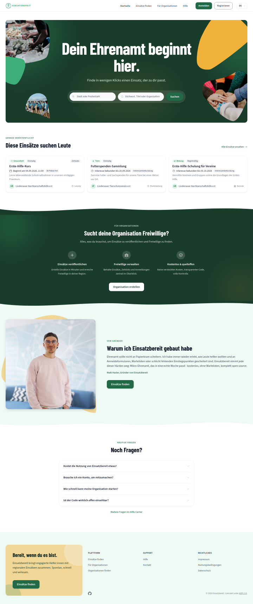

**Measurement method.** Contrast was measured from rendered pixels, not from CSS: I screenshot the page, take the modal background colour inside each text element's box (which handles gradients, photos and translucent overlays that axe reports as "incomplete"), composite the computed `color` over it inside the page via canvas (which handles Tailwind 4's `oklab`/`color-mix` alpha), and compute the WCAG ratio. Focus indicators were verified by pixel-diffing each tab stop focused versus blurred after real `Tab` presses. Horizontal overflow was measured with `scrollWidth`/`clientWidth` and bounding-rect comparison against the viewport.

**Excluded on purpose.** Backend logic, data model, infrastructure, security, CI, performance, code hygiene, dead code, and diff/PR review - those belong to `einsatzbereit-review` and `.claude/skills/self-review`. I also did not re-run axe-core or jsx-a11y checks; everything under Accessibility below is something those tools structurally cannot flag.

**Test data.** I created exactly one signup (an expression of interest on "Gassi-Dienst für Tierheimhunde") and withdrew it again in the same session. Nothing else was created, confirmed, cancelled, promoted or deleted. I deliberately did not submit the past-slot booking in F17, did not submit feedback, did not submit a content report, and did not exercise the admin promote/block actions (I verified from source that all four are behind `ConfirmDialog`). Note that the staging environment is shared and was being exercised by at least one other tester during the review; a few unrelated "QA-Testeintrag" records are visible in the screenshots.

**Not found in the UI.** The brief mentions saved searches/alerts, invitation acceptance and CSV export. I could not reach saved searches or an invitation-acceptance flow from any persona, and `grep` over `frontend/src` returns no CSV export at all - these appear not to be implemented in the frontend yet, so they are unreviewed rather than reviewed-and-clean.

---

## Findings

### Content

#### F1 - "Anmelden" carries four unrelated meanings

**Kategorie:** Content
**Schweregrad:** Hoch
**Konfidenz:** Bestätigt
**Einordnung:** Best Practice (Nielsen-Norman-Heuristik #2 "Übereinstimmung mit der realen Welt", #4 "Konsistenz und Standards"; `/frontend-design` writing rules: "An action keeps the same name through the whole flow")
**Ort:** global - header, `/volunteer-opportunities/:id`, `/my-signups`, `/profile` - Persona: alle - Viewport: alle - Sprache: DE

Beleg: `f06-detail-action-rail.png`, `f20-profile-stats.png`, `f08-past-tab.png`. Code: `frontend/src/locales/de.json` (`auth.signIn`, `signUp.*`, `myEngagements.*`, `profile.loginStreakLabel_one`).
The same root word is used for four different things at once:

- the header button that starts the OIDC login is "Anmelden";
- the action rail on an opportunity says "Melde dich an, um mitzumachen." with a button "Anmelden" - which also means log in;
- the accessible name of the slot CTA is "Für Zeitslot anmelden", where it means sign up;
- the account area is "Meine Anmeldungen" and each card says "Angemeldet: 21.08.2026" (registered), while the profile stat says "1 Tag in Folge angemeldet" (logged in).

Auswirkung: A volunteer reading "Anmelden" on an opportunity page cannot tell whether they are about to create an account, sign in, or commit to a shift. In the account area the same word swaps meaning between the page title and the profile stat directly above it. This is the single most-repeated word in the product and it is the least reliable.
Verbesserungsvorschlag: Reserve "Anmelden" for authentication only. Use "Mitmachen" or "Platz sichern" for slot sign-up, keep "Interesse bekunden" as-is, rename "Meine Anmeldungen" to "Meine Einsätze", and change `profile.loginStreakLabel_*` to "Tage in Folge aktiv" (or drop the stat, see F5). Then fix the routes and test ids to match. Aufwand: M

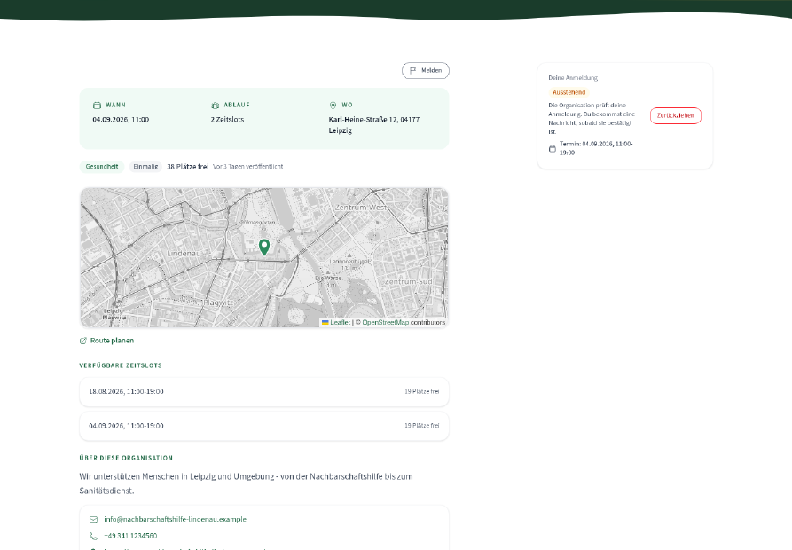
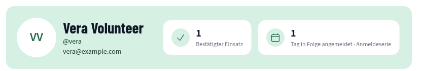
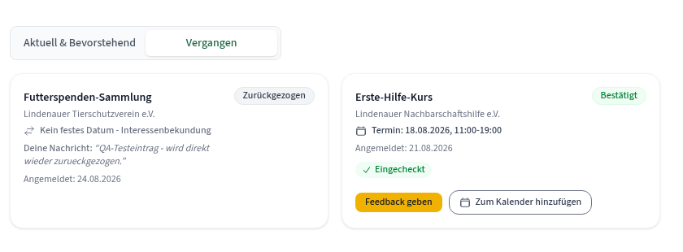

#### F2 - The withdraw dialog frees a seat that does not exist

**Kategorie:** Content
**Schweregrad:** Mittel
**Konfidenz:** Bestätigt
**Einordnung:** Best Practice (Nielsen #2)
**Ort:** `/volunteer-opportunities/:id`, expression-of-interest opportunities - Persona: Vera - Viewport: alle - Sprache: DE/EN

Beleg: live dialog on "Gassi-Dienst für Tierheimhunde" reads "Dein Platz für "Gassi-Dienst für Tierheimhunde" wird wieder freigegeben, und du kannst dich später erneut anmelden." Code: `frontend/src/locales/de.json:979` (`confirmDialog.withdraw.message`), used for both participation types.
Auswirkung: Expression-of-interest opportunities have no capacity and no seat - the card in the same list literally says "Unbegrenzt viele Plätze". Telling the user a seat is being released describes a mechanic that does not exist here and undermines trust in the rest of the copy.
Verbesserungsvorschlag: Split the string by `participationType`. Slots: keep the current text. Interest: "Deine Interessenbekundung für "{{title}}" wird zurückgezogen. Du kannst später erneut Interesse bekunden." Aufwand: S

#### F3 - The blocked "Verlassen" button explains how to delete the organization instead

**Kategorie:** Content
**Schweregrad:** Mittel
**Konfidenz:** Bestätigt
**Einordnung:** Best Practice (Nielsen #9 "Fehler erkennen, diagnostizieren, beheben")
**Ort:** `/app/:orgId/dashboard/members` - Persona: Olaf (last organizer) - Viewport: alle - Sprache: DE

Beleg: `f09-members-disabled-hint.png`. Code: `frontend/src/locales/de.json:550` (`leaveOrganizationLastOrganizerHint`), rendered via `aria-describedby="leave-organization-hint"` in `pages/app/OrgMembersPage.tsx:553`.
The key name says the cause is "last organizer". The text says: "Entferne zuerst die anderen Mitglieder, danach kannst du die Organisation in den Einstellungen löschen."
Auswirkung: The user asked to leave. The answer explains how to delete the whole organization, and never states the actual reason (you are the only organizer). An organizer who wants to hand over and step away is pointed at a destructive action they did not ask for.
Verbesserungsvorschlag: Lead with the cause and the real fix: "Du bist die einzige Person mit Organisator:in-Rolle. Befördere zuerst ein anderes Mitglied, dann kannst du die Organisation verlassen." Keep the delete route as a secondary sentence. Aufwand: S

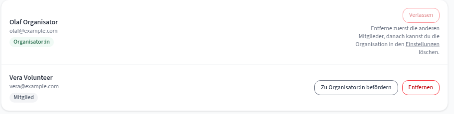

#### F4 - German switches between "du" and "Sie" inside the same product

**Kategorie:** Content
**Schweregrad:** Mittel
**Konfidenz:** Bestätigt
**Einordnung:** Best Practice (`/frontend-design`: "Cohesion and consistency are how people learn their way around"; Nielsen #4)
**Ort:** `/privacy-policy`, `/terms-of-use`, `/imprint` vs. the rest of the app - Persona: alle - Viewport: alle - Sprache: DE

Beleg: `/terms-of-use` reads "Mit der Erstellung eines Kontos ... erklären Sie sich mit diesen Bedingungen einverstanden. Wenn Sie nicht einverstanden sind, nutzen Sie die Plattform bitte nicht."; `/privacy-policy` has a section titled "Ihre Rechte". Meanwhile `/contact`, one click away in the same footer group, says "Melde ein Problem" and "wende dich bitte direkt an die Organisation", and the landing page says "Finde in wenigen Klicks einen Einsatz, der zu dir passt."
Auswirkung: The register flips inside the legal cluster itself - "Kontakt" is informal, the other three are formal - so this is not a deliberate "legal texts are formal" convention, it is drift. For a product whose whole voice is warm and informal, the switch reads as if the legal pages were pasted in from elsewhere.
Verbesserungsvorschlag: Pick one. Given the product voice and the audience, convert the three legal pages to "du" (German consumer terms are routinely written informally), or if formal wording is a deliberate legal choice, make it uniform across all four pages and say so once. Aufwand: M

#### F5 - "1 Person hat sich bereits angemeldet" counts the reader

**Kategorie:** Content
**Schweregrad:** Niedrig
**Konfidenz:** Bestätigt
**Einordnung:** Best Practice (Nielsen #2)
**Ort:** `/volunteer-opportunities/:id` - Persona: Vera (signed up) - Viewport: alle - Sprache: DE

Beleg: after signing up for "Gassi-Dienst für Tierheimhunde" the chip row gains "1 Person hat sich bereits angemeldet"; the only signup is the reader's own, and the action rail directly beside it already says "Deine Anmeldung / Ausstehend".
Auswirkung: The line is meant as social proof and instead tells the user something they just did, phrased as if someone else did it. At small counts it is actively misleading.
Verbesserungsvorschlag: Exclude the current user from the count and hide the line at zero: "1 weitere Person hat sich bereits angemeldet", suppressed when the remainder is 0. Aufwand: S

#### F6 - The create wizard falls back to "Bitte ausfüllen." while every other form explains itself

**Kategorie:** Content
**Schweregrad:** Niedrig
**Konfidenz:** Bestätigt
**Einordnung:** Best Practice (`/frontend-design`: "Errors ... are never vague about what happened"; Nielsen #9)
**Ort:** "Einsatz erstellen" wizard, step 1 - Persona: Olaf - Viewport: alle - Sprache: DE

Beleg: `f14-wizard-validation.png` - both "Titel" and "Beschreibung" show the identical "Bitte ausfüllen." Compare the sign-up dialog ("Bitte gib eine Nachricht ein.") and the upload rejection ("„huge.png“ ist 5,6 MB groß - erlaubt sind maximal 2 MB.", `f13-upload-error.png`), both of which name the field and the fix.
Auswirkung: The product already has the better pattern; this screen is the outlier. It also loses the character counter, which the error replaces.
Verbesserungsvorschlag: Use per-field messages ("Gib deinem Einsatz einen Titel.", "Beschreibe kurz, was Freiwillige erwartet.") and keep the counter visible alongside the error. Aufwand: S

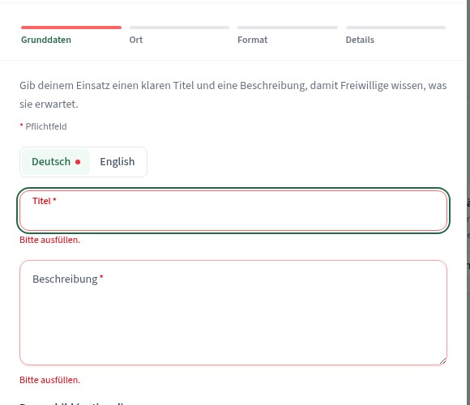
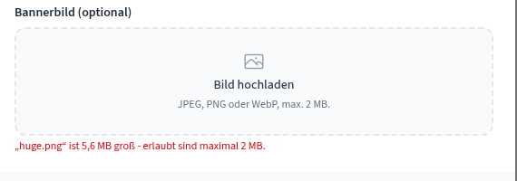

#### F7 - Section eyebrows carry no information

**Kategorie:** Content
**Schweregrad:** Niedrig
**Konfidenz:** Werturteil
**Einordnung:** Präferenz (informed by `/frontend-design`: "Structural devices ... should encode something true about the content, not decorate it")
**Ort:** `/opportunities` ("EHRENAMT"), `/profile`, `/my-signups`, `/profile/settings`, Keycloak ("KONTO"), `/organizations/:id` ("ORGANISATION") - Persona: alle - Viewport: alle - Sprache: DE/EN

Beleg: `f15-profile-badges.png` (page band "KONTO / Mein Profil"), `f11-org-profile.png` ("ORGANISATION / Lindenauer Nachbarschaftshilfe e.V.").
Auswirkung: Some eyebrows on this site do real work - "GERADE VEROEFFENTLICHT" above the landing-page cards is a genuine claim, and the organizer pages use the organization name, which is the most useful thing that slot could hold. The rest restate the heading in capitals ("KONTO / Mein Profil", "ORGANISATION / <org name>", "EHRENAMT" above "Einsätze finden") and cost a full typographic level plus vertical space on every page.
Verbesserungsvorschlag: Keep the eyebrow only where it adds a fact the heading does not carry (recency, owner, count, status). Drop it on `/profile`, `/my-signups`, `/profile/settings`, `/organizations/:id` and `/opportunities`, and reclaim the band height. Aufwand: S

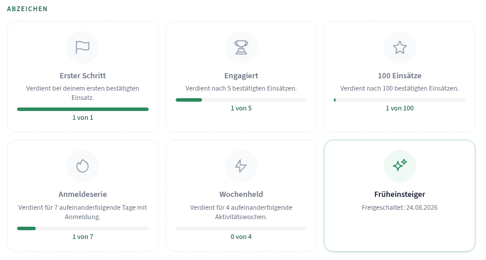
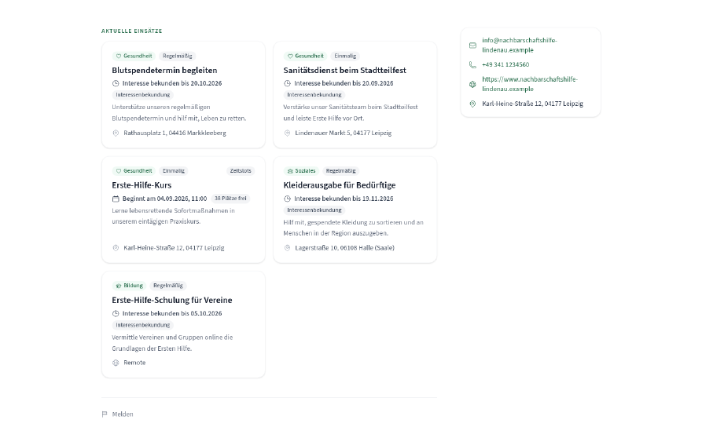

#### F8 - "Route planen" hands the user to Google Maps, on a page whose map is self-hosted

**Kategorie:** Content
**Schweregrad:** Niedrig
**Konfidenz:** Bestätigt
**Einordnung:** Best Practice (Nielsen #4; the project's own privacy posture, see `/privacy-policy` and the tile proxy)
**Ort:** `/volunteer-opportunities/:id` - Persona: alle - Viewport: alle - Sprache: DE/EN

Beleg: the rendered link resolves to `https://www.google.com/maps/dir/?api=1&destination=Tierparkweg%205%2C%2004177%20Leipzig`. Code: `frontend/src/pages/VolunteerOpportunityDetailPage.tsx:374-375`. The map above it is OpenStreetMap served through the project's own API (`SingleMarkerMap.tsx:10`, `${apiUrl}/v1/maps/tiles/{z}/{x}/{y}.png`), specifically so no third party sees the request.
Auswirkung: The project goes to the trouble of proxying tiles to keep OSM out of the request path, then sends the one click that reveals both the user's location intent and the destination straight to Google. For an AGPL project with a detailed privacy policy this is an inconsistency users can see.
Verbesserungsvorschlag: Point at `https://www.openstreetmap.org/directions?to=<lat>,<lon>`, or offer a geo: URI on touch devices so the platform's own maps app handles it. If Google is a deliberate choice for routing quality, say so at the link. Aufwand: S

### Visuelles Design

#### F9 - The primary search CTA has no shape: 1.26:1 against its own container

**Kategorie:** Visuelles Design
**Schweregrad:** Hoch
**Konfidenz:** Bestätigt
**Einordnung:** Best Practice (WCAG 2.2 AA, SC 1.4.11 Non-text Contrast - 3:1 for "visual information required to identify user interface components")
**Ort:** `/` hero and `/opportunities` hero - Persona: alle - Viewport: 375/768/1440 - Sprache: DE/EN

Beleg: `f03-hero-cta-contrast.png`. Measured from rendered pixels: button fill `#226947` (`bg-brand-700`), immediately adjacent container `#3a543f` (the `bg-white/10` glass panel over the `brand-800` hero). **Ratio 1.26:1**, against a 3:1 requirement. Horizontal pixel scan across the left edge shows no border and no shadow between the two: `-1:#38513d 0:#236645 1:#226947`. The white label itself is fine (8.7:1), so axe passes the page.
Auswirkung: The most important control on the landing page reads as a slightly different patch of green rather than a button. Anyone with reduced contrast sensitivity, on a dim screen, or outdoors sees "Suchen" floating in the panel with no boundary. It affects both entry points into the core browse flow and every viewport.
Verbesserungsvorschlag: The hero is already dark, so the CTA should be light: use a white or `accent-400` fill with `brand-800` text (that pairing measures 6.45:1 and is already used for the footer CTA card), or keep the green and add a `brand-300`/white 2px border. Do not solve it by lightening the panel - the inputs rely on that contrast. Aufwand: S

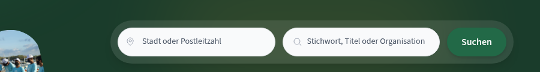

#### F10 - Dashboard edit mode pushes text below AA

**Kategorie:** Visuelles Design
**Schweregrad:** Hoch
**Konfidenz:** Bestätigt
**Einordnung:** Best Practice (WCAG 2.2 AA, SC 1.4.3 Contrast (Minimum))
**Ort:** `/app/:orgId/dashboard` after pressing "Bearbeiten" - Persona: Olaf - Viewport: 1440 (also 768/375) - Sprache: DE/EN

Beleg: `f04-dashboard-edit-mode.png`. Pixel-measured in edit mode: white text on the tinted `#63a181` surface (the "Einsatz erstellen" button label, the calendar event chips "Erste-Hilfe-Kurs 1/20", the active "Monat" toolbar button) = **3.02:1** at 12-14 px, requirement 4.5:1. Weekday headers `#6b7280` on `#e8fbef` = **4.48:1**, marginally under. 17 text nodes fall below threshold in this state; the same page in normal mode has zero.
Auswirkung: Edit mode is a modal state reached by one click and it is the only place in the product where measured contrast fails. It is invisible to the existing axe coverage because the E2E scans see the page at rest, not after an interaction. Organizers arranging their dashboard have to read widget content through a green wash.
Verbesserungsvorschlag: Keep the grid overlay behind the widgets instead of over them - render the drop-target grid as a background layer and leave widget cards on their normal white surface with an accent outline to signal the mode. If the tint must stay, raise the tinted surface to at least `#4e8c6d` for white text or switch those labels to `brand-900`. Aufwand: M

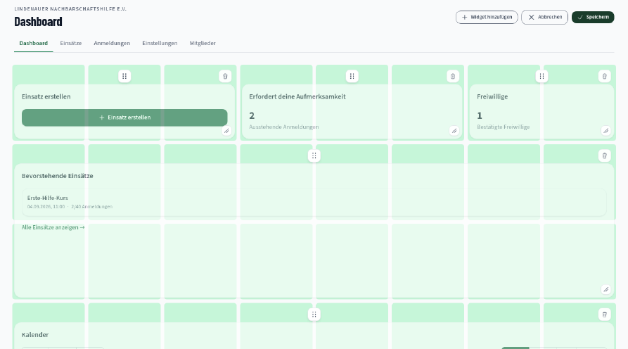

#### F11 - The current page in the header is marked by a 1.20:1 lightness difference and nothing else

**Kategorie:** Visuelles Design
**Schweregrad:** Mittel
**Konfidenz:** Bestätigt
**Einordnung:** Best Practice (Nielsen #1 "Sichtbarkeit des Systemstatus"; WCAG 1.4.1 Use of Color in spirit - the distinction is conveyed by lightness alone)
**Ort:** global header on every page - Persona: alle - Viewport: 768/1440 - Sprache: DE/EN

Beleg: `f05-header-current-page.png` (taken on `/opportunities`, where "Einsätze finden" is current). The active link is `text-white`, the inactive links are `text-brand-100` (`#d6f0e3`): **ratio 1.20:1**. There is no underline, pill, bar or dot. `aria-current="page"` is set correctly, so screen reader users are served - sighted users are not.
Auswirkung: On a header with four items over a dark gradient, a 1.20:1 difference is not perceivable at a glance; I had to read the DOM to confirm which item was active. The product already owns the right pattern: the organizer tab bar marks the current tab with a 2 px green underline plus a weight change (`f18-org-dashboard.png`). The header simply does not use it.
Verbesserungsvorschlag: Add a non-colour cue to the `aria-current="page"` link - a 2 px underline in `accent-400` or white, or a subtle `bg-white/10` pill. Reuse the org tab treatment so the two navigations read as one system. Aufwand: S

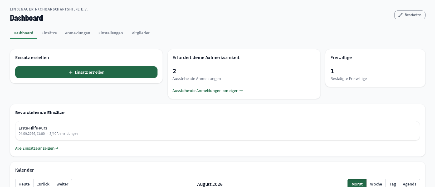

#### F12 - Half the desktop canvas is empty on the detail page and across the organizer area

**Kategorie:** Visuelles Design
**Schweregrad:** Mittel
**Konfidenz:** Werturteil
**Einordnung:** Präferenz (informed by `/frontend-design`: "minimal directions need precision in spacing"; Nielsen #8)
**Ort:** `/volunteer-opportunities/:id`, `/app/:orgId/dashboard/members`, `/app/:orgId/dashboard/settings`, `/my-signups` - Persona: Vera, Olaf - Viewport: 1440 - Sprache: DE/EN

Beleg: `f06-detail-action-rail.png` - the action rail holds one 165 px card and then roughly 1,100 px of empty column while the left column runs to the footer. On `/app/:orgId/dashboard/members` the content stops at x=928 while the header rule and tab bar span the full 1,408 px, so the right 35% of the page is blank below a full-width rule. `/my-signups` shows two cards and about 250 px of empty space beneath them.
Auswirkung: The pages do not read as deliberately spacious; they read as a two-column layout with the second column missing. The full-width rule above a half-width body is the specific detail that makes it look broken rather than minimal.
Verbesserungsvorschlag: Two options, pick per page. Either constrain the header rule and tab bar to the same max width as the content so the composition is coherent, or give the empty column something real: on the detail page, move "Ueber diese Organisation" and "Weitere Einsätze dieser Organisation" into the rail and let the description breathe; on members, put the invite form in the rail. Aufwand: M

#### F13 - The amber accent is decoration in one place and a call to action in another

**Kategorie:** Visuelles Design
**Schweregrad:** Niedrig
**Konfidenz:** Bestätigt
**Einordnung:** Best Practice (Nielsen #4)
**Ort:** `/my-signups` (scope "Vergangen") vs. footer CTA card vs. hero blob - Persona: Vera - Viewport: alle - Sprache: DE/EN

Beleg: `f08-past-tab.png` shows "Feedback geben" as a filled `accent-400` (`#f0b23a`) button, sitting next to a normal outlined button. The same token is a decorative background on the footer CTA card and a decorative blob in the hero. Everywhere else in the product, a filled action is `brand-700` green.
Auswirkung: A colour cannot mean "background ornament", "brand warmth" and "primary action" at once. Amber also reads as a caution colour next to the green/red status vocabulary the same card uses ("Bestätigt" green, "Absagen" red), so "Feedback geben" looks like a warning.
Verbesserungsvorschlag: Decide what `accent-400` means. If it stays decorative, make "Feedback geben" a normal primary button. If it becomes the "gentle nudge" action colour, stop using it as a page background. Aufwand: S

#### F14 - The documented brand colour is not the colour users actually see on controls

**Kategorie:** Visuelles Design
**Schweregrad:** Niedrig
**Konfidenz:** Bestätigt
**Einordnung:** Best Practice (WCAG 2.2 AA SC 1.4.3 explains the constraint; the inconsistency itself is a convention issue)
**Ort:** design tokens, manifest, all filled buttons - Persona: alle - Viewport: alle - Sprache: DE/EN

Beleg: `frontend/src/styles/global.css:374` defines `--color-brand-600: #2d8a5e`, and `manifest.*.webmanifest` plus `<meta name="theme-color">` both ship `#2d8a5e`. But `#2d8a5e` on white measures **4.28:1**, below the 4.5:1 needed for body text, so the product uses `brand-700` `#226947` (6.60:1) for every filled button, every link and the focus ring. `brand-600` survives only on icons and the map marker, where 3:1 suffices.
Auswirkung: This is the right engineering call - text stayed accessible - but it means the "theme colour" in the manifest, the browser tab tint and the OS splash do not match the green users see in the interface. It also makes `brand-600` a trap for future contributors, who will reach for "the brand colour" and produce a failure.
Verbesserungsvorschlag: Either promote `#226947` to the documented theme colour and update the manifest and `theme-color` meta, or darken `brand-600` to a value that clears 4.5:1 on white and use it consistently. Add a one-line comment in `global.css` recording that `brand-600` is icon-only. Aufwand: S

#### F15 - No dark mode at all; `color-scheme` is pinned to light

**Kategorie:** Visuelles Design
**Schweregrad:** Niedrig
**Konfidenz:** Bestätigt
**Einordnung:** Präferenz
**Ort:** global - Persona: alle - Viewport: alle - Sprache: DE/EN

Beleg: `frontend/src/styles/global.css:3-5` sets `:root { color-scheme: light }`; both manifests declare `background_color: #ffffff`; there is no `prefers-color-scheme` block anywhere in the stylesheet.
Auswirkung: Einsatzbereit's own framing is short-notice, on-site volunteering - checking in at an event, looking up an address on the way. A full-brightness white app is the wrong thing to hand someone at 22:00 in a dark car park, and a system-wide dark preference is simply ignored.
Verbesserungsvorschlag: Not a defect and not small, but worth putting on the roadmap deliberately rather than by omission. The token system is already centralised in `@theme`, so a dark palette is mostly a second token block plus auditing the dark-green hero surfaces, which would need to become the light surfaces. Aufwand: L

#### F16 - A badge you have fully earned still looks unearned

**Kategorie:** Visuelles Design
**Schweregrad:** Mittel
**Konfidenz:** Bestätigt
**Einordnung:** Best Practice (Nielsen #1 "Sichtbarkeit des Systemstatus", #4 "Konsistenz und Standards")
**Ort:** `/profile` - Persona: Vera - Viewport: alle - Sprache: DE/EN

Beleg: `f15-profile-badges.png`. "Erster Schritt" reads "1 von 1" with a full green progress bar - it is earned - yet its card, its icon and its title are rendered exactly like the unearned "Engagiert" (1 von 5) and "Wochenheld" (0 von 4): grey glyph on a grey disc, grey title, plain card. "Früheinsteiger" in the same grid gets the earned treatment: a green-tinted disc, a coloured glyph, a dark title, a green ring on the card, and "Freigeschaltet: 24.08.2026" in place of a bar.

Auswirkung: The grid uses two different visual languages for "earned" - a completed progress bar and an unlock date - and only the second one is styled as an achievement. A volunteer who earns a badge through the progress path gets no visible reward for it, which is the entire purpose of the feature. The profile stat band directly above compounds this by reporting "1 Bestätigter Einsatz" while the badge for exactly that milestone still looks grey.

Verbesserungsvorschlag: Derive one `earned` boolean (`progress >= target || unlockedAt != null`) and drive a single earned style from it: coloured glyph, dark title, green ring. Keep the progress bar as supporting detail on unearned cards only, and show the unlock date on every earned card. Aufwand: S

### UX

#### F17 - Time slots that have already happened are listed as available and can be booked

**Kategorie:** UX
**Schweregrad:** Kritisch
**Konfidenz:** Bestätigt
**Einordnung:** Best Practice (Nielsen #5 "Fehlervermeidung", #1 "Sichtbarkeit des Systemstatus")
**Ort:** `/volunteer-opportunities/01a0254e-5025-75e6-a903-2d8c98fa6811` ("Erste-Hilfe-Kurs") - Persona: jede angemeldete Person ohne bestehende Anmeldung (verifiziert mit `admin`) - Viewport: alle - Sprache: DE/EN

Beleg: `f01-past-slot-list.png` and `f01-past-slot-confirm.png`. On 2026-08-24 the section headed "Verfügbare Zeitslots" lists `18.08.2026, 11:00-19:00` with "19 Plätze frei". The row is an enabled `<button>` (`disabled: false`), and activating it opens a dialog reading "Anmeldung bestätigen / Du meldest dich für 18.08.2026, 11:00-19:00 an." I stopped there and did not submit.

Code: `frontend/src/pages/VolunteerOpportunityDetailPage.tsx:825` renders `opportunity.timeSlots.map(...)` with no date filter, and line 827 computes `clickable = showSignUpCta && !isSlotFull(...)` - capacity only, never time. The same unfiltered array is handed to the sign-up dialog at line 980. The page header does it correctly one screen above: line 129 uses `findNextTimeSlot`, which in `lib/format.ts` explicitly skips slots whose `endDateTime` is in the past - which is why "WANN" shows 04.09.2026 while the list below still offers 18.08.2026.

The same unfiltered data reaches the organizer side: the dashboard calendar plots "Erste-Hilfe-Kurs 1/20" on 18 August (`f18-org-dashboard.png`), and the engagement management screen lists a volunteer against the expired slot (`f12-engagement-rows.png`).

Auswirkung: A volunteer can commit to a shift that ended six days ago. They get a pending signup, the organizer gets a notification for a shift that is over, and the capacity counters ("38 Plätze frei" on the card) keep counting seats in expired slots. This is the one finding in this report that produces wrong data rather than confusion, and it sits on the product's core flow.
Verbesserungsvorschlag: Filter at the render site the same way the header already does: derive `upcomingSlots = timeSlots.filter(ts => new Date(ts.endDateTime) >= now)` once, feed it to both the list and `SignUpModal`, and keep expired slots visible only in a collapsed "Vergangene Zeitslots" group rendered as static rows. Guard the dialog too, so a stale tab cannot submit an expired slot. Also exclude expired slots from the capacity label on the card. Aufwand: S

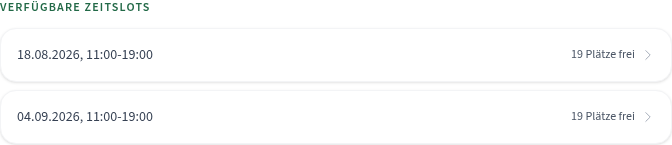
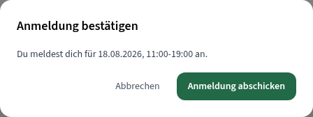

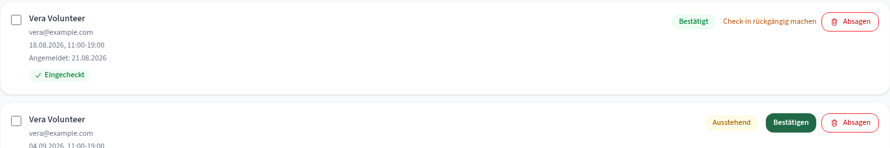

Vermutlich Backend: the API returns all slots, which is correct for the organizer's own views. Nothing here needs a backend change; the frontend has the timestamps it needs.

#### F18 - The date filter treats days in the past as ordinary selectable days

**Kategorie:** UX
**Schweregrad:** Mittel
**Konfidenz:** Bestätigt
**Einordnung:** Best Practice (Nielsen #5; WCAG 1.4.1 Use of Color - here, the state is carried by no visual channel at all)
**Ort:** `/opportunities`, "Datum" filter - Persona: alle - Viewport: alle - Sprache: DE/EN

Beleg: `f07-mini-calendar-past-days.png`. On 2026-08-24, days 1 to 23 render identically to days 25 to 31 - same colour, same weight, no strikethrough, no disabled styling. In the DOM each is `disabled: false` with `aria-label="Samstag, 1. August 2026, in der Vergangenheit"`. The previous-month chevron is enabled and unbounded, so a user can page back to 2025 and select there.
Auswirkung: The information exists - but only for screen reader users. Sighted users get a calendar that invites them to filter by a date that can only ever return zero results, and the "Tage mit Einsätzen" dot legend does not distinguish "no events" from "already gone".
Verbesserungsvorschlag: Disable past days and mute them visually (keep the existing accessible name, which is already good), and stop the previous-month navigation at the current month. Aufwand: S

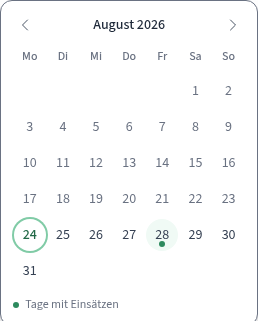

#### F19 - The slot list never says which slot you are signed up for

**Kategorie:** UX
**Schweregrad:** Mittel
**Konfidenz:** Bestätigt
**Einordnung:** Best Practice (Nielsen #1, #6 "Wiedererkennen statt Erinnern")
**Ort:** `/volunteer-opportunities/:id` for slot-based opportunities - Persona: Vera - Viewport: alle - Sprache: DE/EN

Beleg: `f06-detail-action-rail.png`. Vera holds a pending signup for `04.09.2026, 11:00-19:00` (the rail says so). The list below shows both slots with identical styling and identical "19 Plätze frei"; nothing marks the one she is in.
Auswirkung: The user has to read the rail, hold a date in their head, and match it against the list. On an opportunity with more than two slots that becomes real work, and it is exactly what "recognition rather than recall" is about.
Verbesserungsvorschlag: Mark the booked row with the same status chip the rail uses ("Ausstehend"/"Bestätigt") and a subtle `brand-50` fill, and replace its chevron with a non-interactive state. Aufwand: S

#### F20 - "Vergangen" holds signups that are not past, and offers no way back

**Kategorie:** UX
**Schweregrad:** Mittel
**Konfidenz:** Bestätigt
**Einordnung:** Best Practice (Nielsen #2, #3 "Nutzerkontrolle und -freiheit")
**Ort:** `/my-signups`, scope "Vergangen" - Persona: Vera - Viewport: alle - Sprache: DE/EN

Beleg: `f08-past-tab.png`. A withdrawn expression of interest on "Futterspenden-Sammlung" sits under "Vergangen" although its deadline ("Interesse bekunden bis 20.09.2026") is nearly a month away, and the card offers no action at all. The withdraw dialog that produced this state promised "du kannst dich später erneut anmelden" (F2), but there is no path from here - the user has to find the opportunity again through search.
Auswirkung: The bucket label is wrong (withdrawn is a status, not a time), and the one promise the withdraw flow made is not honoured anywhere in the account area.
Verbesserungsvorschlag: Rename the scopes to "Aktiv" and "Abgeschlossen & zurückgezogen", or add a third scope. Either way, give a withdrawn card whose deadline has not passed an "Erneut anmelden" / "Erneut Interesse bekunden" action that reopens the sign-up dialog. Aufwand: M

#### F21 - "Zum Kalender hinzufügen" is offered for an engagement that already happened

**Kategorie:** UX
**Schweregrad:** Mittel
**Konfidenz:** Bestätigt
**Einordnung:** Best Practice (Nielsen #8 "Ästhetisches und minimalistisches Design", #2)
**Ort:** `/my-signups`, scope "Vergangen" - Persona: Vera - Viewport: alle - Sprache: DE/EN

Beleg: `f08-past-tab.png` - the "Erste-Hilfe-Kurs" card is dated `Termin: 18.08.2026, 11:00-19:00`, is already marked "Eingecheckt", and still shows "Zum Kalender hinzufügen" next to "Feedback geben".
Auswirkung: One of two actions on a completed engagement does nothing useful, which dilutes the one that matters (leaving feedback). It is the same missing "is this in the past" check as F17, surfacing in a different component.
Verbesserungsvorschlag: Render the calendar menu only while `endDateTime` is in the future. On completed engagements, let "Feedback geben" stand alone as the primary action. Aufwand: S

#### F22 - The signups scope is not in the URL, so it cannot be linked, bookmarked or restored

**Kategorie:** UX
**Schweregrad:** Mittel
**Konfidenz:** Bestätigt
**Einordnung:** Best Practice (Nielsen #3, #4; the project's own convention on `/opportunities`)
**Ort:** `/my-signups` - Persona: Vera - Viewport: alle - Sprache: DE/EN

Beleg: switching from "Aktuell & Bevorstehend" to "Vergangen" leaves the URL at `https://einsatzbereit.maik-hasler.de/my-signups`. A reload or a Back press returns to the default scope. By contrast `/opportunities` writes every filter to the query string (`?q=Erste`), survives reload, and survives a language switch.
Auswirkung: The app has decided that browse state belongs in the URL and then does not apply that decision one route over. Back does not undo the scope change, which is the behaviour users expect once one part of the product has taught them it works.
Verbesserungsvorschlag: Mirror the `/opportunities` pattern: `?scope=past`, read on mount, written with `setSearchParams(..., { replace: true })`. Aufwand: S

#### F23 - Disabled controls explain themselves in three different ways, one of which is invisible on touch

**Kategorie:** UX
**Schweregrad:** Mittel
**Konfidenz:** Bestätigt
**Einordnung:** Best Practice (Nielsen #4, #9; WCAG 2.2 AA SC 1.4.13 in spirit - `title` tooltips are not dismissible, hoverable or reachable without a pointer)
**Ort:** `/app/:orgId/dashboard/settings` vs. `/app/:orgId/dashboard/members` - Persona: Vera (Mitglied), Olaf - Viewport: alle - Sprache: DE/EN

Beleg: three patterns for the same problem.

- Members, "Verlassen" disabled for the last organizer: visible helper text plus `aria-describedby="leave-organization-hint"` - the right pattern (`f09-members-disabled-hint.png`), though the text itself is wrong (F3).
- Organization settings, "Bearbeiten" disabled for a plain member: the reason lives only in `title="Nur Organisatoren können die Organisationseinstellungen bearbeiten."` A disabled button is not in the tab order, so a keyboard user never triggers the tooltip, and on touch there is no hover at all. Vera sees a greyed pencil and no explanation.
- The create wizard, "Als Entwurf speichern" disabled: a visible sentence under the button ("Gib im Schritt "Grunddaten" einen Titel ein, bevor du als Entwurf speicherst.") - also good (`f14-wizard-validation.png`).

Auswirkung: Two of three cases are handled well; the third is the one a non-organizer meets first, and it is the one that says nothing. On mobile it is a dead grey control with no story.
Verbesserungsvorschlag: Standardise on the members/wizard pattern - a short visible sentence wired with `aria-describedby`. Reserve `title` for supplementary detail, never for the only explanation. Aufwand: S

#### F24 - The organization directory has no header entry, and its footer entry is easy to confuse with "Für Organisationen"

**Kategorie:** UX
**Schweregrad:** Mittel
**Konfidenz:** Bestätigt
**Einordnung:** Best Practice (Nielsen #1, #6)
**Ort:** global header and footer; `/organizations` - Persona: alle - Viewport: alle - Sprache: DE/EN

Beleg: the anonymous header is Startseite / Einsätze finden / Für Organisationen / Hilfe. "Für Organisationen" points at `/#for-organizations`, a marketing anchor on the landing page. The actual directory at `/organizations` appears only in the footer as "Organisationen finden". Consequence: on `/organizations` no header item carries `aria-current="page"` and no header item is highlighted, so the page has no place in the navigation at all.
Auswirkung: One of the product's four top-level public areas is reachable only from the footer, and the two similarly named entry points lead to completely different things - a pitch for organizers versus a directory for volunteers.
Verbesserungsvorschlag: Rename the header item to "Für Organisationen" -> "Organisation werden" (or move it into the account menu, since it is a conversion CTA, not navigation) and add "Organisationen" to the header pointing at `/organizations`. At minimum, disambiguate the two labels. Aufwand: S

#### F25 - One dashboard feature has two names, and its edit controls float away from their widgets

**Kategorie:** UX
**Schweregrad:** Niedrig
**Konfidenz:** Bestätigt
**Einordnung:** Best Practice (Nielsen #4; Nielsen #6)
**Ort:** `/app/:orgId/dashboard` - Persona: Olaf - Viewport: 1440 - Sprache: DE/EN

Beleg: `f18-org-dashboard.png` and `f04-dashboard-edit-mode.png`. At rest the page offers "Bearbeiten" in the top-right primary-action slot and "Dashboard anpassen" as a full-width button at the bottom; both lead into the same layout editor, where the button becomes "Widget hinzufügen". In edit mode each widget's drag handle and delete button are positioned along its grid row rather than on the widget card, so the delete icon for "Bevorstehende Einsätze" sits roughly 1,200 px to the right of the widget's title, over empty grid.
Auswirkung: Two labels for one feature is a small cost. The detached controls are the bigger one - it is genuinely unclear which trash icon removes which widget, and the removal is destructive.
Verbesserungsvorschlag: Use one label ("Dashboard anpassen") in one place. Anchor the drag handle and delete button to the top-right corner of each widget card, not to the grid row. And note that the top-right primary slot currently holds a layout action while the page's real primary action ("Einsatz erstellen") is buried in a widget - swapping those would help more than either change. Aufwand: M

#### F26 - The map looks interactive but is frozen, and silently vanishes when coordinates are missing

**Kategorie:** UX
**Schweregrad:** Niedrig
**Konfidenz:** Bestätigt
**Einordnung:** Best Practice (Nielsen #1, #3)
**Ort:** `/volunteer-opportunities/:id` - Persona: alle - Viewport: alle - Sprache: DE/EN

Beleg: `SingleMarkerMap.tsx:52-60` disables `dragging`, `scrollWheelZoom`, `doubleClickZoom`, `touchZoom`, `boxZoom` and `keyboard`, and renders no zoom control - yet the component keeps full Leaflet chrome (attribution bar, marker with a clickable popup), which reads as a live map. Separately, "Gassi-Dienst für Tierheimhunde" has a full street address ("Tierparkweg 5, 04177 Leipzig") and a "Route planen" link but **no map at all** (`document.querySelector('.leaflet-container')` returns null), while "Erste-Hilfe-Kurs" at a comparable address shows one.
Auswirkung: Freezing the map is the right call for mobile - it avoids the classic scroll-hijack trap, and I confirmed there is no scroll conflict at 375 px. But nothing tells the user, so they pinch and drag at a picture. And because the map is fixed at zoom 14 with no controls, there is no way to zoom out and orient. The inconsistent presence of the map between two opportunities with equally complete addresses makes the detail page look unreliable.
Verbesserungsvorschlag: Make the static intent explicit - drop the Leaflet interaction chrome, keep the attribution, and make the whole tile block a link to the routing destination with a visible "Größere Karte öffnen" affordance. For missing coordinates, render a consistent placeholder ("Karte für diese Adresse nicht verfügbar") instead of removing the block, so the layout does not change shape between opportunities. Aufwand: S

Vermutlich Backend: the missing map is almost certainly a missing `latitude`/`longitude` on that opportunity (no geocoding at creation time). The frontend fix above is the fallback; filling the coordinates is a backend/data concern and out of scope here.

### UI

#### F27 - The organization switcher truncates mid-word: "Lin... schaftshilfe e.V."

**Kategorie:** UI
**Schweregrad:** Hoch
**Konfidenz:** Bestätigt
**Einordnung:** Best Practice (Nielsen #1, #4; the brief's own question - is it always unambiguous whose behalf you act on)
**Ort:** `/app/:orgId/*` header - Persona: Olaf, Vera - Viewport: 375 (and any width where the name does not fit) - Sprache: DE/EN

Beleg: `f02-org-switcher-and-tabs-375.png`. Code: `frontend/src/lib/middleTruncateSplit.ts` splits the name at `Math.ceil(text.length / 2)` with no word-boundary awareness, and `components/Header/OrganizationSwitcher.tsx:45,98,104` renders the halves as two spans - the head with `truncate`, the tail pinned with `shrink-0 whitespace-nowrap`. For "Lindenauer Nachbarschaftshilfe e.V." (35 chars) the split lands inside "Nachbarschaftshilfe", giving head `"Lindenauer Nachbar"` and tail `"schaftshilfe e.V."`. At 375 px the head collapses to 35 px of the available width and the control renders **"Lin... schaftshilfe e.V."**

Two side effects: because the halves are flex children, `innerText` (and therefore copy-paste and any text extraction) yields `"Lindenauer Nachbar\nschaftshilfe e.V."` even at desktop where the label looks fine; and the pinned tail means *any* truncation of *any* multi-word name produces a broken word, not just this one.

Auswirkung: The control whose entire job is to say which organization you are acting for produces a nonsense string on phones. The intent behind middle-truncation - keep the legal suffix "e.V." visible - is sound, but the character-midpoint split defeats it.
Verbesserungsvorschlag: Split on a word boundary near the midpoint and keep only the last whole token (plus any legal suffix) as the tail: for this name, head `"Lindenauer Nachbarschaftshilfe"`, tail `"e.V."`, giving "Lindenauer Nachbar... e.V." Add a test with a long single-word name to pin the boundary behaviour. Long term, consider showing the avatar plus a short name on mobile and the full name only from `sm:` upward. Aufwand: S

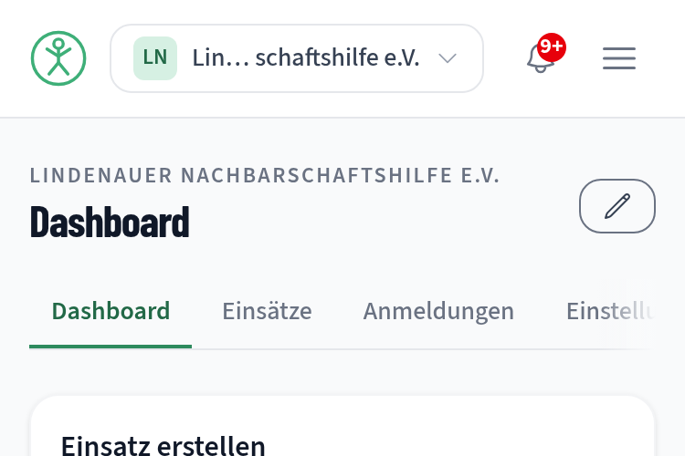

#### F28 - The organizer tab bar scrolls out of view at 375 px with no affordance

**Kategorie:** UI
**Schweregrad:** Hoch
**Konfidenz:** Bestätigt
**Einordnung:** Best Practice (Nielsen #6, #7 "Flexibilität und Effizienz"; WCAG 1.4.10 Reflow in spirit)
**Ort:** every `/app/:orgId/dashboard/*` page - Persona: Olaf, Vera - Viewport: 375 - Sprache: DE

Beleg: `f02-org-switcher-and-tabs-375.png`. The nav is `flex gap-1 overflow-x-auto border-b`, `scrollWidth 474` inside `clientWidth 343`. "Einstellungen" is clipped at the right edge (`right: 402` against a 375 px viewport) and "Mitglieder" is entirely off-screen (`right: 490`). There is no fade, no gradient mask, no chevron, and no scrollbar rendered - the bar simply looks like it ends after four items, one of them cut.
Auswirkung: On a phone, two of five organizer sections are invisible and there is no cue that horizontal scrolling exists. Member management and organization settings are effectively undiscoverable on mobile. Every organizer page is affected.
Verbesserungsvorschlag: Add a right-edge gradient mask that appears while the bar is scrollable (and a left one once scrolled), and scroll the active tab into view on mount. If the five items will not shrink to fit, fall back to a "Mehr" overflow menu below `sm:`. Aufwand: S

#### F29 - The calendar agenda table is clipped inside its card at 375 px

**Kategorie:** UI
**Schweregrad:** Mittel
**Konfidenz:** Bestätigt
**Einordnung:** Best Practice (WCAG 2.2 AA SC 1.4.10 Reflow - content must not require scrolling in two dimensions; here the inner region does scroll, but silently)
**Ort:** `/app/:orgId/dashboard`, Kalender widget, Agenda view - Persona: Olaf - Viewport: 375 - Sprache: DE

Beleg: measured `TABLE.rbc-agenda-table` at `width 480` extending to `right: 514` inside a 375 px viewport, scrolling inside `.rbc-agenda-view` (`scrollWidth 480` / `clientWidth 307`). The "TERMIN" column and the event title are cut at the card edge. The page itself does not scroll horizontally, which is correct - but there is no visual hint that the table does.
Auswirkung: The mobile default for the calendar widget is Agenda, so this is what an organizer sees first on a phone: a table whose most informative column is chopped, with several hundred pixels of empty space beneath it.
Verbesserungsvorschlag: Below `sm:`, render the agenda as stacked rows (date and time on one line, title on the next) instead of a three-column table, or at minimum add the same scroll affordance as F28. Aufwand: M

#### F30 - "Check-in rückgängig machen" is bare text sitting between two real buttons

**Kategorie:** UI
**Schweregrad:** Niedrig
**Konfidenz:** Bestätigt
**Einordnung:** Best Practice (Nielsen #4)
**Ort:** `/app/:orgId/dashboard/opportunities/:id/engagements` - Persona: Olaf - Viewport: 1440 - Sprache: DE/EN

Beleg: `f12-engagement-rows.png`. In one row: a "Bestätigt" status chip, then "Check-in rückgängig machen" as unstyled amber text with no underline, border or padding, then an outlined "Absagen" button. The row below shows a filled "Bestätigen" and an outlined "Absagen" in the same position.
Auswirkung: An action that reverses a recorded check-in is the least button-like element in a row of buttons, so it is both easy to miss and easy to mistake for a status label. Its hit area is the text bounds only.
Verbesserungsvorschlag: Give it the same outlined treatment as "Absagen", or move it into the row overflow menu that already exists elsewhere in the organizer area. Aufwand: S

#### F31 - The notification panel crowds three controls into a 320 px header

**Kategorie:** UI
**Schweregrad:** Niedrig
**Konfidenz:** Bestätigt
**Einordnung:** Best Practice (Nielsen #8 "Ästhetisches und minimalistisches Design"; Nielsen #5 "Fehlervermeidung")
**Ort:** global header, notification dropdown - Persona: Vera, Olaf, Admin - Viewport: alle - Sprache: DE/EN

Beleg: `f10-notification-panel.png`. In a `w-80` (320 px) panel the header holds "Benachrichtigungen" plus two text buttons, "Alle als gelesen markieren" and "Gelesene löschen"; both wrap to two lines, both are 12 px `brand-700` text with no separation beyond a 12 px gap, and the destructive one is styled identically to the harmless one. The list below (`max-h-80 overflow-y-auto`) cuts the fourth item mid-sentence with no fade, mask or visible scrollbar, so the panel appears to end there.

Auswirkung: The two bulk actions are hard to tell apart at a glance, and the one that deletes is the easier of the two to hit by accident because it sits at the outer edge. The clipped fourth item makes an eight-item backlog look like a three-item one.

Verbesserungsvorschlag: Move both bulk actions into a small overflow menu on the header row, or drop "Gelesene löschen" to the bottom of the list where it acts on what the user has just read. Add a bottom fade mask while the list is scrollable. Aufwand: S

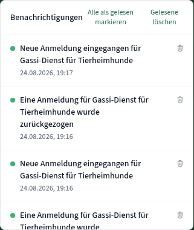

### Barrierefreiheit

These complement the existing axe-core and jsx-a11y coverage; each is something those tools structurally cannot detect. The automated coverage itself came out clean - see Strengths below.

#### F32 - The organization switcher never announces which organization is active

**Kategorie:** Barrierefreiheit
**Schweregrad:** Mittel
**Konfidenz:** Bestätigt
**Einordnung:** Best Practice (WCAG 2.2 A, SC 4.1.2 Name, Role, Value - a control's name should convey its current value)
**Ort:** `/app/:orgId/*` header - Persona: Olaf, Vera - Viewport: alle - Sprache: DE/EN

Beleg: accessibility tree for the org app header renders exactly `button: "Organisation wechseln"`. The org name lives in two child spans that are excluded because `aria-label` on the button overrides its contents (`OrganizationSwitcher.tsx:90`). Compare the language selector three elements to the right, which gets it right: `button: "DE - Sprache wechseln, aktuell Deutsch"`.
Auswirkung: A screen reader user in the organizer app can operate the switcher but cannot hear which organization is selected. They can recover the answer from the page eyebrow and the document title, but the control itself - the thing that exists to answer that question - is silent. For an organizer in more than one organization, confirming context requires leaving the control and hunting elsewhere.
Verbesserungsvorschlag: Follow the language selector's own pattern: `aria-label={t('org.switcherLabel', { name: currentOrg.name })}` -> "Organisation wechseln, aktuell Lindenauer Nachbarschaftshilfe e.V." Aufwand: S

#### F33 - Past days in the date filter are announced but not shown

**Kategorie:** Barrierefreiheit
**Schweregrad:** Niedrig
**Konfidenz:** Bestätigt
**Einordnung:** Best Practice (WCAG 2.2 A, SC 1.4.1 Use of Color - here the reverse: state exists only in the accessible name)
**Ort:** `/opportunities`, "Datum" filter - Persona: alle - Viewport: alle - Sprache: DE/EN

Beleg: `f07-mini-calendar-past-days.png` plus DOM: `aria-label="Samstag, 1. August 2026, in der Vergangenheit"`, `disabled: false`, and styling identical to future days.
Auswirkung: This is the same defect as F18 seen from the other side, and worth stating separately because it inverts the usual pattern: the accessible name is more informative than the visual, so an automated audit sees a well-labelled control while sighted users get no signal at all. It also means fixing the visual alone is not enough - the days should be genuinely `disabled` so the announced state and the actual behaviour agree.
Verbesserungsvorschlag: Set `disabled` on past days and mute them visually; keep the accessible name exactly as it is. Aufwand: S

#### F34 - The Keycloak language trigger hides the current language from screen readers

**Kategorie:** Barrierefreiheit
**Schweregrad:** Niedrig
**Konfidenz:** Bestätigt
**Einordnung:** Best Practice (WCAG 2.2 A, SC 4.1.2)
**Ort:** Keycloak FTL theme - login, registration, forgot-password - Persona: alle - Viewport: alle - Sprache: DE/EN

**Note: this is an FTL template under `keycloak/`, not React.**

Beleg: `
` wraps a globe icon, a `DE` and a chevron; the `aria-label` suppresses the "DE". The SPA's own selector announces "DE - Sprache wechseln, aktuell Deutsch".
Auswirkung: Small in isolation, but it is the first screen a new user meets, and it makes the auth pages behave differently from the app they lead into.
Verbesserungsvorschlag: Mirror the SPA string in the FTL theme: `aria-label="${msg('languageSwitchLabel', currentLanguageName)}"`. Aufwand: S

### i18n

DE/EN parity is complete, including both long legal documents; plural forms are fully populated for the streak and engagement counters (`_one` and `_other` in both files); the language switch preserves the route, the query string and unsaved input; and the SPA propagates the choice to Keycloak via `ui_locales`. One inconsistency:

#### F35 - English uses two different date conventions

**Kategorie:** i18n
**Schweregrad:** Niedrig
**Konfidenz:** Bestätigt
**Einordnung:** Best Practice (Nielsen #4)
**Ort:** `/opportunities`, `/volunteer-opportunities/:id` vs. `/privacy-policy`, `/terms-of-use` - Persona: alle - Viewport: alle - Sprache: EN

Beleg: formatted dates resolve through `resolveDateLocale("en") -> "en-GB"` (`frontend/src/lib/format.ts`, asserted in `lib/format.test.ts:201`), producing British short form: "Starts 4 Sept 2026", "Express interest by 5 Oct 2026". The hand-written legal timestamps in `frontend/src/locales/en.json:781` and `:873` use American long form: "Last updated: August 7, 2026".
Auswirkung: Minor on its own, but the two conventions appear two clicks apart and the American string is the one a user reads when checking how current the privacy policy is. It also means the hardcoded date will silently drift out of sync with any future locale change.
Verbesserungsvorschlag: Either format the legal timestamp through the same helper from an ISO date in the locale file, or change the two strings to "Last updated: 7 August 2026". The former also removes a hand-maintained date from two places. Aufwand: S

### PWA

No findings. The installability metadata, the offline behaviour and the localized manifest all held up under test - see Strengths.

---

## Strengths

Worth recording, because several of these are things that are usually broken and are expensive to get right:

- **Measured text contrast passes AA everywhere at rest.** I ran a rendered-pixel audit over 13 routes across anonymous, Vera, Olaf and Admin. Zero enabled text elements fell below threshold. The lowest observed was 4.54:1 (the footer copyright line). The only sub-threshold hits were a disabled control (explicitly exempt under SC 1.4.3) and the edit-mode state in F10.
- **Focus is visible on every tab stop, including on dark surfaces.** All 22 stops I walked produced a measurable indicator. The design is deliberate: a 2 px `brand-700` outline for light backgrounds plus a 4 px white halo (`box-shadow`) that carries the indicator on the dark hero, where the outline alone would only manage 1.84:1. I also verified the indicator survives inside `overflow-hidden` dropdown panels (6.9 % pixel change, 6.6:1).
- **Dialogs are correct.** Focus moves into the dialog, cycles inside it (verified over 10 `Tab` presses - never escaped), `Escape` closes, and focus returns to the exact trigger. Validation sets `aria-invalid="true"`, wires `aria-describedby` to the message, and fires a `role="alert"`.
- **`prefers-reduced-motion` is fully honoured.** With `reducedMotion: 'reduce'`, `document.getAnimations()` returns 0 both immediately and after settling, and `scroll-behavior` resolves to `auto`. Without it, 33 animations run at load. That is a complete implementation, not a partial one.
- **The drag-and-drop dashboard has a real keyboard alternative.** Each widget's handle is a labelled button ("Kalender" verschieben oder Größe ändern); `Enter` enters a grid-placement mode driven by arrow keys, with a live region announcing "Spalte 2, Zeile 1. ... Escape zum Abbrechen." This satisfies WCAG 2.2 SC 2.5.7 Dragging Movements, which no automated checker tests and most products fail.
- **Upload errors are exemplary.** "„huge.png“ ist 5,6 MB groß - erlaubt sind maximal 2 MB." names the file, its actual size and the limit, in one sentence, in a `role="alert"`.
- **Offline is a state, not an error.** The app shell loads from the service worker, and the message reads "Du bist offline. Sobald deine Verbindung zurück ist, laden wir die Einsätze." with a retry. The manifest is localized per language and swaps at runtime when the user switches; it includes wide and narrow screenshots with captions.
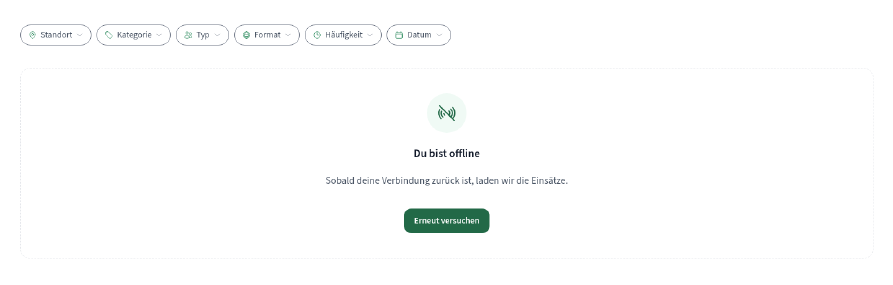
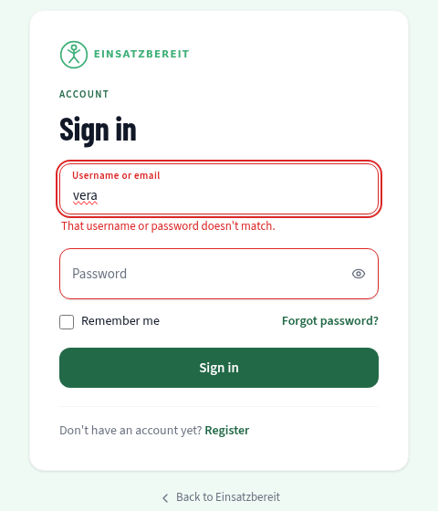

- **Deep links survive login.** Visiting `/my-signups` while logged out passes `returnTo` through `signinRedirect`, and after authentication the user lands back on `/my-signups`, not the homepage.
- **Map tiles are proxied through the project's own API**, so browsing an opportunity leaks nothing to a tile CDN. (Which is what makes F8 stand out.)
- **The organization app's permission model is honestly reflected in the UI.** As a plain member, Vera sees the organizer pages read-only: no invite form, no create button, no danger zone, and the edit action disabled rather than hidden-then-failing.

---

## Parking Lot

Out of scope for this review; noted with the lens they belong to.

- On every page load for a logged-out visitor, the silent SSO probe iframe is rejected by Keycloak's `frame-ancestors 'self'`, producing a console error and a failed request (`ERR_BLOCKED_BY_RESPONSE`, HTTP 400) on `login.maik-hasler.de/.../auth`. It is a harmless fallback in practice - I confirmed that `automaticSilentRenew` for authenticated users works, with the token refreshing cleanly twice over an 8-minute observation - but it means every anonymous page view carries a red console error. Lens: **bugs**.
- The admin user list on the public staging environment shows a real personal email address (`maikhasler@proton.me`) to anyone who logs in as `admin`, whose password is published in the README. Lens: **security**.
- The brief lists saved searches/alerts, invitation acceptance and CSV export; none of the three exist in `frontend/src`. Either the brief is ahead of the implementation or these are backend-only. Lens: **docs drift**.
- The admin organization list has "Verbergen" but no verification action, while the brief describes "Organisationen verifizieren". Lens: **dead features** or **docs drift**.
- `splitForMiddleTruncation` (F27) has no test covering a long single-token name or a name whose midpoint falls inside a word. Lens: **test gaps**.
- The contrast regression in dashboard edit mode (F10) is invisible to the current axe coverage because `AccessibilityTests` scans pages at rest. A scan taken after entering edit mode would have caught it. Lens: **test gaps**.
- `frontend/scripts/check-i18n-keys.js` fails with `MODULE_NOT_FOUND` when run directly from `frontend/`. Lens: **contributor-dx**.

---

## Prioritized Next Steps

### Quick wins (low effort, high impact)

1. **F17 - filter expired time slots** out of the detail list, the sign-up dialog and the capacity label. One derived array, reused in three places; the correct helper (`findNextTimeSlot`) already exists. This is the only finding that produces bad data.
2. **F27 - split the org name on a word boundary.** A three-line change in `middleTruncateSplit.ts` plus a regression test.
3. **F9 - repaint the hero CTA.** Swap `bg-brand-700` for a light fill on the dark hero; the `accent-400` + `brand-800` pairing is already proven at 6.45:1 elsewhere in the product.
4. **F28 - add a scroll affordance to the organizer tab bar** and scroll the active tab into view. Two organizer sections are currently unreachable-looking on phones.
5. **F11 - give `aria-current="page"` a visible treatment** in the header, reusing the org tab underline.
6. **F18 / F33 - disable past days** in the date filter and bound the previous-month navigation.
7. **F2, F3, F6 - three string fixes** with real semantic consequences: the seat that does not exist, the hint that answers the wrong question, the error that says nothing.
8. **F32 - put the organization name in the switcher's accessible name**, mirroring the language selector.

### Larger undertakings

- **F1 - retire the overloaded "Anmelden".** This is a vocabulary decision, not a string swap: it touches locale keys, routes (`/my-signups`), test ids and the organizer side. Worth doing once, deliberately, before the surface grows.
- **F12 - decide what the second column is for** on the detail page and the organizer pages, or constrain the full-width rules to match the content width. The current state is the main reason the desktop layout reads as unfinished.
- **F10 + F25 - rework dashboard edit mode**: grid behind the widgets rather than over them, controls anchored to their own card, one name for the feature, and the page's real primary action back in the primary slot.
- **F20 + F22 - rebuild the signups scopes** around status rather than time, put the scope in the URL, and add the "erneut anmelden" path the withdraw dialog already promises.
- **F4 - settle the German address form** across product and legal copy, and write it down so it stops drifting.
- **F15 - dark mode**, if the on-site/evening use case is real. The `@theme` token block makes this tractable; the dark-green hero surfaces are the hard part.

---

## Appendix: evidence index

All files live in `docs/reviews/assets/2026-08-24/`. Captured with Chromium 141 against the live staging deployment on 2026-08-24.

| File | Shows | Route / persona / viewport |
|---|---|---|
| `f01-past-slot-list.png` | "Verfügbare Zeitslots" listing an expired slot as available | detail page, admin, 1440 |
| `f01-past-slot-confirm.png` | Confirmation dialog for a slot six days in the past | detail page, admin, 1440 |
| `f02-org-switcher-and-tabs-375.png` | Broken org switcher label and clipped organizer tab bar | org dashboard, Olaf, 375 |
| `f03-hero-cta-contrast.png` | "Suchen" CTA at 1.26:1 against its container | landing page, anonymous, 1440 |
| `f04-dashboard-edit-mode.png` | Dashboard edit mode overlay and detached widget controls | org dashboard, Olaf, 1440 |
| `f05-header-current-page.png` | Header nav with the current page barely distinguished | opportunity list, anonymous, 1440 |
| `f06-detail-action-rail.png` | Detail page action rail, slot list, empty second column | detail page, Vera, 1440 |
| `f07-mini-calendar-past-days.png` | Date filter with past days styled as selectable | opportunity list, anonymous, 1440 |
| `f08-past-tab.png` | "Vergangen" scope: withdrawn future signup, calendar action, amber CTA | my signups, Vera, 1440 |
| `f09-members-disabled-hint.png` | Disabled "Verlassen" with a hint about deleting the organization | org members, Olaf, 1440 |
| `f10-notification-panel.png` | Notification dropdown header and clipped list | opportunity list, Olaf, 1440 |
| `f11-org-profile.png` | Public organization profile, "Melden" placement | organization profile, anonymous, 1440 |
| `f12-engagement-rows.png` | Engagement rows, unstyled "Check-in rückgängig machen" | engagement management, Olaf, 1440 |
| `f13-upload-error.png` | Oversize upload rejection naming file, size and limit | create wizard, Olaf, 1440 |
| `f14-wizard-validation.png` | Create wizard step 1 with generic field errors | create wizard, Olaf, 1440 |
| `f15-profile-badges.png` | Badge grid: completed badge styled as unearned | profile, Vera, 1440 |
| `f16-offline-state.png` | Offline empty state with retry | opportunity list offline, anonymous, 1440 |
| `f17-keycloak-login-error.png` | Keycloak inline login error (English) | Keycloak login, anonymous, 1440 |
| `f18-org-dashboard.png` | Organizer dashboard at rest, calendar plotting the expired slot | org dashboard, Olaf, 1440 |
| `f19-home-desktop.png` | Landing page, full length | landing page, anonymous, 1440 |
| `f20-profile-stats.png` | Profile stat band, including the streak label | profile, Vera, 1440 |
