# Frontend & UX Review - einsatzbereit - 2026-08-24

Reviewed: https://einsatzbereit.maik-hasler.de/ (live staging)
Repo commit at review time: `ee27be5` (local `main`; the deployed build was not fingerprinted, so code references are indicative rather than exact)
Reviewer role: senior frontend/UX reviewer, audit mode (`.claude/skills/frontend-design` applied as a yardstick, not as a redesign brief)

## Executive Summary

Einsatzbereit does not look or feel like a template. The visual direction is a real decision: a deep forest green (`--color-brand-800: #1a3c2b`) against mint and a mustard accent, a chunky condensed display face against a humanist body face, organic blob-cropped photography, and wave-shaped section transitions. Measured against WCAG 2.2 AA, the palette holds up well: every text sample I pixel-tested over gradients and photographs cleared its threshold with room to spare (the white hero headline never drops below 10.1:1 against its own painted backdrop). The a11y engineering is likewise better than average, and much of it is invisible to axe-core: the mobile menu is a real `role="dialog"` with a focus trap and scroll lock, `prefers-reduced-motion` is respected by wrapping the keyframes in a `no-preference` query rather than bolting on an override, focus rings are consistent and contrast-aware, tab order matches visual order, and destructive confirmations open with focus on the safe option. Locale key parity between `de.json` and `en.json` is exact (1357/1357), the language switch preserves route, query string and filter state, and per-locale date formatting is correct.

The problems cluster in three places. **First, the primary discovery path is broken.** Typing a city into the location filter shows "Keine passende Stadt gefunden." for four of the seven keystrokes in "Leipzig" and only recovers on the fully typed name; at three characters the geocoder returns Köln, Dresden, Regensburg and Halle for the query "Lei". A volunteer looking for work nearby hits a dead end before they ever see a result. **Second, a Content-Security-Policy rule silently breaks a UI primitive in production**: `img-src` does not allow `data:`, so the chevron that `selectClass` paints as a background image is blocked and every `<select>` on the organizer and admin surfaces renders as a plain box that does not read as a dropdown at all. **Third, no modal in the app draws a backdrop scrim**, so the sign-up dialog, the four-step create wizard and the mobile menu all float over a page that is still at full contrast and still looks clickable.

Below those sit a set of smaller but real inconsistencies: German quotation marks appear in three different styles (and two of them inside the same dialog), the danger red that marks "delete my account" is also used for "clear filters" and "sign out", the org switcher middle-truncates mid-word into "Lin... schaftshilfe e.V." at 375 px, and the star rating is five unrelated buttons rather than a radio group. The single most valuable half-day of work is the select chevron plus the location autocomplete: one is a five-line change, the other unblocks the product's core job.

## Scope & Method

**Tooling.** No `/live-verify` skill exists in this environment and the Playwright MCP browser tools were not available this turn, so I drove Chromium 141 (the Playwright bundle at `/opt/pw-browsers/chromium-1194`) directly through Playwright 1.56.1 scripts. Chromium is the only engine available here; no Safari/WebKit or Firefox verification was possible, and that is noted per the brief. One environment caveat worth recording: the session's egress proxy resets Chromium's TLS 1.3 ClientHello, so the browser was launched with `--ssl-version-max=tls1.2`. That affects the transport only, not rendering or behaviour.

**Personas.** All three documented accounts were used: `vera` (role `user`; she is also a plain `Mitglied` of Lindenauer Nachbarschaftshilfe e.V. in the seed data), `olaf` (`user` + `organisator`), `admin`.

**Viewports.** 375 x 812 (touch enabled), 768 x 1024, 1440 x 900.

**Languages.** German (default) and English, switched via the in-app selector on the home page, the browse page with an active filter, the opportunity detail page and the Keycloak login screen.

**Surfaces covered.** Public: `/`, `/opportunities` (list, all six filter dropdowns, mini calendar, city autocomplete, radius chips, keyword search, empty state), `/organizations`, opportunity detail incl. the Leaflet map, `/help`, `/contact`, `/imprint`, `/terms-of-use`, `/privacy-policy`, `/unsubscribe`, `/unsubscribed`, 404. Keycloak (FTL): login, login error, forgot password, registration, the locale switcher, DE and EN. Vera: profile + badges, `/my-signups` (upcoming and past), profile settings, notifications dropdown, account menu, expression-of-interest submit and withdraw, the feedback/rating dialog. Olaf: org dashboard and its widgets, opportunities, engagements, per-opportunity engagement management, members and invitations, org settings, the four-step create-opportunity wizard including banner upload with an invalid type and an oversized file. Admin: organizations, users, reports, audit log. Cross-cutting: keyboard-only passes, focus rings, focus traps, `prefers-reduced-motion`, pixel-level contrast sampling over gradients and photos, PWA manifests, service worker and offline behaviour for visited and unvisited routes.

**Not covered / not present.** Three features named in the brief do not exist in the deployed build and are therefore neither reviewed nor reported as gaps: **CSV export** (zero matches in `de.json`/`en.json`), **saved searches / alerts** (likewise), and **organization verification** in the admin area (the org list offers "Verbergen" only). There is also no map *view* on the browse page; `SingleMarkerMap` is used only on the opportunity detail page. Also out of scope by the brief: backend logic, data model, infrastructure, security vulnerabilities, CI, code hygiene and dead code (see the Parking Lot).

**Test data.** One expression of interest was created on "Gassi-Dienst für Tierheimhunde" as Vera and withdrawn again immediately. The withdrawal is the only cleanup path the UI offers, so a record with status "Zurückgezogen" and the timestamp 24.08.2026 remains in her past sign-ups. The create-opportunity wizard was walked and cancelled without submitting; no opportunity, organization, member change or upload was persisted.

**Console noise.** The 400 + `ERR_BLOCKED_BY_RESPONSE` pair on the silent-renew iframe fires on every page load on every route, signed in or not. It is reported as F28 because it has a user-facing consequence; other console output was clean.

---

## Findings

### Content

#### F1 - City autocomplete dead-ends while you are still typing the city name

**Category:** Content
**Severity:** Critical
**Confidence:** Confirmed
**Classification:** Best practice (Nielsen-Norman heuristic #9 "Help users recognize, diagnose, and recover from errors"; #1 "Visibility of system status")
**Location:** `/opportunities`, "Standort" filter and the home hero location field - Persona: anonymous (and all others) - Viewport: all - Language: DE/EN

Evidence: `assets/2026-08-24/01-city-autocomplete-no-match.png`. Reproduced by typing "Leipzig" one character at a time and logging every response of `GET https://api.maik-hasler.de/v1/maps/cities`:

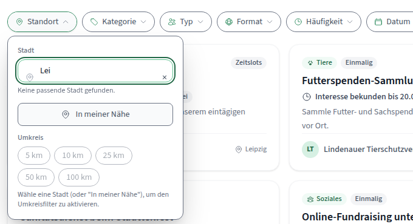

| Query | API response | UI |
| ----- | ------------ | -- |
| `Le` | `[Leipzig]` | suggestion shown |
| `Lei` | `[Köln, Dresden, Regensburg, Halle (Saale)]` | "Keine passende Stadt gefunden." |
| `Leip` | `[]` | "Keine passende Stadt gefunden." |
| `Leipz` | `[]` | "Keine passende Stadt gefunden." |
| `Leipzi` | `[]` | "Keine passende Stadt gefunden." |
| `Leipzig` | `[Leipzig]` | suggestion shown, badged "Passt genau" |

Impact: "find an assignment near me" is the product's core job, and the location field is the entrance to it. A user who types at a normal pace sees an explicit "no matching city found" for most of the word and reasonably concludes their town is not on the platform. The two orgs in the seed data are both in Leipzig, so this fails on the single most likely query in the whole system.

Suggested fix, frontend side (the root cause is almost certainly backend, see below): (a) do not replace a previously good suggestion list with the empty state while a newer request is in flight or has returned nothing - keep the last non-empty result and only clear it when the input itself is cleared; (b) suppress the empty state until the field has been idle for a beat *and* at least one request has completed for the current value; (c) when the API returns entries that do not contain the query (the `Lei` case), the current client-side filter correctly discards them, but the resulting message should distinguish "still searching" from "nothing matched". Effort: S.

Probable backend cause: the geocoding endpoint returns results unrelated to the query at 3 characters and nothing at all for 4-6 character prefixes of a city it does resolve at 7. Not fixed here.

#### F2 - Time slots that are already in the past are offered as available

**Category:** Content
**Severity:** High
**Confidence:** Confirmed
**Classification:** Best practice (Nielsen-Norman heuristic #2 "Match between system and the real world"; #5 "Error prevention")
**Location:** `/volunteer-opportunities/01a0254e-5025-75e6-a903-2d8c98fa6811` ("Erste-Hilfe-Kurs"), section "VERFÜGBARE ZEITSLOTS"; also the organizer's "Zeitslot" filter on the engagement management page and the dashboard calendar - Persona: all - Viewport: all - Language: DE/EN

Evidence: `assets/2026-08-24/02-past-timeslot-offered.png`. On 24.08.2026 the page lists `18.08.2026, 11:00-19:00 - 19 Plätze frei` under the heading "Verfügbare Zeitslots", six days after that slot ended. The summary block directly above it says `WANN 04.09.2026, 11:00`, i.e. the page contradicts itself about when the assignment happens.

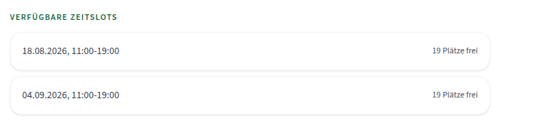

Impact: a volunteer cannot tell which of the two slots is real. The count in the hero ("38 Plätze frei") is the sum of both, so the headline availability number is inflated by a slot nobody can attend. For an organizer, the same stale slot pollutes the slot filter and the calendar.

Suggested fix: filter or visually demote elapsed slots in the detail view rather than rendering whatever the API returns - a past slot should either disappear from "Verfügbare Zeitslots" or move to a clearly labelled "Vergangen" group with its seat count suppressed. The same guard belongs in the organizer slot filter. Effort: S.

Probable backend cause: the opportunity endpoint appears to return all slots regardless of end time. Not fixed here.

#### F3 - German quotation marks appear in three different styles, two of them in the same dialog

**Category:** Content
**Severity:** Medium
**Confidence:** Confirmed
**Classification:** Best practice (project's own convention - `de.json` already uses German typographic quotes in 17 strings; Nielsen-Norman heuristic #4 "Consistency and standards")
**Location:** throughout the German UI - Persona: all - Viewport: all - Language: DE

Evidence: `assets/2026-08-24/09-mixed-quote-styles.png` shows both styles inside the create-opportunity dialog at once:

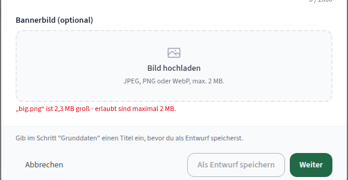

- typographic German `„...“` - upload errors: `„big.png“ ist 2,3 MB gross - erlaubt sind maximal 2 MB.`; prose, e.g. `help.intro`, `privacyPolicy.section2Body3`
- straight ASCII `"..."` - two lines below in the same dialog: `Gib im Schritt "Grunddaten" einen Titel ein...`; the filter chip on `/opportunities` renders `"Gassi"`; the withdraw dialog renders `Dein Platz für "Gassi-Dienst für Tierheimhunde"...`
- English curly `“...”` - user-submitted messages on `/my-signups` and on the organizer's engagement list: `Deine Nachricht: “Ich würde beim nächsten Blutspendetermin gerne...”`

`de.json` currently holds 17 occurrences of `„` against 40 escaped `\"`, plus the curly pair applied in component markup around user content.

Impact: quotation marks are one of the most visible signals of whether a German interface was localised carefully or machine-assembled. Three styles, sometimes adjacent, read as sloppiness in a product whose credibility rests on looking trustworthy to volunteers and small associations.

Suggested fix: pick `„...“` for German and `“...”` for English, apply it to every interpolated value in the locale files, and route the two component-level quote wrappers (sign-up message rendering) through the same rule so the style follows the active language. Effort: S.

#### F4 - The withdraw dialog promises to release a seat that does not exist

**Category:** Content
**Severity:** Medium
**Confidence:** Confirmed
**Classification:** Best practice (Nielsen-Norman heuristic #2 "Match between system and the real world")
**Location:** opportunity detail, "Zurückziehen" on an expression-of-interest opportunity - Persona: Vera - Viewport: 1440 - Language: DE

Evidence: `assets/2026-08-24/19-withdraw-dialog-wording.png`. Withdrawing from "Gassi-Dienst für Tierheimhunde" (type: Interessenbekundung, no fixed capacity) opens `Anmeldung zurückziehen?` / `Dein Platz für "Gassi-Dienst für Tierheimhunde" wird wieder freigegeben, und du kannst dich später erneut anmelden.` The submission toast for the same flow reads `Anmeldung übermittelt.`

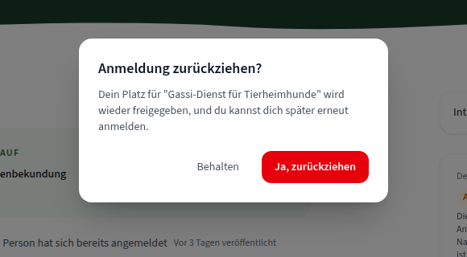

Impact: an expression of interest has no seat to release, so the sentence describes a mechanic that does not apply. Combined with the toast, the interface talks about a booking where the user performed a much softer action, which muddies the distinction between the two opportunity types the whole product is built around.

Suggested fix: branch the confirmation copy on opportunity type - for an expression of interest, say what actually happens ("Deine Interessenbekundung wird zurückgezogen. Du kannst später erneut Interesse bekunden."). Same for the toast. Effort: S.

#### F5 - Member search reports "no users found" for users it did find

**Category:** Content
**Severity:** Medium
**Confidence:** Confirmed
**Classification:** Best practice (Nielsen-Norman heuristic #9 "Help users recognize, diagnose, and recover from errors")
**Location:** `/app/{orgId}/dashboard/members`, "Mitglied einladen" - Persona: Olaf - Viewport: 1440 - Language: DE

Evidence: `assets/2026-08-24/18-invite-member-not-found.png`. `GET /v1/organizations/{id}/members/search?q=vera` returns 200; the panel renders `Keine Nutzer:innen gefunden.` The same is true for `q=olaf`. `q=maik` returns `maikhasler` with an "Einladen" button, confirming the search itself works and existing members are simply filtered out of the result.

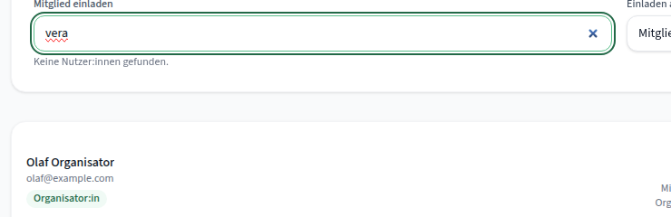

Impact: an organizer checking whether a colleague is already on the platform is told they do not exist. The correct answer ("already a member of this organization") is the opposite of what is shown.

Suggested fix: distinguish the two states - render already-joined matches as a disabled row labelled "Ist bereits Mitglied" instead of folding them into the empty state. Effort: S.

#### F6 - Nowhere to invite someone who does not have an account yet

**Category:** Content
**Severity:** Medium
**Confidence:** Confirmed
**Classification:** Best practice (Nielsen-Norman heuristic #10 "Help and documentation")
**Location:** `/app/{orgId}/dashboard/members` - Persona: Olaf - Viewport: all - Language: DE/EN

Evidence: `assets/2026-08-24/18-invite-member-not-found.png`. The only entry point is `#member-search` (`placeholder="Nach Benutzername oder E-Mail suchen..."`, minimum four characters) plus a role select. Searching for an unregistered address yields `Keine Nutzer:innen gefunden.` and nothing else - no explanation, no next step.

Impact: onboarding a second coordinator is the moment an association decides whether the platform is usable. Right now that person has to be told out of band to register first, and the interface never says so.

Suggested fix: at minimum, extend the empty state to explain the constraint and give the organizer something to send ("Diese Person hat noch kein Konto. Schicke ihr den Registrierungslink..."), with a copyable link. A real email invitation flow is the larger version of the same fix. Effort: S for the empty state, L for email invitations.

#### F7 - The draft hint points at the step you are already on

**Category:** Content
**Severity:** Low
**Confidence:** Confirmed
**Classification:** Best practice (Nielsen-Norman heuristic #9)
**Location:** create-opportunity wizard, step 1 - Persona: Olaf - Viewport: 1440 - Language: DE

Evidence: `assets/2026-08-24/04-modal-no-scrim.png`, bottom of the dialog. While the wizard is on "Schritt 1 von 4: Grunddaten", the footer reads `Gib im Schritt "Grunddaten" einen Titel ein, bevor du als Entwurf speicherst.`

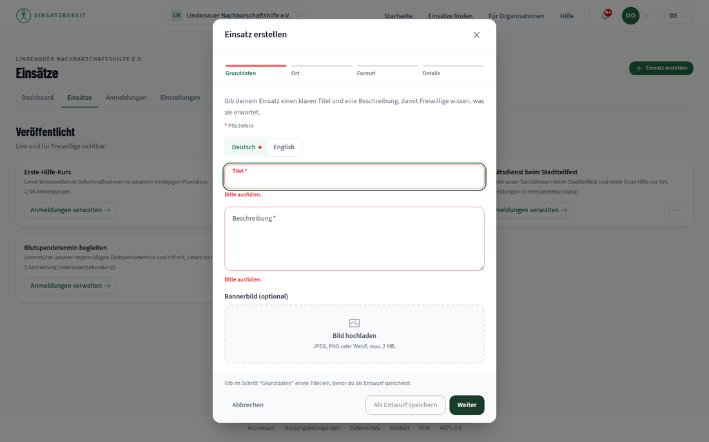

Impact: mild, but it sends the user looking for a step they are standing in. Suggested fix: drop the step reference when the user is already on that step ("Gib einen Titel ein, bevor du als Entwurf speicherst."), or move the hint next to the title field. Effort: S.

#### F8 - "Angebote" appears where the rest of the product says "Einsätze"

**Category:** Content
**Severity:** Low
**Confidence:** Confirmed
**Classification:** Best practice (project's own terminology - `de.json` uses "Einsatz"/"Einsätze" 182 times against 2 uses of "Angebot")
**Location:** home hero search, unresolvable location - Persona: anonymous - Viewport: 1440 - Language: DE
**Code:** `frontend/src/locales/de.json:64` (`heroSearchLocationNotFound`)

Evidence: `assets/2026-08-24/14-hero-location-not-found.png`. Searching for "Kleinkleckersdorf" from the home hero raises a `role="alert"` banner reading `Dieser Ort wurde nicht gefunden - zeige stattdessen alle Angebote.`

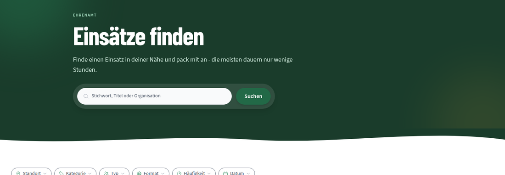

Impact: small in isolation, but it is a term the product otherwise never uses, in a message that appears at the exact moment a user is already confused. Suggested fix: "...zeige stattdessen alle Einsätze." Effort: S.

Worth recording as the counter-observation: the DE/EN terminology is otherwise disciplined. Einsatz/opportunity, Anmeldung/sign-up and Zeitslot/slot are used consistently across 1357 keys, and the du/Sie split (informal in the product, formal in the legal pages) holds without leakage in either direction.

#### F9 - One meta description for every route

**Category:** Content
**Severity:** Low
**Confidence:** Confirmed
**Classification:** Preference (with a best-practice edge for link previews)
**Location:** all routes - Persona: any - Viewport: any - Language: DE/EN

Evidence: `<title>` is correctly per-route and localised ("Einsätze finden | Einsatzbereit", "Find opportunities | Einsatzbereit"), but `meta[name=description]` is byte-identical on `/`, `/opportunities`, `/organizations`, `/help` and the 404 page.

Impact: an opportunity link shared in a WhatsApp group or a Slack channel previews with generic platform boilerplate instead of the assignment. Suggested fix: set the description per route, and on the detail page use the opportunity's own summary. Effort: M (needs the description to be set after the data loads).

---

### Visual Design

#### F10 - The hero loses all of its imagery at 375 px and keeps one clipped blob

**Category:** Visual Design
**Severity:** Medium
**Confidence:** Confirmed
**Classification:** Preference (design judgement, not a rule violation)
**Location:** `/` - Persona: any - Viewport: 375 - Language: DE/EN

Evidence: `assets/2026-08-24/07-hero-375.png` against the desktop composition. At 1440 the hero carries three blob-cropped volunteer photographs plus a mint and a mustard shape, and it is the most confident thing on the page. At 375 all three photographs are gone and what remains is a flat dark-green rectangle with a single mustard shape sliced off by the container's right edge - a crop that reads as a rendering artefact rather than a decision.

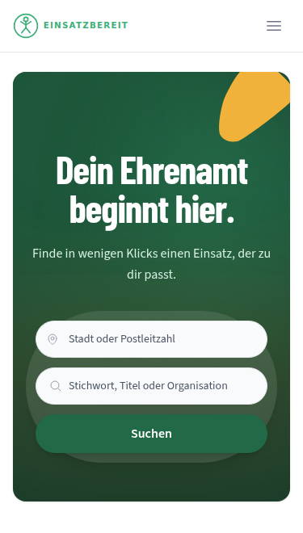

Impact: mobile is where volunteers actually browse, and it gets the version of the brand with the personality removed. The identity that the desktop hero establishes never reaches the majority of the audience.

Suggested fix: keep one photograph on mobile (the "hands together" crop carries the message best at small size) and either finish the mustard shape inside the container or push it far enough off-canvas that the crop looks intentional. Effort: M.

#### F11 - At 1440 px the right half of the interior pages is empty

**Category:** Visual Design
**Severity:** Medium
**Confidence:** Confirmed
**Classification:** Preference
**Location:** `/opportunities` hero, opportunity detail (hero and the "Weitere Einsätze dieser Organisation" rail) - Persona: any - Viewport: 1440 - Language: DE/EN

Evidence: `assets/2026-08-24/14-hero-location-not-found.png` (browse hero) and the full-page capture of the detail route. The `/opportunities` hero is a roughly 460 px tall dark-green band whose content stops at about x=880; the remaining 40 percent is empty. On the detail page the related-opportunity cards inherit the narrow left content column and lay out two-up inside 670 px while the entire right half of the viewport is white.

Impact: the home page is composed with real intent; the interior pages read as the same template with the art removed. The related-opportunities rail in particular looks like a layout that lost its right-hand column.

Suggested fix: either commit to the asymmetry with something on the right (the home hero's shape language would carry over cleanly), or let the related-opportunities section break out of the article column to full width and lay out three-up. Effort: M.

#### F12 - The founder portrait is the one stock-looking image on the page

**Category:** Visual Design
**Severity:** Low
**Confidence:** Value judgement
**Classification:** Preference
**Location:** `/`, "Vom Gründer" band - Persona: any - Viewport: 1440 - Language: DE/EN

Evidence: full-page capture of `/`, second section. Every other photograph on the page shows people doing volunteer work: sorting bottles, a beach clean-up crew, hands stacked together. The founder portrait places him against a blue "digital network and binary code" backdrop - the visual vocabulary of a generic SaaS landing page, in a section whose entire job is to make the project feel personal and human.

Impact: the copy in that band is the most personal writing in the product ("Ehrenamt sollte nicht an Papierkram scheitern"), and the image argues against it.

Suggested fix: a plain portrait, ideally in a volunteering context, cropped into the same blob language as the hero photographs. Effort: S once an image exists.

#### F13 - The declared theme colour is not the green the app actually uses

**Category:** Visual Design
**Severity:** Low
**Confidence:** Confirmed
**Classification:** Preference
**Location:** `index.html`, `manifest.de.webmanifest`, `manifest.en.webmanifest` - Persona: any - Viewport: 375 (most visible) - Language: DE/EN

Evidence: both manifests and the `<meta name="theme-color">` declare `#2d8a5e`, which is `--color-brand-600`. The app's dark surfaces - the hero, the "Für Organisationen" band, the primary buttons - use `--color-brand-800: #1a3c2b`, and focus rings use `--color-brand-700: #226947`. `#2d8a5e` appears nowhere as a large surface.

Impact: on Android Chrome and in the installed PWA the browser chrome is tinted a mid green that meets a much darker green at the top of the page, so the app's own header looks like it is sitting on someone else's colour.

Suggested fix: set `theme_color` and the meta tag to `#1a3c2b` so the system chrome continues the hero. Effort: S.

---

### UX

#### F14 - Danger red is used for actions that are not destructive

**Category:** UX
**Severity:** Medium
**Confidence:** Confirmed
**Classification:** Best practice (Nielsen-Norman heuristic #4 "Consistency and standards")
**Location:** `/opportunities` filter bar ("Zurücksetzen"), account menu ("Abmelden"), engagement lists ("Absagen") - Persona: all - Viewport: all - Language: DE/EN

Evidence: `assets/2026-08-24/11-filter-reset-danger-red.png` (the "Zurücksetzen" chip sits in the filter row in red with a red border while every neighbouring chip is neutral) and `assets/2026-08-24/10-account-menu-abmelden-red.png` ("Abmelden" is the only red item in the account menu). The tokens are not merely similar, they are identical. Measured on the live DOM:

| Control | Action | `color` | `border-color` |
| ------- | ------ | ------- | -------------- |
| "Zurücksetzen" chip | clears the active filters | `oklch(0.505 0.213 27.518)` | `oklch(0.637 0.237 25.331)` |
| "Organisation löschen" | permanently deletes an organization | `oklch(0.505 0.213 27.518)` | `oklch(0.637 0.237 25.331)` |
| "Mein Konto löschen" | permanently deletes the account | `oklch(0.505 0.213 27.518)` | `oklch(0.637 0.237 25.331)` |
| "Abmelden" | signs out | `oklch(0.577 0.245 27.325)` | - |

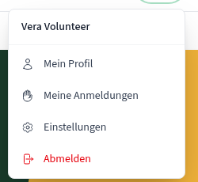

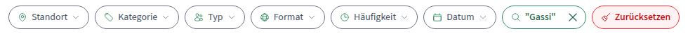

Impact: clearing a filter is a one-click-reversible convenience and signing out costs nothing but a re-login; dressing both as dangerous trains users to ignore the colour, which is exactly the signal that has to survive for account deletion.

Suggested fix: reserve red for irreversible actions. "Zurücksetzen" should be a neutral or brand-tinted chip; "Abmelden" should be a normal menu item, separated by a rule if it needs distance. "Absagen" is a reasonable borderline case and can keep the red, but the trash icon on it is wrong - nothing is deleted when an organizer declines a sign-up (see F23). Effort: S.

#### F15 - The notifications empty state says nothing

**Category:** UX
**Severity:** Low
**Confidence:** Confirmed
**Classification:** Best practice (frontend-design writing guidance: "an empty screen is an invitation to act")
**Location:** notifications dropdown - Persona: Vera - Viewport: 1440 - Language: DE/EN
**Code:** `frontend/src/components/Header/NotificationDropdown.tsx:169`

Evidence: `assets/2026-08-24/12-notifications-empty.png`. The panel renders a heading and the single sentence `Keine Benachrichtigungen.` The shared `EmptyState` component supports `message` and `action`, and the rest of the product uses them well - the profile says `Dein Profil ist noch leer / Füge eine Bio, Fähigkeiten oder Kontaktpräferenzen hinzu, damit Organisationen etwas über dich wissen.` with a "Profil vervollständigen" button; the offline state explains itself and offers a retry; the admin reports tab says `Keine gemeldeten Inhalte. Alles erledigt.`

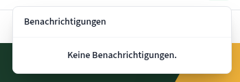

Impact: minor on its own, but it is the one empty state that gives a new user nothing - it neither explains when notifications appear nor points anywhere. It also makes it ambiguous whether the panel is empty or still loading.

Suggested fix: pass a `message` that names the trigger ("Hier erscheinen Bestätigungen, Absagen und Erinnerungen zu deinen Anmeldungen."). Secondary: `EmptyState` renders its title as a `<p>`, so empty regions are invisible to heading navigation; a heading element would be a small improvement across all 18 call sites. Effort: S.

#### F16 - The detail map cannot be panned or zoomed

**Category:** UX
**Severity:** Low
**Confidence:** Confirmed
**Classification:** Preference
**Location:** opportunity detail - Persona: any - Viewport: 375 primarily - Language: DE/EN
**Code:** `frontend/src/components/SingleMarkerMap.tsx:52-58`

Evidence: the map is created with `dragging={false} scrollWheelZoom={false} doubleClickZoom={false} touchZoom={false} boxZoom={false} keyboard={false} zoomControl={false}`. To be explicit about what this gets right: because everything is off, there is **no** touch-scroll-versus-zoom conflict on mobile, and the container carries `role="group"` with `aria-label="Karte mit dem Standort von Karl-Heine-Straße 12, 04177 Leipzig"` - both good decisions.

The trade-off is that at 375 px the map is a static 339 x 254 image at zoom 14, which is enough to see one marker and almost nothing else. A volunteer deciding whether an address is reachable cannot zoom out to find the nearest tram stop; the only escape is "Route planen", which leaves the site.

Suggested fix: keep dragging off (it protects page scroll) but consider enabling pinch zoom on touch with a "zum Zoomen mit zwei Fingern" hint, or offer a fullscreen map affordance. Effort: M.

#### F17 - "Route planen" does not say where it sends you

**Category:** UX
**Severity:** Low
**Confidence:** Confirmed
**Classification:** Best practice (Nielsen-Norman heuristic #2; #1)
**Location:** opportunity detail, below the map - Persona: any - Viewport: all - Language: DE/EN

Evidence: the link resolves to `https://www.google.com/maps/dir/?api=1&destination=51.3325196,12.3454319` and carries an external-link icon but no destination name. This sits directly under a map whose tiles the privacy policy explicitly says are proxied through the project's own backend rather than fetched from a third party (`privacyPolicy.section3cBody`), so the page takes care not to leak the user to a third party and then offers a one-click route to Google.

Impact: users who care about that distinction are not given the chance to notice it, and nobody is told a new tab is about to open onto another company's product.

Suggested fix: name the destination in the label ("In Google Maps öffnen") or offer a provider choice. Effort: S.

---

### UI

#### F18 - Every `<select>` renders without its dropdown chevron in production

**Category:** UI
**Severity:** High
**Confidence:** Confirmed
**Classification:** Best practice (Nielsen-Norman heuristic #4 "Consistency and standards"; #6 "Recognition rather than recall")
**Location:** `/app/{orgId}/dashboard/engagements` ("Status"), `/app/{orgId}/dashboard/members` ("Einladen als"), `/app/{orgId}/dashboard/opportunities/{id}/engagements` ("Status", "Zeitslot") - Persona: Olaf, Admin - Viewport: all - Language: DE/EN
**Code:** `frontend/src/lib/formClasses.ts:8`

Evidence: `assets/2026-08-24/03-select-missing-chevron.png`. The "Status" control renders as a plain rounded box containing the words "Alle Status" and nothing else; next to it the search input looks identical in weight, so the dropdown reads as a disabled text field. The cause is deterministic and reproduces on every load, with a console error naming it exactly:

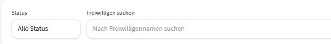

```
Refused to load the image 'data:image/svg+xml;charset=utf-8,%3Csvg ... %3E'
because it violates the following Content Security Policy directive
```

`selectClass` sets `appearance: none` and paints the chevron with `bg-[url('data:image/svg+xml;...')]`. The deployed CSP is `img-src 'self' blob: https://api.maik-hasler.de https://storage.maik-hasler.de` - no `data:` - so the background image is blocked while `appearance: none` has already removed the native arrow. Seven usages across three files, on three routes.

Impact: this is the one defect that makes a shipped screen look broken rather than imperfect. Organizers cannot tell the status filter is interactive, and it is inconsistent with every other dropdown in the product (the org switcher, the six filter chips and the language selector all render their chevrons, because those draw inline `<svg>` elements).

Suggested fix, frontend side: replace the CSS background with a real inline `<svg>` positioned over the select (the same approach the filter chips already use), which removes the CSP dependency entirely. The alternative - adding `data:` to `img-src` - is a server-header change and widens the policy for the whole app, so the component fix is the better one. Effort: S.

#### F19 - No modal in the app dims the page behind it

**Category:** UI
**Severity:** Medium
**Confidence:** Confirmed
**Classification:** Best practice (Nielsen-Norman heuristic #1 "Visibility of system status"; #8 "Aesthetic and minimalist design")
**Location:** create-opportunity wizard, sign-up / expression-of-interest dialog, withdraw confirmation, image crop dialog, mobile navigation menu - Persona: all - Viewport: all - Language: DE/EN

Evidence: `assets/2026-08-24/04-modal-no-scrim.png` (create wizard) and `assets/2026-08-24/08-mobile-menu-375.png` (mobile menu). Scanning every `position: fixed` element with `z-index >= 10` while a modal is open returns exactly two: the toast container, and the modal wrapper itself with `background-color: rgba(0, 0, 0, 0)`. There is no scrim element at all.

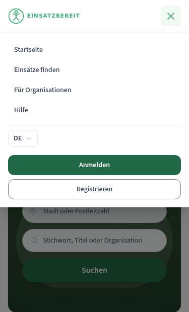

In the create-wizard screenshot the opportunity cards behind the dialog are fully legible and their "Anmeldungen verwalten" buttons still look pressable; in the mobile-menu screenshot the hero's search inputs sit at full contrast immediately below the open panel.

Impact: a modal state is communicated only by a drop shadow. Users cannot tell what is still interactive, and on mobile the menu reads as a panel that dropped in rather than as a state the page is in.

To be clear about what is already right: the dialogs themselves are well built - `role="dialog"`, `aria-modal="true"`, a labelled title, focus moved into the first field, focus trapped, `html { overflow: hidden }` scroll lock, Escape to close, and an unsaved-changes guard on the wizard. The scrim is the missing piece, not the semantics.

Suggested fix: add a single translucent backdrop element (`bg-black/40` or a brand-tinted equivalent) to the shared `Modal` and to `MobileMenu`. One change covers every overlay in the product. Effort: S.

#### F20 - The org switcher truncates mid-word at 375 px

**Category:** UI
**Severity:** Medium
**Confidence:** Confirmed
**Classification:** Best practice (Nielsen-Norman heuristic #6 "Recognition rather than recall")
**Location:** org app shell header - Persona: Olaf, Vera - Viewport: 375 - Language: DE/EN
**Code:** `frontend/src/lib/middleTruncateSplit.ts:1-4`, `frontend/src/components/Header/OrganizationSwitcher.tsx:88-108`

Evidence: `assets/2026-08-24/06-org-switcher-and-tabs-375.png`. "Lindenauer Nachbarschaftshilfe e.V." renders as **"Lin... schaftshilfe e.V."**

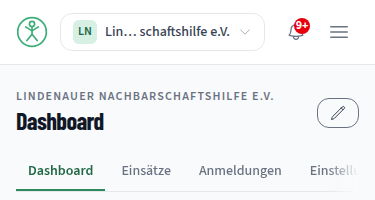

The mechanism: `splitForMiddleTruncation` splits the name at the character midpoint (`Math.ceil(text.length / 2)`), giving head `"Lindenauer Nachbar"` and tail `" schaftshilfe e.V."`. The head is `truncate`d, the tail is `shrink-0 whitespace-nowrap`. At 375 px the fixed tail consumes nearly all available width, so the head collapses to three characters and the ellipsis lands inside the word "Nachbarschaftshilfe".

The intent is sound - middle truncation keeps two similarly prefixed org names distinguishable, and the unit test in `middleTruncateSplit.test.ts` is explicitly about that case - but a split that can fall inside a word produces a label that reads as a bug.

Suggested fix: snap the split to a word boundary (search backwards from the midpoint for whitespace), and cap the tail so it can never claim more than roughly half the container. As a fallback below a width threshold, plain end truncation with the existing `title` attribute is more readable than a mangled middle. Effort: S.

#### F21 - The last organizer tab is off-screen at 375 px with no scroll affordance

**Category:** UI
**Severity:** Medium
**Confidence:** Confirmed
**Classification:** Best practice (Nielsen-Norman heuristic #6 "Recognition rather than recall")
**Location:** `/app/{orgId}/dashboard/*` tab strip - Persona: Olaf, Vera - Viewport: 375 - Language: DE/EN

Evidence: `assets/2026-08-24/06-org-switcher-and-tabs-375.png` plus measurement: the strip has `scrollWidth: 474` against `clientWidth: 343` with `overflow-x: auto`; the "Mitglieder" tab starts at x=406 in a 375 px viewport, i.e. entirely outside it. The only hint that more exists is that "Einstellungen" happens to be sliced by the viewport edge.

Impact: "Mitglieder" is where an organizer invites their team and promotes a co-organizer. On a phone it is invisible and, without a fade, arrow or peeking tab, undiscoverable except by an accidental horizontal swipe.

Suggested fix: add an edge fade or scroll-shadow on the strip, and make sure the active tab scrolls itself into view on mount. At this count the tabs would also fit a two-row wrap or a dropdown at the narrowest breakpoint. Effort: S.

#### F22 - Invalid fields are styled differently in different dialogs, and the focus ring stays brand green

**Category:** UI
**Severity:** Medium
**Confidence:** Confirmed
**Classification:** Best practice (Nielsen-Norman heuristic #4 "Consistency and standards"; #9)
**Location:** sign-up / expression-of-interest dialog vs. create-opportunity wizard vs. Keycloak login - Persona: Vera, Olaf - Viewport: 1440 - Language: DE

Evidence, measured on the live DOM:

| Surface | Field | Border while invalid |
| ------- | ----- | -------------------- |
| Expression-of-interest dialog | `textarea` (focused) | `rgb(91, 191, 140)` - `--color-brand-400`, i.e. **green** |
| Create-opportunity wizard | `#opportunity-title` (focused) | `oklch(0.704 0.191 22.216)` - red |
| Create-opportunity wizard | `#opportunity-description` (blurred) | `oklch(0.808 0.114 19.571)` - light red |
| Keycloak login | `#username`, `#password` | red |

Screenshots: `assets/2026-08-24/05-signup-modal-invalid-green-border.png` and `assets/2026-08-24/20-create-wizard-invalid-field.png`. In the second, note that even where the border is correctly red, the 2 px focus ring around it is brand green, so a focused invalid field is wrapped in the colour the product uses for "fine".

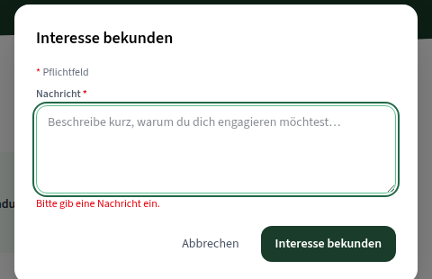

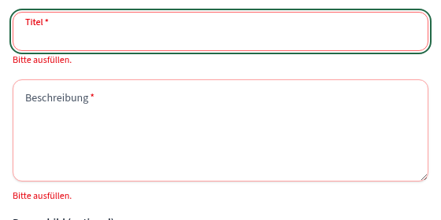

The ARIA underneath is correct everywhere - `aria-invalid="true"`, `aria-describedby` pointing at the message, `role="alert"` on the message, and focus returned to the offending field - so this is a visual-language problem, not a WCAG 3.3.1 failure.

Impact: in the expression-of-interest dialog the only signal that something is wrong is a line of red text below a field that looks valid and focused. Across the product, three different visual treatments for the same state make the error language unlearnable.

Suggested fix: one error token for border and ring, applied by the shared `Field` primitive, with the focus ring switching to the error colour when `aria-invalid` is set. Effort: S.

#### F23 - The report control loses its label at 375 px

**Category:** UI
**Severity:** Low
**Confidence:** Confirmed
**Classification:** Best practice (Nielsen-Norman heuristic #4; WCAG 2.2 AA 3.2.4 "Consistent Identification" in spirit)
**Location:** opportunity detail - Persona: any - Viewport: 375 - Language: DE/EN

Evidence: `assets/2026-08-24/13-report-icon-only-375.png`. At 1440 the control reads "⚑ Melden". At 375 the text is dropped and only the outline flag icon remains, right-aligned in otherwise empty space above the info card. It carries `aria-label="Einsatz melden"`, so assistive technology is fine; sighted mobile users get an unlabelled flag.

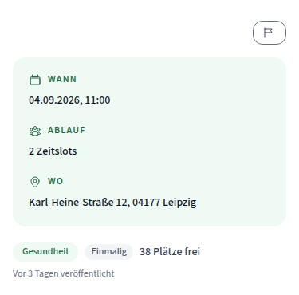

Impact: a flag glyph most commonly means "save" or "bookmark" elsewhere, so the affordance invites mistaken taps on a moderation action - and moderation is precisely where accidental use is costly.

Suggested fix: keep the text label on mobile (it is two syllables) or move the control into an overflow menu with a written label. Related and cheap: "Absagen" in the organizer engagement list uses a trash icon although nothing is deleted - a cross or a slash matches the action better. Effort: S.

---

### Accessibility

These findings deliberately sit outside what `jsx-a11y` and the existing axe-core page scans already cover. The broader picture from the keyboard-only passes is good: the skip link works and moves real focus to `<main>`, tab order matched visual order on every page tested, every interactive element had a visible 2 px outline plus a white halo, and no focus trap was found outside the intended modal ones.

#### F24 - The star rating is five unrelated buttons

**Category:** Accessibility
**Severity:** Medium
**Confidence:** Confirmed
**Classification:** Best practice (WAI-ARIA Authoring Practices, radio group pattern; WCAG 2.2 AA 1.3.1 "Info and Relationships")
**Location:** "Erfahrung bewerten" dialog, reached from a past sign-up - Persona: Vera - Viewport: 1440 - Language: DE/EN

Evidence: `assets/2026-08-24/17-rating-modal-stars.png` and the live DOM:

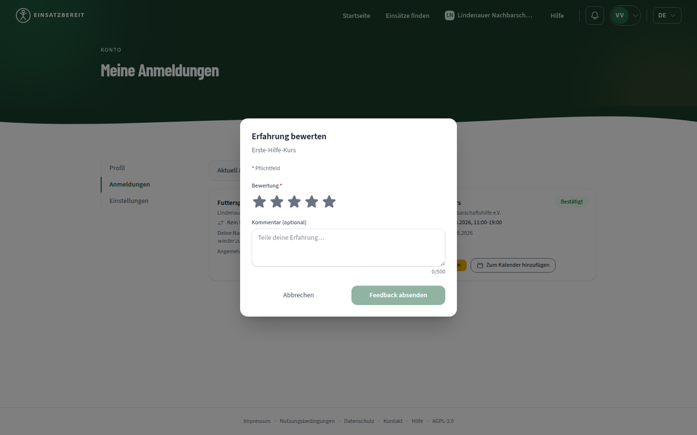

```
BUTTON aria-label="1 Stern"   role=null aria-checked=null
BUTTON aria-label="2 Sterne"  role=null aria-checked=null
BUTTON aria-label="3 Sterne"  role=null aria-checked=null
BUTTON aria-label="4 Sterne"  role=null aria-checked=null
BUTTON aria-label="5 Sterne"  role=null aria-checked=null
```

Tabbing through the dialog produces five separate stops before the comment field. There is no `role="radiogroup"`, no `aria-checked`, no arrow-key navigation, no roving `tabindex`, and the required-field label "Bewertung*" is not programmatically associated with the group.

Impact: a keyboard user must press Tab five times to give five stars. A screen-reader user hears five unrelated buttons, is never told which value is currently selected, and is not told that together they form the dialog's one required field. axe-core cannot flag this because every individual button is valid.

Suggested fix: wrap the stars in `role="radiogroup"` labelled by the "Bewertung" text, give each star `role="radio"` with `aria-checked`, implement arrow-key selection with a roving `tabindex` so the group is one tab stop, and add `aria-required="true"`. Effort: M.

#### F25 - The mobile menu's close control cannot be reached by keyboard, and its label never changes

**Category:** Accessibility
**Severity:** Medium
**Confidence:** Confirmed
**Classification:** Best practice (WAI-ARIA Authoring Practices, dialog pattern; WCAG 2.2 AA 4.1.2 "Name, Role, Value")
**Location:** mobile navigation - Persona: all - Viewport: 375, 768 - Language: DE/EN
**Code:** `frontend/src/components/Header/MobileHeader.tsx:43-48`, `frontend/src/components/Header/MobileMenu.tsx:60-78`

Evidence: with the menu open, the focus trap cycles through exactly seven elements - Startseite, Einsätze finden, Für Organisationen, Hilfe, the language button, Anmelden, Registrieren - and never reaches the visible X. The toggle lives in the header, outside `panelRef`, so `panelRef.current.querySelectorAll(FOCUSABLE_SELECTOR)` cannot see it (`toggleInsideDialog: false`).

Separately, the toggle renders `aria-label={t("nav.openMenu")}` unconditionally while `MenuToggleIcon` swaps to an X on `open`. With the menu open, the icon says "close" and the accessible name still says "Menü öffnen".

Impact: Escape does close the menu, so nobody is trapped, but the one visible control for closing it is unreachable by keyboard, and the label actively misdescribes it. Worth contrasting with the project's own Keycloak theme, which gets the equivalent case right: its password toggle switches between "Passwort einblenden" and "Passwort ausblenden".

Suggested fix: include the trigger in the trap's focusable set (or move a close button inside the panel and focus it on open), and swap the label to `nav.closeMenu` when `mobileOpen` is true. Adding `aria-controls` pointing at the panel is a small extra. Effort: S.

#### F26 - Required registration fields are not marked required

**Category:** Accessibility
**Severity:** Low
**Confidence:** Confirmed
**Classification:** Best practice (WCAG 2.2 AA 3.3.2 "Labels or Instructions"; Nielsen-Norman heuristic #5)
**Location:** Keycloak registration page (**FTL template, not React**) - Persona: anonymous - Viewport: 1440 - Language: DE/EN

Evidence: the form renders a "* Pflichtfeld" legend and asterisks on "E-Mail*", "Benutzername*", but the inputs carry `required: false` and no `aria-required`, so neither native browser validation nor assistive technology knows they are mandatory. The mismatch is only caught after a round trip to the server.

Impact: small, but it is the first form a new volunteer meets, and it fails a check the login page in the same theme passes properly (login sets `aria-invalid` and `aria-describedby` correctly on both fields).

Suggested fix: add `required` and `aria-required="true"` in the registration FTL template. Effort: S.

The rest of the Keycloak theme reviewed well and is worth recording as a strength (`assets/2026-08-24/16-keycloak-login-error.png`): `ui_locales` is forwarded from the app so DE and EN both render correctly, the locale switcher is a native `<details>/<summary>` with a proper `aria-label`, the login error preserves the entered username, returns focus to it, and wires `aria-invalid` + `aria-describedby` on both fields. One caveat that a full screen-reader pass would need to confirm: the error region is `aria-live="polite"` without `role="alert"`, and since Keycloak re-renders the whole page on a failed login, a live region that already exists at load time is generally not announced. `role="alert"` would be the safer choice.

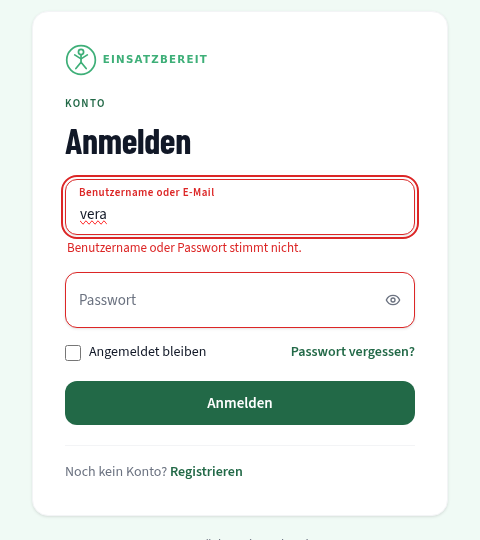

---

### i18n

No blocking findings. Recorded because the brief asks and because the result is genuinely good:

- **Key parity is exact**: 1357 keys in `de.json`, 1357 in `en.json`, zero on either side only.
- **No raw i18next keys** surfaced on any route in either language, and no mixed-language remnants.
- **State survives the switch**: switching to English on `/opportunities?q=Gassi` kept the route, the query string, the active filter chip and the result set; `<html lang>` and `<title>` both updated.
- **Date and number formats are per-locale**: `04.09.2026, 11:00` in German, `4 Sept 2026, 11:00` in English.
- **No layout broke under the longer German strings** at any of the three viewports - `document.scrollWidth` never exceeded the viewport width on any page tested, in either language.
- **Per-language PWA manifests** (`manifest.de.webmanifest` / `manifest.en.webmanifest`) with translated descriptions and screenshot labels.

The quotation-mark inconsistency (F3) and the "Angebote" slip (F8) are filed under Content because they are German copy issues rather than i18n mechanics.

---

### PWA

#### F27 - `config.js` is not precached, so offline the app silently reconfigures itself to localhost

**Category:** PWA
**Severity:** Low
**Confidence:** Confirmed
**Classification:** Best practice (Nielsen-Norman heuristic #9)
**Location:** all routes, offline - Persona: any - Viewport: 1440 - Language: DE/EN

Evidence: with the service worker registered and `/`, `/opportunities` and `/help` visited, going offline and reloading produces:

```
FAILED GET https://einsatzbereit.maik-hasler.de/config.js :: net::ERR_INTERNET_DISCONNECTED
Refused to connect to 'http://localhost:8080/realms/einsatzbereit/.well-known/openid-configuration' ...
Refused to connect to 'http://localhost:5000/v1/volunteer-opportunities?PageNumber=1&PageSize=9' ...
```

The runtime config file is not in the precache manifest, so when it fails to load the app falls back to its development defaults and starts addressing `localhost:8080` and `localhost:5000`. Those requests are then blocked by the app's own `connect-src`, which is what keeps the failure contained.

Impact: today this is invisible to users because the visible offline handling is good (see below) and the CSP catches the fallback. It is still the wrong failure mode - the app is one CSP relaxation away from silently pointing at a dev backend, and the console fills with misleading errors that will cost time in any future offline debugging.

Suggested fix: add `config.js` to the service worker's precache list, and make the config loader keep the last successfully loaded values instead of falling back to development defaults when the fetch fails. Effort: S.

Worth stating plainly as a strength (`assets/2026-08-24/15-offline-state.png`): the offline experience itself is handled the way the brief asks for. Previously visited routes reload from the service worker, an unvisited route (`/imprint`) still renders from the cached shell, and the data-dependent panel shows a proper state rather than an error - an icon, `Du bist offline`, `Sobald deine Verbindung zurück ist, laden wir die Einsätze.` and an "Erneut versuchen" button. The only gap is that there is no app-level offline indicator, so the user learns their status only when a data panel fails.

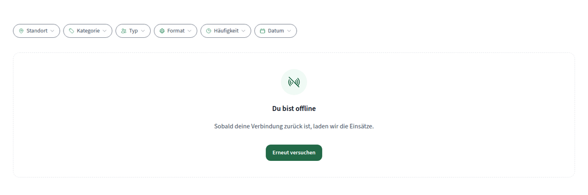

---

### Cross-cutting

#### F28 - Silent token renewal can never succeed, and errors on every page load

**Category:** UX (with a technical root cause in the OIDC client configuration)
**Severity:** Medium
**Confidence:** Confirmed
**Classification:** Best practice (Nielsen-Norman heuristic #3 "User control and freedom")
**Location:** every route, signed in and signed out - Persona: all - Viewport: all - Language: DE/EN

Evidence: on every single page load the app opens a hidden iframe to

```
https://login.maik-hasler.de/realms/einsatzbereit/protocol/openid-connect/auth
  ?client_id=frontend&redirect_uri=https%3A%2F%2Feinsatzbereit.maik-hasler.de%2Fsilent-renew.html&...
```

and it fails twice over. Keycloak answers **HTTP 400**, and independently the response carries `content-security-policy: frame-ancestors 'self'` plus `x-frame-options: SAMEORIGIN`, so Chromium blocks the frame with `ERR_BLOCKED_BY_RESPONSE`. Two console errors per page load, on every route I visited, in every persona.

Impact: the "silent" half of session renewal is dead. A volunteer filling in an expression-of-interest message or an organizer halfway through the four-step create wizard will, once the access token lifetime elapses, be bounced to the login screen rather than renewed transparently - and the wizard's unsaved-changes guard cannot help against a redirect. It also means the console is never clean, which hides real problems.

Suggested fix: this is Keycloak client configuration rather than component code, so it is flagged rather than fixed - either allow `https://einsatzbereit.maik-hasler.de` as a `frame-ancestors` source for the realm and register `silent-renew.html` as a valid redirect URI, or drop the iframe strategy in `react-oidc-context` in favour of refresh-token rotation. Whichever is chosen, the frontend should stop firing the probe when it cannot succeed, so the errors stop. Effort: S on the frontend side once the auth strategy is decided.

---

## Parking Lot

One line each; all out of scope for this review, with the lens that owns them.

- Real personal data (`maikhasler` / `maikhasler@proton.me`) is visible to any organizer on the engagement list of a publicly testable staging environment - `security`.
- A plain `Mitglied` (Vera) can open the org dashboard and read every member's email address on the Mitglieder tab - `security` (authorization model).
- The city geocoding endpoint returns results unrelated to the query at 3 characters and empty arrays for 4-6 character prefixes of a city it resolves at 7 - `bugs` (backend).
- The opportunity endpoint returns time slots whose end time has passed - `bugs` (backend).
- `manifest.webmanifest`, `manifest.json` and `site.webmanifest` all return HTTP 200 with `text/html` (the SPA fallback) rather than 404 - `ci` / deployment configuration.
- `manifest.de.webmanifest` is minified while `manifest.en.webmanifest` is pretty-printed - `repo-hygiene` (build inconsistency, no user impact).
- No `loading="lazy"` on any image, including the 512 x 512 founder portrait below the fold - performance, explicitly out of scope here.
- Seed organizations use `.example` contact details, and the detail page renders the full raw URL (`https://www.nachbarschaftshilfe-lindenau.example`) rather than a host-only label - staging data, but the raw-URL presentation is worth a look when real orgs land.
- `EmptyState` renders its title as a `<p>` across all 18 call sites, so empty regions are not reachable by heading navigation - noted under F15, would suit an `accessibility` lens sweep.

## Prioritized Next Steps

**Quick wins - low effort, high impact.** Do these first; together they are well under a day and they remove the two things that make the product look broken.

1. **F18** - swap the `selectClass` chevron from a `data:` background image to an inline `<svg>`. One file, unblocks three routes, removes a permanent console error.
2. **F1** - stop the location autocomplete from flashing "Keine passende Stadt gefunden." while a request is in flight or after a transient empty response. This is the difference between a usable and an unusable search entry point, even before the geocoder itself is fixed.
3. **F19** - add a backdrop scrim to the shared `Modal` and `MobileMenu`. One change, every overlay in the product.
4. **F2** - hide or demote elapsed time slots in the detail view and the organizer slot filter.
5. **F22** - one error token for border and ring in the shared `Field` primitive, with the focus ring switching colour on `aria-invalid`.
6. **F25** - include the mobile menu trigger in the focus trap and swap its `aria-label` when open.
7. **F14** - take the danger red off "Zurücksetzen" and "Abmelden".
8. **F20** - snap the org-name split to a word boundary.
9. **F8**, **F7**, **F4**, **F5** - four small copy corrections.

**Larger undertakings.**

- **F28** - decide the session-renewal strategy (Keycloak `frame-ancestors` and redirect URI, or refresh-token rotation) and stop firing a probe that cannot succeed. Needs an auth decision, not just a component change.
- **F3** - one quotation-mark convention per language, applied across `de.json`/`en.json` and the two component-level quote wrappers. Mechanical but broad, and worth a lint rule so it does not drift back.
- **F24** - rebuild the star rating as a proper radio group with roving `tabindex`.
- **F10** / **F11** - a mobile hero that keeps its imagery, and a decision about the empty right half of the interior pages. This is design work, not a patch, and it is where the product has the most to gain visually: the home page already proves the team can do it.
- **F6** - invitations for people who do not have an account yet. The clearest functional gap in the organizer flow.
- **F9** - per-route meta descriptions, including opportunity summaries on detail pages.
